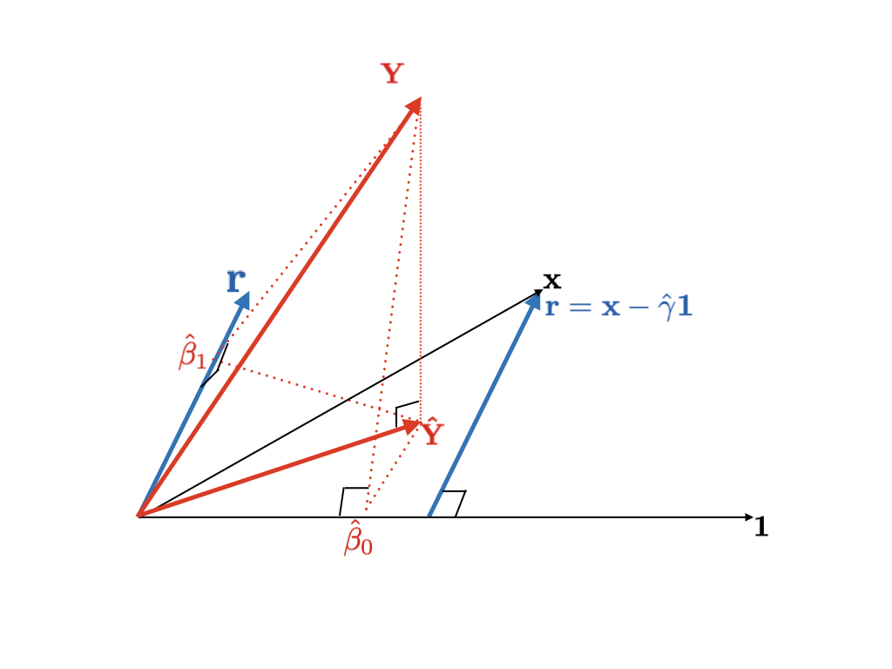

# Multiple Linear Regression {#multiple}

## Model

```{r}
(cem <- MPV::cement %>% tbl_df())
```

Above is a data set about cement and concerning four ingredients from the @Montgomery:2015aa textbook.

- `y`: heat evolved in calories per gram of cement
- `x1`: tricalcium aluminate
- `x2`: tricalcium silicate
- `x3`: tetracalcium alumino ferrite
- `x4`: dicalcium silicate

Given data $(x_{11}, x_{12}, \ldots, x_{1p}, Y_1), \ldots, (x_{n1}, x_{n2}, \ldots, x_{np}, Y_n)$ ($p = 4$), we try to fit linear regression model

$$Y_i = \beta_0 + \beta_1 x_{i1} + \cdots + \beta_p x_{ip} + \epsilon_{i}$$

with

$$\epsilon_i \iid (0, \sigma^2)$$

Compared to simple linear regression problem \@ref(simple), we have more parameters for coefficients

$$(\beta_0, \beta_1, \ldots, \beta_p, \sigma^2)$$

Each $\beta_j$ is a change of $Y$ when each predictor variable $x_j$ increases in 1 unit while the others fixed. In this part, we use *matrix notation*. Extending our former matrix work \@ref(matnot),

$$
\underset{\substack{\\ \\ \\ \\ \huge \mathbf{Y}}}{\begin{bmatrix}
  Y_1 \\
  Y_2 \\
  \vdots \\
  Y_n
\end{bmatrix}} = \underset{\substack{\\ \\ \\ \\ \huge X}}{\begin{bmatrix}
  1 & x_{11} & \cdots & x_{1p} \\
  1 & x_{21} & \cdots & x_{2p} \\
  \vdots & \vdots & \vdots & \vdots \\
  1 & x_{n1} & \cdots & x_{np}
\end{bmatrix}} \underset{\substack{\\ \\ \\ \\ \huge \boldsymbol\beta}}{\begin{bmatrix}
  \beta_0 \\
  \vdots \\
  \beta_p
\end{bmatrix}} + \underset{\substack{\\ \\ \\ \\ \huge \boldsymbol\epsilon}}{\begin{bmatrix}
  \epsilon_1 \\
  \epsilon_2 \\
  \vdots \\
  \epsilon_n
\end{bmatrix}}
$$

where $\epsilon_i$ are i.i.d., and

$$E\boldsymbol\epsilon = \mathbf{0}$$

$$Var\boldsymbol\epsilon = \sigma^2 I$$


## Least Square Estimation

Write $\boldsymbol\beta \equiv (\beta_1, \ldots, \beta_p)^T \in \R^{p + 1}$. Extend Equation \@ref(eq:qmatrix).

\begin{equation}
  \begin{split}
    \boldsymbol{\hat\beta} & = \argmin_{\boldsymbol\beta \in \R^{p + 1}} \sum_{i = 1}^n (Y_i - \beta_0 - \beta_1 x_{i1} - \cdots - \beta_p x_{ip})^2 \\
    & = \argmin_{\boldsymbol\beta \in \R^{p + 1}} \lVert \mathbf{Y} - \beta_0 \mathbf{1} - \beta_1 \mathbf{x}_1 - \cdots - \beta_p \mathbf{x}_p \rVert^2 \\
    & = \argmin_{\boldsymbol\beta \in \R^{p + 1}} \lVert \mathbf{Y} - X\boldsymbol\beta \rVert^2
  \end{split}
  (\#eq:qmultiple)
\end{equation}

As discussed, the solution $\boldsymbol{\hat\beta}$ is related to the projection. $X\boldsymbol{\hat\beta}$ is a projection of $\mathbf{Y}$ onto $Col(X)$.

### Normal equation

Now recap the section \@ref(solproj). Fundamental subspaces theorem \@ref(thm:fundsub) implies that

$$\mathbf{Y} - X\boldsymbol{\hat\beta} \in Col(X)^{\perp} = N(X^T)$$

From the second part of subset, i.e. $N(X^T)$, we now have *Normal equation*

\begin{equation}
  X^T(\mathbf{Y} - X\boldsymbol{\hat\beta}) = \mathbf{0}
  (\#eq:multeq)
\end{equation}

This is equivalent to

$$X^T\mathbf{Y} = X^TX\boldsymbol{\hat\beta}$$

Hence, if $X^T X$ is invertible, the equation gives unique solution

$$\boldsymbol{\hat\beta} = (X^TX)^{-1}X^T \mathbf{Y}$$

Our first question is when $X^T X$ is invertible, and Theorem \@ref(thm:fullrank) have said that it is when the model matrix $X$ is full rank.

```{lemma, modelnnd}
Let $X \in \R^{n \times (p + 1)}$ be any model matrix. Then $X^T X$ is always non-negative definite.

$$\forall \mathbf{v} \in \R^{p + 1} : \mathbf{v}^T(X^T X)\mathbf{v} \ge 0$$
```

```{proof}
Let $\mathbf{v} \in \R^{p + 1}$. Then

$$\mathbf{v}^T(X^T X)\mathbf{v} = (X\mathbf{v})^T (X\mathbf{v}) = \lVert X\mathbf{v} \rVert^2 \ge 0$$
```

This lemma can also prove our Theorem \@ref(thm:fullrank).

```{theorem, fullrank2}
Let $\mathbf{Y} = X\boldsymbol\beta$ inconsistent and let $X \in \R^{n \times (p + 1)}$ with $n > p + 1$.

If $rank(X) = p + 1$, i.e. full rank, then $X^T X$ is invertible.
```

```{proof}
Let $\mathbf{c} \in \R^{(p + 1)}$

Suppose that $X^T X$ is positive definite.

\begin{equation*}
  \begin{split}
    & \Leftrightarrow \mathbf{c}^TX^T X \mathbf{c} = 0 \quad \text{implies} \quad \mathbf{c} = \mathbf{0} \\
    & \Leftrightarrow X\mathbf{c} = \mathbf{0} \quad \text{implies} \quad \mathbf{c} = \mathbf{0} \\
    & \Leftrightarrow \text{columns of}\: X \:\text{linearly independent} \\
    & \Leftrightarrow rank(X) = p + 1
  \end{split}
\end{equation*}
```


### Orthogonal decomposition

```{theorem, orthonormal}
Let $Col(X)$ be a subspace of $\R^n$, let $\mathbf{Y} \in \R^n$, and let $\{ \mathbf{u}_0, \ldots, \mathbf{u}_{p} \}$ be an orthonormal basis for $Col(X)$. If

$$\mathbf{\hat{Y}} = \sum_{j = 0}^p \hat\beta_j \mathbf{u}_j$$

where

$$\hat\beta_j = \Pi(\mathbf{Y} \mid R(\mathbf{u}_j)) \quad \text{for each} \: i$$

then $\mathbf{\hat{Y}} - \mathbf{Y} \in Col(X)^{\perp}$.
```

```{theorem, orthonormalproj}
Under the hypothesis of Theorem \@ref(thm:orthonormal), $\mathbf{\hat{Y}} \in Col(X)$ is the closest to $\mathbf{Y}$ amongst its any element $\mathbf{p}$, i.e.

$$\Vert \mathbf{p} - \mathbf{Y} \Vert > \Vert \mathbf{\hat{Y}} - \mathbf{Y} \Vert$$

for any $\mathbf{p} \neq \mathbf{\hat{Y}}$ in $Col(X)$
```

In other words, projection of $\mathbf{Y}$ onto $Col(X)$, $\mathbf{\hat{Y}}$ can be *represented as sum of projections of* $\mathbf{Y}$ *onto each (orthogonal) individual variable*. Before looking at individual basis, consider two-block space.

Write

$$
X = \left[\begin{array}{c|ccc}
  1 & x_{11} & \cdots & x_{1p} \\
  1 & x_{21} & \cdots & x_{2p} \\
  \vdots & \vdots & \vdots & \vdots \\
  1 & x_{n1} & \cdots & x_{np}
\end{array}\right] = [\mathbf{1}, \mathbb{X}_A]
$$

Consider $R(X)$, $R(\mathbf{1})$, and $R(\mathbb{X}_A)$.

To decompose subspace $R(X)$, we try to orthogonalize $\mathbf{1}$ and $\mathbb{X}_A$. By Theorem \@ref(thm:orthonormal), we have

$$\mathbf{1} \perp \mathbb{X}_A - \Pi_{\mathbf{1}}\mathbb{X}_A$$

In fact, the right one $\mathbb{X}_A - \Pi_{\mathbf{1}}\mathbb{X}_A$ is the *residual after simple linear regression* $\mathbb{X}_A$ onto $\mathbf{1}$. We have seen in Figure \@ref(fig:simpledraw2) of section \@ref(matnot) that the *residual is orthogonal to predictor vector*. In this procedure, we choose residual as new predictor instead of response in simple linear regression, i.e. $\mathbb{X}_A$. If this is done to individual predictor variables, it is called *successive orthogonalization* and it will be coved next section with QR decomposition.

Theorem \@ref(thm:dsum) implies that

$$R(X) = R(\mathbf{1}) \oplus R(\mathbb{X}_A - \Pi_{\mathbf{1}}\mathbb{X}_A)$$

```{theorem, orthdecomp, name = "Orthogonal decomposition"}
Let $X = [\mathbf{1}, \mathbb{X}_A]$. Then

(i)

$$R(X) = R(\mathbf{1}) \oplus R(\mathbb{X}_A - \Pi_{\mathbf{1}}\mathbb{X}_A)$$

(ii)

$$\Pi(\cdot \mid R(X)) = \Pi(\cdot \mid R(\mathbf{1})) + \Pi(\cdot \mid R(\mathbb{X}_A - \Pi_{\mathbf{1}}\mathbb{X}_A))$$
```

Write

$$\mathbb{X}_{A, \perp} := \mathbb{X}_A - \Pi_{\mathbf{1}}\mathbb{X}_A$$

Note that

$$\Pi_{\mathbf{1}} = \mathbf{1}(\mathbf{1}^T\mathbf{1})^{-1}\mathbf{1}^T = \frac{1}{n}\mathbf{1}\mathbf{1}^T$$

Then

\begin{equation}
  \begin{split}
    X\boldsymbol{\hat\beta} & = \hat\beta_0\mathbf{1} + \mathbb{X}_A\boldsymbol{\hat\beta}_A \\
    & = \hat\beta_0\mathbf{1} + (\mathbb{X}_{A, \perp} + \Pi_{\mathbf{1}}\mathbb{X}_A)\boldsymbol{\hat\beta}_A \\
    & = \Big(\hat\beta_0 + \frac{1}{n}\mathbf{1}^T\mathbb{X}_A\boldsymbol{\hat\beta}_A \Big)\mathbf{1} + \mathbb{X}_{A,\perp}\boldsymbol{\hat\beta}_A \qquad \because \hat\beta_0 + \frac{1}{n}\mathbf{1}^T\mathbb{X}_A\boldsymbol{\hat\beta}_A \in \R
  \end{split}
  (\#eq:blockfit)
\end{equation}

From (ii) of Theorem \@ref(thm:orthdecomp),

\begin{equation}
  \begin{split}
    \Pi(\mathbf{Y} \mid R(X)) & = \Pi(\mathbf{Y} \mid R(\mathbf{1})) + \Pi(\mathbf{Y} \mid R(\mathbb{X}_{A,\perp})) \\
    & = \overline{Y}\mathbf{1} + \mathbb{X}_{A,\perp}(\mathbb{X}_{A,\perp}^T\mathbb{X}_{A,\perp})^{-1}\mathbb{X}_{A,\perp}^T\mathbf{Y}
  \end{split}
  (\#eq:decompfit)
\end{equation}

Since $\mathbf{1} \perp \mathbb{X}_{A, \perp}$, Equations \@ref(eq:blockfit) and \@ref(eq:decompfit) imply that

$$
\begin{cases}
  \hat\beta_0 = \overline{Y} - \frac{1}{n}\mathbf{1}\mathbb{X}_A\boldsymbol{\hat\beta}_A \\
  \boldsymbol{\hat\beta}_A = (\mathbb{X}_{A,\perp}^T\mathbb{X}_{A,\perp})^{-1}\mathbb{X}_{A,\perp}^T\mathbf{Y}
\end{cases}
$$

```{r illdecomp, echo=FALSE, fig.cap="Orthogonal decomposition of the column space and LSE"}
knitr::include_graphics("images/multiple-orthogonal.png")
```

See Figure \@ref(fig:illdecomp). Two are orthogonal, so sum of projections onto them become LSE. In fact, *each projection indicate each regression coefficient*. When we do not have orthogonal basis, however, each projection is nothing.

```{r illdecomp2, echo=FALSE, fig.cap="Non-orthongality"}
knitr::include_graphics("images/multiple-nonorth.png")
```

So what we have done is orthogonalization.

$$\tilde{\mathbb{X}}_A = \Pi_{\mathbf{1}}\mathbb{X}_A + (\mathbb{X}_A - \Pi_{\mathbf{1}}\mathbb{X}_A)$$

### Gram-Schmidt QR factorization

Let's briefly look at orthogonalization process. From Theorem \@ref(thm:orthonormal), we can derive following *orthonormalization process*.

```{theorem, gs, name = "Gram-Schmidt Process"}
Let $\{ \mathbf{x}_1, \ldots, \mathbf{x}_{p + 1} \}$ be a basis for the inner product space $V$. Let

$$\mathbf{u}_1 = \bigg( \frac{1}{\lVert \mathbf{x}_1 \rVert} \bigg) \mathbf{x}_1$$

and define next $\mathbf{u}_2, \ldots, \mathbf{u}_{p + 1}$ recursively by

$$\mathbf{u}_{k + 1} = \frac{1}{\lVert \mathbf{x}_{k + 1} - \mathbf{r}_k^{*} \rVert}(\mathbf{x}_{k + 1} - \mathbf{r}_k^{*})$$

for $k = 1, \ldots, p$, where

$$\mathbf{r}_k^{*} = <\mathbf{x}_{k + 1}, \mathbf{u}_1> \mathbf{u}_1 + <\mathbf{a}_{k + 1}, \mathbf{u}_2 >\mathbf{u}_2 + \cdots + < \mathbf{a}_{k + 1}, \mathbf{u}_k > \mathbf{u}_k$$

is the projection of $\mathbf{x}_{k + 1}$ onto $sp(\{ \mathbf{u}_1, \ldots, \mathbf{u}_k \})$.

Hence, we get $\{ \mathbf{u}_1, \ldots, \mathbf{u}_{p + 1} \}$ is an orthonormal basis for $V$.
```

\begin{algorithm} \label{alg:alggs}
  \SetAlgoLined
  \SetKwInOut{Input}{input}
  \Input{basis $\{ \mathbf{x}_0, \ldots, \mathbf{x}_p \}$}
  Initialize $\mathbf{v}_0 = \mathbf{x}_0$\;
  \For{$k \leftarrow 1$ \KwTo $p$}{
    $\mathbf{u}_{k - 1} = \frac{\mathbf{v}_{k - 1}}{\lVert \mathbf{v}_{k - 1} \rVert}$\;
    $\mathbf{r}_k^{*} = <\mathbf{x}_{k + 1}, \mathbf{u}_0> \mathbf{u}_0 + <\mathbf{a}_{k + 1}, \mathbf{u}_1 >\mathbf{u}_1 + \cdots + < \mathbf{a}_{k + 1}, \mathbf{u}_k > \mathbf{u}_k$\;
    $\mathbf{v}_{k + 1} = \mathbf{x}_{k + 1} - \mathbf{r}_k^{*}$
  }
  $\mathbf{u}_p = \frac{\mathbf{v}_p}{\lVert \mathbf{v}_p \rVert}$
  \caption{Gram-schmidt process}
\end{algorithm}

Our interest is $Col(X)$, and we can factorizae this model matrix so that it represents orthonormalization process \@ref(thm:gs).

```{theorem, gsqr, name = "Gram-Schmidt QR factorization"}
Let $X \in \R^{n \times (p + 1)}$. Then $X$ can be factored into

$$X = QR$$

where $Q \in \R^{n \times (p + 1)}$ is an orthogonal matrix, i.e. its column vectors are orthonormal and $R \in \R^{(p + 1) \times (p + 1)}$ is an upper triangular matrix whose diagonal entries are all positive.
```

```{proof}
Denote that this is just the representation of Gram-schmidt orthogonalization. Then it gives

$$\mathbf{u}_1 = \frac{\mathbf{x}_1}{\lVert \mathbf{x}_1 \rVert} \Rightarrow \mathbf{x}_1 = \lVert \mathbf{x}_1 \rVert \mathbf{u}_1$$

\begin{equation*}
  \begin{split}
    & \mathbf{v}_2 = \mathbf{x}_2 - <\mathbf{x}_2, \mathbf{u}_1> \mathbf{u}_1, \quad \mathbf{u}_2 = \frac{\mathbf{v}_2}{\lVert \mathbf{v}_2 \rVert} \\
    & \Rightarrow \mathbf{x}_2 = <\mathbf{x}_2, \mathbf{u}_1>\mathbf{u}_1 + \lVert \mathbf{v}_2 \rVert \mathbf{u}_2 \\
    & \Rightarrow \mathbf{x}_2 = \left[\begin{array}{c|c}
      \mathbf{u}_1 & \mathbf{u}_2
    \end{array}\right] \begin{bmatrix}
      <\mathbf{x}_2, \mathbf{u}_1> \\
      \lVert \mathbf{v}_2 \rVert
    \end{bmatrix}
  \end{split}
\end{equation*}

It procees in a simlar way to the others. Hence,

\begin{equation}
  \begin{split}
    X & = \begin{bmatrix} \mathbf{x}_1 & \cdots & \mathbf{x}_{p+1} \end{bmatrix} \\
    & = \begin{bmatrix}
      \mathbf{u}_1 & \mathbf{u}_2 & \cdots & \mathbf{u}_{p + 1}
    \end{bmatrix} \begin{bmatrix}
      \lVert \mathbf{v}_1 \rVert & < \mathbf{x}_2, \mathbf{u}_1> & < \mathbf{x}_3, \mathbf{u}_1> & \cdots & < \mathbf{x}_{p + 1}, \mathbf{u}_1> \\
      0 & \lVert \mathbf{v}_2 \rVert & < \mathbf{x}_3, \mathbf{u}_2> & \cdots & < \mathbf{x}_{p + 1}, \mathbf{u}_2> \\
      0 & 0 & \lVert \mathbf{v}_3 \rVert & \cdots & < \mathbf{x}_{p + 1}, \mathbf{u}_3> \\
      \vdots & \vdots & \vdots & \vdots & \vdots \\
      0 & 0 & 0 & 0 & \lVert \mathbf{v}_{p + 1} \rVert
    \end{bmatrix} \\
    & \equiv QR
  \end{split}
  (\#eq:qrrep)
\end{equation}
```

Look again the equation in Theorem \@ref(thm:gs). In each process $k$, the projection is done to the $(k - 1)$-dimensional space. In other words, as process goes through, dimension increases. So we try to project each vector only in 1-dimension each step.

```{theorem, modgs, name = "Modified Gram-Schmidt Process"}
Let $\{ \mathbf{x}_1, \ldots, \mathbf{x}_{p + 1} \}$ be a basis for the inner product space $V$ and let $\{ \mathbf{q}_1, \ldots, \mathbf{q}_{p + 1} \}$ be an orthonormal basis.

Set $\mathbf{q}_1 = \frac{\mathbf{x}_1}{\lVert \mathbf{x}_1 \rVert}$. Then consider $sp(\{ \mathbf{q}_1 \})$.

In the first step, make every $\{ \mathbf{x}_2, \ldots, \mathbf{x}_{p + 1} \}$ orthogonal to $\mathbf{q}_1$.

$$\mathbf{x}_k^{(1)} = \mathbf{x}_k - (\mathbf{q}_1^T \mathbf{x}_k)\mathbf{q}_1, \quad k = 2, \ldots, p + 1$$

So we get orthogonal set $\{ \mathbf{q}_1, \mathbf{x}_2^{(1)}, \ldots, \mathbf{x}_{p + 1}^{(1)} \}$. Next, set $\mathbf{q}_2 = \frac{\mathbf{x}^{(1)}}{\lVert \mathbf{x}_2^{(2)} \rVert}$. Consider $sp(\{ \mathbf{q}_2 \})$. Since we have $\mathbf{q}_1 \perp \mathbf{q}_2$,

$$\mathbf{x}_k^{(2)} = \mathbf{x}_k^{(1)} - (\mathbf{q}_2^T \mathbf{x}_k^{(1)})\mathbf{q}_2 \perp \mathbf{q}_2 , \quad k = 3, \ldots, p + 1$$

Thus, get $\{ \mathbf{q}_1, \mathbf{q}_2, \mathbf{x}_3^{(2)}, \ldots, \mathbf{x}_{p + 1}^{(2)} \}$. $\mathbf{q}_3, \ldots, \mathbf{q}_{p + 1}$ are successively determined in a similary way.

At the last step, set

$$\mathbf{q}_{p + 1} = \frac{\mathbf{x}_{p + 1}^{(p)}}{\lVert \mathbf{x}_{p + 1}^{(p)} \rVert}$$
```

Since each projection is done in 1-dimension, the algorithm becomes more understandable. Consider

$$
Q = \begin{bmatrix}
  \mathbf{q}_1 & \mathbf{q}_2 & \cdots \mathbf{q}_{p + 1}
\end{bmatrix} \in \R^{n \times (p + 1)} \quad \text{orthogonal}
$$

and

$$
R = [r_{kj}] = \begin{bmatrix}
  r_{11} & r_{12} & \cdots & r_{1,p+1} \\
  0 & r_{22} & \cdots & r_{2, p+1} \\
  0 & 0 & \cdots & r_{3,p+1} \\
  \vdots & \vdots & \vdots & \vdots \\
  0 & 0 & 0 & r_{p+1, p+1}
\end{bmatrix} \in \R^{(p+1) \times (p + 1)}
$$

We can perform $QR$ factorization by following step.

\begin{algorithm} \label{alg:algqr}
  \SetAlgoLined
  \For{$k \leftarrow 1$ \KwTo $(p + 1)$}{
    $r_{kk} = \lVert \mathbf{x}_{k} \rVert$\;
    $\mathbf{q}_k = \frac{\mathbf{x}_k}{r_{kk}}$\;
    \For{$j \leftarrow 1$ \KwTo $(p + 1)$}{
      $r_{kj} = \mathbf{q}_k^T\mathbf{x}_j$\;
      $\mathbf{x}_j = \mathbf{x}_j - r_{kj}\mathbf{q}_k$\;
    }
  }
  \caption{QR decomposition for modified G-S process}
\end{algorithm}

This *orthonormal basis* gives some useful facts with least squares problem [@Leon:2014aa].

### Successive orthogonalization

In fact, G-S process $\ref{alg:alggs}$ is equivalent to succesive orthogonalization, i.e. regress(project) $\mathbf{x}_j$ onto the others [@Hastie:2013aa].

\begin{algorithm} \label{alg:algorth}
  \SetAlgoLined
  Initialize $\mathbf{v}_0 = \mathbf{1}$\;
  \For{$k \leftarrow 1$ \KwTo $p$}{
    Regress $\mathbf{x}_k$ on $\mathbf{q}_0, \ldots, \mathbf{q}_{k - 1}$\;
    $\hat\beta_{lk} = \frac{<\mathbf{v}_l, \mathbf{x}_k>}{< \mathbf{v}_l, \mathbf{v}_l>}, l = 0, \ldots, k - 1$\;
    Residual $\mathbf{v}_k = \mathbf{x}_k - \sum\limits_{l = 0}^{k - 1}\hat\beta_{lk}\mathbf{v}_k$\;
  }
  Regress $\mathbf{Y}$ on $\mathbf{v}_p$
  \caption{Successive orthogonalization}
\end{algorithm}

Now we can solve least squares problem using QR decomposition. Recall that

$$X = QR$$

as specified in Theorem \@ref(thm:gsqr). Then normal equation implies that

\begin{equation}
  \begin{split}
    & (X^TX)\boldsymbol{\hat\beta} = X^T\mathbf{Y} \\
    & \Leftrightarrow R^TQ^TQR \boldsymbol{\hat\beta} = R^TQ^T \mathbf{Y} \\
    & \Leftrightarrow R^TR \boldsymbol{\hat\beta} = R^TQ^T \mathbf{Y} \qquad \because Q^TQ = I \\
    & \Leftrightarrow R \boldsymbol{\hat\beta} = Q^T \mathbf{Y} \qquad \text{if}\: R \:\text{is invertible}
  \end{split}
  (\#eq:qrbeta)
\end{equation}

Hence,

\begin{equation}
  \boldsymbol{\hat\beta} = R^{-1}Q^T\mathbf{Y}
  (\#eq:qrhat)
\end{equation}

It follows that

\begin{equation}
  \mathbf{\hat{Y}} = (QR)\boldsymbol{\hat\beta} = QQ^T\mathbf{Y}
  (\#eq:qrfit)
\end{equation}

Let's compare the result. Base function `qr()` give the QR factorization. Given this object, we can get each $Q$ and $R$ by `qr.Q()` and `qr.R()`.

```{r}
cem_qr <-
  cem %>% 
  model.matrix(y ~ ., data = .) %>% 
  qr()
cem_q <- qr.Q(cem_qr)
cem_r <- qr.R(cem_qr)
```

Using Equation \@ref(eq:qrhat), we get each coefficient as follow.

```{r}
solve(cem_r) %*% t(cem_q) %*% cem$y
```

On the other hand, `lm()` gives the following result.

```{r}
lm(y ~ ., data = cem)
```

We can check the result is same. In fact, `lm()` fits the model by default `method = "qr"`.

> the method to be used; for fitting, currently only method = "qr" is supported; method = "model.frame" returns the model frame (the same as with model = TRUE, see below).

By default and only way, `lm()` fits the model using $QR$ factorization. What does this orthogonal basis mean? For simplicity, consider simple linear regression problem.

```{r qrpng, echo=FALSE, fig.cap="Orthogonalized basis"}
knitr::include_graphics("images/multiple-qr1.png")
```

```{r qrpng2, echo=FALSE, fig.cap="Non-orthogonal basis"}

```

See Figure \@ref(fig:qrpng). By construbtion, projection onto each basis is same as $\hat\beta_0$ and $\hat\beta_1$. In Figure \@ref(fig:qrpng2), however, each projection is not regression coefficient.

```{r simpledraw3, echo=FALSE, fig.cap="QR decomposition for model matrix"}

```

Regress $\mathbf{x}$ onto $\mathbf{1}$. Its residual can be a new orthogonalized predictor.


