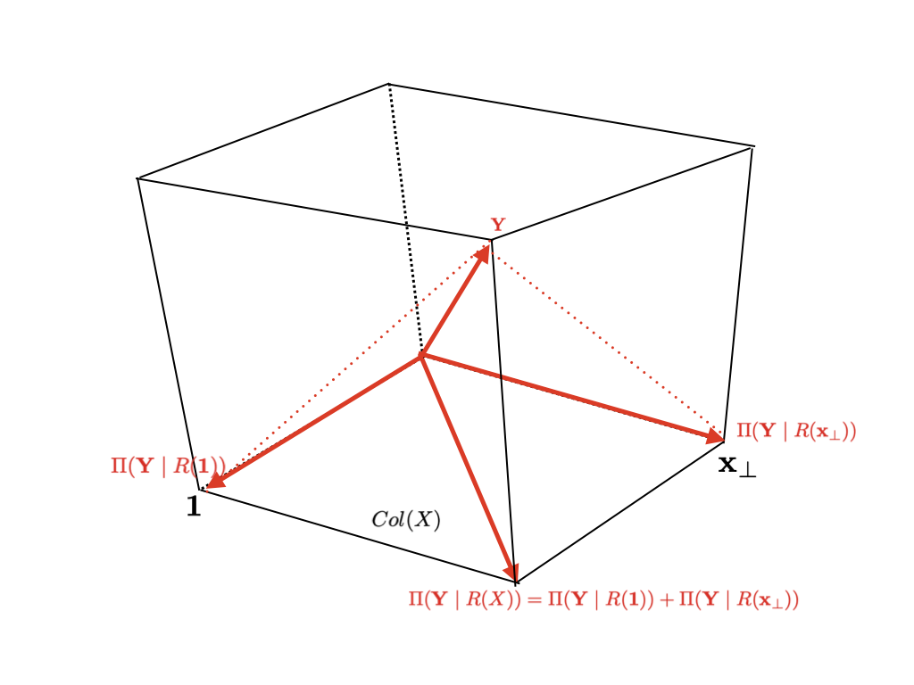

# Multiple Linear Regression {#multiple}

## Model

```{r}
(cem <- MPV::cement %>% tbl_df())
```

Above is a data set about cement and concerning four ingredients from the @Montgomery:2015aa textbook.

- `y`: heat evolved in calories per gram of cement
- `x1`: tricalcium aluminate
- `x2`: tricalcium silicate
- `x3`: tetracalcium alumino ferrite
- `x4`: dicalcium silicate

Given data $(x_{11}, x_{12}, \ldots, x_{1p}, Y_1), \ldots, (x_{n1}, x_{n2}, \ldots, x_{np}, Y_n)$ ($p = 4$), we try to fit linear regression model

$$Y_i = \beta_0 + \beta_1 x_{i1} + \cdots + \beta_p x_{ip} + \epsilon_{i}$$

with

$$\epsilon_i \iid (0, \sigma^2)$$

Compared to simple linear regression problem \@ref(simple), we have more parameters for coefficients

$$(\beta_0, \beta_1, \ldots, \beta_p, \sigma^2)$$

Each $\beta_j$ is a change of $Y$ when each predictor variable $x_j$ increases in 1 unit while the others fixed. In this part, we use *matrix notation*. Extending our former matrix work \@ref(matnot),

$$
\underset{\huge \mathbf{Y}}{\begin{bmatrix}
  Y_1 \\
  Y_2 \\
  \vdots \\
  Y_n
\end{bmatrix}} = \underset{\huge X}{\begin{bmatrix}
  1 & x_{11} & \cdots & x_{1p} \\
  1 & x_{21} & \cdots & x_{2p} \\
  \vdots & \vdots & \vdots & \vdots \\
  1 & x_{n1} & \cdots & x_{np}
\end{bmatrix}} \underset{\huge \B}{\begin{bmatrix}
  \beta_0 \\
  \vdots \\
  \beta_p
\end{bmatrix}} + \underset{\huge \E}{\begin{bmatrix}
  \epsilon_1 \\
  \epsilon_2 \\
  \vdots \\
  \epsilon_n
\end{bmatrix}}
$$

where $\epsilon_i$ are i.i.d., and

$$E \E = \mathbf{0}$$

$$Var \E = \sigma^2 I$$


## Least Square Estimation

Write $\boldsymbol\beta \equiv (\beta_1, \ldots, \beta_p)^T \in \R^{p + 1}$. Extend Equation \@ref(eq:qmatrix).

\begin{equation}
  \begin{split}
    \hb & = \argmin_{ \B \in \R^{p + 1}} \sum_{i = 1}^n (Y_i - \beta_0 - \beta_1 x_{i1} - \cdots - \beta_p x_{ip})^2 \\
    & = \argmin_{ \B \in \R^{p + 1}} \lVert \mathbf{Y} - \beta_0 \mathbf{1} - \beta_1 \mathbf{x}_1 - \cdots - \beta_p \mathbf{x}_p \rVert^2 \\
    & = \argmin_{ \B \in \R^{p + 1}} \lVert \mathbf{Y} - X \B \rVert^2
  \end{split}
  (\#eq:qmultiple)
\end{equation}

As discussed, the solution $\boldsymbol{\hat\beta}$ is related to the projection. $X\boldsymbol{\hat\beta}$ is a projection of $\mathbf{Y}$ onto $Col(X)$.

### Normal equation

Now recap the section \@ref(solproj). Fundamental subspaces theorem \@ref(thm:fundsub) implies that

$$\mathbf{Y} - X \hb \in Col(X)^{\perp} = N(X^T)$$

From the second part of subset, i.e. $N(X^T)$, we now have *Normal equation*

\begin{equation}
  X^T(\mathbf{Y} - X \hb) = \mathbf{0}
  (\#eq:multeq)
\end{equation}

This is equivalent to

$$X^T\mathbf{Y} = X^TX \hb$$

Hence, if $X^T X$ is invertible, the equation gives unique solution

$$\hb = (X^TX)^{-1}X^T \mathbf{Y}$$

Our first question is when $X^T X$ is invertible, and Theorem \@ref(thm:fullrank) have said that it is when the model matrix $X$ is full rank.

```{lemma, modelnnd}
Let $X \in \R^{n \times (p + 1)}$ be any model matrix. Then $X^T X$ is always non-negative definite.

$$\forall \mathbf{v} \in \R^{p + 1} : \mathbf{v}^T(X^T X)\mathbf{v} \ge 0$$
```

```{proof}
Let $\mathbf{v} \in \R^{p + 1}$. Then

$$\mathbf{v}^T(X^T X)\mathbf{v} = (X\mathbf{v})^T (X\mathbf{v}) = \lVert X\mathbf{v} \rVert^2 \ge 0$$
```

This lemma can also prove our Theorem \@ref(thm:fullrank).

```{theorem, fullrank2}
Let $\mathbf{Y} = X\boldsymbol\beta$ inconsistent and let $X \in \R^{n \times (p + 1)}$ with $n > p + 1$.

If $rank(X) = p + 1$, i.e. full rank, then $X^T X$ is invertible.
```

```{proof}
Let $\mathbf{c} \in \R^{(p + 1)}$

Suppose that $X^T X$ is positive definite.

\begin{equation*}
  \begin{split}
    & \Leftrightarrow \mathbf{c}^TX^T X \mathbf{c} = 0 \quad \text{implies} \quad \mathbf{c} = \mathbf{0} \\
    & \Leftrightarrow X\mathbf{c} = \mathbf{0} \quad \text{implies} \quad \mathbf{c} = \mathbf{0} \\
    & \Leftrightarrow \text{columns of}\: X \:\text{linearly independent} \\
    & \Leftrightarrow rank(X) = p + 1
  \end{split}
\end{equation*}
```


### Orthogonal decomposition

```{theorem, orthonormal}
Let $Col(X)$ be a subspace of $\R^n$, let $\mathbf{Y} \in \R^n$, and let $\{ \mathbf{u}_0, \ldots, \mathbf{u}_{p} \}$ be an orthonormal basis for $Col(X)$. If

$$\mathbf{\hat{Y}} = \sum_{j = 0}^p \hat\beta_j \mathbf{u}_j$$

where

$$\hat\beta_j = \Pi(\mathbf{Y} \mid R(\mathbf{u}_j)) \quad \text{for each} \: i$$

then $\mathbf{\hat{Y}} - \mathbf{Y} \in Col(X)^{\perp}$.
```

```{theorem, orthonormalproj}
Under the hypothesis of Theorem \@ref(thm:orthonormal), $\mathbf{\hat{Y}} \in Col(X)$ is the closest to $\mathbf{Y}$ amongst its any element $\mathbf{p}$, i.e.

$$\Vert \mathbf{p} - \mathbf{Y} \Vert > \Vert \mathbf{\hat{Y}} - \mathbf{Y} \Vert$$

for any $\mathbf{p} \neq \mathbf{\hat{Y}}$ in $Col(X)$
```

In other words, projection of $\mathbf{Y}$ onto $Col(X)$, $\mathbf{\hat{Y}}$ can be *represented as sum of projections of* $\mathbf{Y}$ *onto each (orthogonal) individual variable*. Before looking at individual basis, consider two-block space.

Write

$$
X = \left[\begin{array}{c|ccc}
  1 & x_{11} & \cdots & x_{1p} \\
  1 & x_{21} & \cdots & x_{2p} \\
  \vdots & \vdots & \vdots & \vdots \\
  1 & x_{n1} & \cdots & x_{np}
\end{array}\right] = [\mathbf{1}, \mathbb{X}_A]
$$

Consider $R(X)$, $R(\mathbf{1})$, and $R(\mathbb{X}_A)$.

To decompose subspace $R(X)$, we try to orthogonalize $\mathbf{1}$ and $\mathbb{X}_A$. By Theorem \@ref(thm:orthonormal), we have

$$\mathbf{1} \perp \mathbb{X}_A - \Pi_{\mathbf{1}}\mathbb{X}_A$$

In fact, the right one $\mathbb{X}_A - \Pi_{\mathbf{1}}\mathbb{X}_A$ is the *residual after simple linear regression* $\mathbb{X}_A$ onto $\mathbf{1}$. We have seen in Figure \@ref(fig:simpledraw2) of section \@ref(matnot) that the *residual is orthogonal to predictor vector*. In this procedure, we choose residual as new predictor instead of response in simple linear regression, i.e. $\mathbb{X}_A$. If this is done to individual predictor variables, it is called *successive orthogonalization* and it will be coved next section with QR decomposition.

Theorem \@ref(thm:dsum) implies that

$$R(X) = R(\mathbf{1}) \oplus R(\mathbb{X}_A - \Pi_{\mathbf{1}}\mathbb{X}_A)$$

```{theorem, orthdecomp, name = "Orthogonal decomposition"}
Let $X = [\mathbf{1}, \mathbb{X}_A]$. Then

\begin{enumerate}[label=(\roman*)]
  \item $$R(X) = R(\mathbf{1}) \oplus R(\mathbb{X}_A - \Pi_{\mathbf{1}}\mathbb{X}_A)$$ \label{itm:orthdecompone}
  \item $$\Pi(\cdot \mid R(X)) = \Pi(\cdot \mid R(\mathbf{1})) + \Pi(\cdot \mid R(\mathbb{X}_A - \Pi_{\mathbf{1}}\mathbb{X}_A))$$ \label{itm:orthdecomptwo}
\end{enumerate}
```

Write

$$\mathbb{X}_{A, \perp} := \mathbb{X}_A - \Pi_{\mathbf{1}}\mathbb{X}_A$$

Note that

$$\Pi_{\mathbf{1}} = \mathbf{1}(\mathbf{1}^T\mathbf{1})^{-1}\mathbf{1}^T = \frac{1}{n}\mathbf{1}\mathbf{1}^T$$

Then

\begin{equation}
  \begin{split}
    X\boldsymbol{\hat\beta} & = \hat\beta_0\mathbf{1} + \mathbb{X}_A\boldsymbol{\hat\beta}_A \\
    & = \hat\beta_0\mathbf{1} + (\mathbb{X}_{A, \perp} + \Pi_{\mathbf{1}}\mathbb{X}_A)\boldsymbol{\hat\beta}_A \\
    & = \Big(\hat\beta_0 + \frac{1}{n}\mathbf{1}^T\mathbb{X}_A\boldsymbol{\hat\beta}_A \Big)\mathbf{1} + \mathbb{X}_{A,\perp}\boldsymbol{\hat\beta}_A \qquad \because \hat\beta_0 + \frac{1}{n}\mathbf{1}^T\mathbb{X}_A\boldsymbol{\hat\beta}_A \in \R
  \end{split}
  (\#eq:blockfit)
\end{equation}

From (ii) of Theorem \@ref(thm:orthdecomp),

\begin{equation}
  \begin{split}
    \Pi(\mathbf{Y} \mid R(X)) & = \Pi(\mathbf{Y} \mid R(\mathbf{1})) + \Pi(\mathbf{Y} \mid R(\mathbb{X}_{A,\perp})) \\
    & = \overline{Y}\mathbf{1} + \mathbb{X}_{A,\perp}(\mathbb{X}_{A,\perp}^T\mathbb{X}_{A,\perp})^{-1}\mathbb{X}_{A,\perp}^T\mathbf{Y}
  \end{split}
  (\#eq:decompfit)
\end{equation}

Since $\mathbf{1} \perp \mathbb{X}_{A, \perp}$, Equations \@ref(eq:blockfit) and \@ref(eq:decompfit) imply that

\begin{equation}
  \begin{cases}
    \hat\beta_0 = \overline{Y} - \frac{1}{n}\mathbf{1}^T\mathbb{X}_A\boldsymbol{\hat\beta}_A \\
    \boldsymbol{\hat\beta}_A = (\mathbb{X}_{A,\perp}^T\mathbb{X}_{A,\perp})^{-1}\mathbb{X}_{A,\perp}^T\mathbf{Y}
  \end{cases}
  (\#eq:orthbeta)
\end{equation}

```{r illdecomp, echo=FALSE, fig.cap="Orthogonal decomposition of the column space and LSE"}
knitr::include_graphics("images/multiple-orthogonal.png")
```

See Figure \@ref(fig:illdecomp). Two are orthogonal, so sum of projections onto them become LSE. In fact, *each projection indicate each regression coefficient*. When we do not have orthogonal basis, however, each projection is nothing.

```{r illdecomp2, echo=FALSE, fig.cap="Non-orthongality"}

```

So what we have done is orthogonalization.

$$\tilde{\mathbb{X}}_A = \Pi_{\mathbf{1}}\mathbb{X}_A + (\mathbb{X}_A - \Pi_{\mathbf{1}}\mathbb{X}_A)$$

### Gram-Schmidt QR factorization

Let's briefly look at orthogonalization process. From Theorem \@ref(thm:orthonormal), we can derive following *orthonormalization process*.

```{theorem, gs, name = "Gram-Schmidt Process"}
Let $\{ \mathbf{x}_1, \ldots, \mathbf{x}_{p + 1} \}$ be a basis for the inner product space $V$. Let

$$\mathbf{u}_1 = \bigg( \frac{1}{\lVert \mathbf{x}_1 \rVert} \bigg) \mathbf{x}_1$$

and define next $\mathbf{u}_2, \ldots, \mathbf{u}_{p + 1}$ recursively by

$$\mathbf{u}_{k + 1} = \frac{1}{\lVert \mathbf{x}_{k + 1} - \mathbf{r}_k^{*} \rVert}(\mathbf{x}_{k + 1} - \mathbf{r}_k^{*})$$

for $k = 1, \ldots, p$, where

$$\mathbf{r}_k^{*} = <\mathbf{x}_{k + 1}, \mathbf{u}_1> \mathbf{u}_1 + <\mathbf{x}_{k + 1}, \mathbf{u}_2 >\mathbf{u}_2 + \cdots + < \mathbf{x}_{k + 1}, \mathbf{u}_k > \mathbf{u}_k$$

is the projection of $\mathbf{x}_{k + 1}$ onto $sp(\{ \mathbf{u}_1, \ldots, \mathbf{u}_k \})$.

Hence, we get $\{ \mathbf{u}_1, \ldots, \mathbf{u}_{p + 1} \}$ is an orthonormal basis for $V$.
```

\begin{algorithm} \label{alg:alggs}
  \SetAlgoLined
  \SetKwInOut{Input}{input}
  \Input{basis $\{ \mathbf{x}_0, \ldots, \mathbf{x}_p \}$}
  Initialize $\mathbf{v}_0 = \mathbf{x}_0$\;
  \For{$k \leftarrow 1$ \KwTo $p$}{
    $\mathbf{u}_{k - 1} = \frac{\mathbf{v}_{k - 1}}{\lVert \mathbf{v}_{k - 1} \rVert}$\;
    $\mathbf{r}_k^{*} = <\mathbf{x}_{k + 1}, \mathbf{u}_0> \mathbf{u}_0 + <\mathbf{x}_{k + 1}, \mathbf{u}_1 >\mathbf{u}_1 + \cdots + < \mathbf{x}_{k + 1}, \mathbf{u}_k > \mathbf{u}_k$\;
    $\mathbf{v}_{k + 1} = \mathbf{x}_{k + 1} - \mathbf{r}_k^{*}$
  }
  $\mathbf{u}_p = \frac{\mathbf{v}_p}{\lVert \mathbf{v}_p \rVert}$
  \caption{Gram-schmidt process}
\end{algorithm}

Our interest is $Col(X)$, and we can factorizae this model matrix so that it represents orthonormalization process \@ref(thm:gs).

```{theorem, gsqr, name = "Gram-Schmidt QR factorization"}
Let $X \in \R^{n \times (p + 1)}$. Then $X$ can be factored into

$$X = QR$$

where $Q \in \R^{n \times (p + 1)}$ is an orthogonal matrix, i.e. its column vectors are orthonormal and $R \in \R^{(p + 1) \times (p + 1)}$ is an upper triangular matrix whose diagonal entries are all positive.
```

```{proof}
Denote that this is just the representation of Gram-schmidt orthogonalization. Then it gives

$$\mathbf{u}_1 = \frac{\mathbf{x}_1}{\lVert \mathbf{x}_1 \rVert} \Rightarrow \mathbf{x}_1 = \lVert \mathbf{x}_1 \rVert \mathbf{u}_1$$

\begin{equation*}
  \begin{split}
    & \mathbf{v}_2 = \mathbf{x}_2 - <\mathbf{x}_2, \mathbf{u}_1> \mathbf{u}_1, \quad \mathbf{u}_2 = \frac{\mathbf{v}_2}{\lVert \mathbf{v}_2 \rVert} \\
    & \Rightarrow \mathbf{x}_2 = <\mathbf{x}_2, \mathbf{u}_1>\mathbf{u}_1 + \lVert \mathbf{v}_2 \rVert \mathbf{u}_2 \\
    & \Rightarrow \mathbf{x}_2 = \left[\begin{array}{c|c}
      \mathbf{u}_1 & \mathbf{u}_2
    \end{array}\right] \begin{bmatrix}
      <\mathbf{x}_2, \mathbf{u}_1> \\
      \lVert \mathbf{v}_2 \rVert
    \end{bmatrix}
  \end{split}
\end{equation*}

It procees in a simlar way to the others. Hence,

\begin{equation}
  \begin{split}
    X & = \begin{bmatrix} \mathbf{x}_1 & \cdots & \mathbf{x}_{p+1} \end{bmatrix} \\
    & = \begin{bmatrix}
      \mathbf{u}_1 & \mathbf{u}_2 & \cdots & \mathbf{u}_{p + 1}
    \end{bmatrix} \begin{bmatrix}
      \lVert \mathbf{v}_1 \rVert & < \mathbf{x}_2, \mathbf{u}_1> & < \mathbf{x}_3, \mathbf{u}_1> & \cdots & < \mathbf{x}_{p + 1}, \mathbf{u}_1> \\
      0 & \lVert \mathbf{v}_2 \rVert & < \mathbf{x}_3, \mathbf{u}_2> & \cdots & < \mathbf{x}_{p + 1}, \mathbf{u}_2> \\
      0 & 0 & \lVert \mathbf{v}_3 \rVert & \cdots & < \mathbf{x}_{p + 1}, \mathbf{u}_3> \\
      \vdots & \vdots & \vdots & \vdots & \vdots \\
      0 & 0 & 0 & 0 & \lVert \mathbf{v}_{p + 1} \rVert
    \end{bmatrix} \\
    & \equiv QR
  \end{split}
  (\#eq:qrrep)
\end{equation}
```

Look again the equation in Theorem \@ref(thm:gs). In each process $k$, the projection is done to the $(k - 1)$-dimensional space. In other words, as process goes through, dimension increases. So we try to project each vector only in 1-dimension each step.

```{theorem, modgs, name = "Modified Gram-Schmidt Process"}
Let $\{ \mathbf{x}_1, \ldots, \mathbf{x}_{p + 1} \}$ be a basis for the inner product space $V$ and let $\{ \mathbf{q}_1, \ldots, \mathbf{q}_{p + 1} \}$ be an orthonormal basis.

Set $\mathbf{q}_1 = \frac{\mathbf{x}_1}{\lVert \mathbf{x}_1 \rVert}$. Then consider $sp(\{ \mathbf{q}_1 \})$.

In the first step, make every $\{ \mathbf{x}_2, \ldots, \mathbf{x}_{p + 1} \}$ orthogonal to $\mathbf{q}_1$.

$$\mathbf{x}_k^{(1)} = \mathbf{x}_k - (\mathbf{q}_1^T \mathbf{x}_k)\mathbf{q}_1, \quad k = 2, \ldots, p + 1$$

So we get orthogonal set $\{ \mathbf{q}_1, \mathbf{x}_2^{(1)}, \ldots, \mathbf{x}_{p + 1}^{(1)} \}$. Next, set $\mathbf{q}_2 = \frac{\mathbf{x}^{(1)}}{\lVert \mathbf{x}_2^{(2)} \rVert}$. Consider $sp(\{ \mathbf{q}_2 \})$. Since we have $\mathbf{q}_1 \perp \mathbf{q}_2$,

$$\mathbf{x}_k^{(2)} = \mathbf{x}_k^{(1)} - (\mathbf{q}_2^T \mathbf{x}_k^{(1)})\mathbf{q}_2 \perp \mathbf{q}_2 , \quad k = 3, \ldots, p + 1$$

Thus, get $\{ \mathbf{q}_1, \mathbf{q}_2, \mathbf{x}_3^{(2)}, \ldots, \mathbf{x}_{p + 1}^{(2)} \}$. $\mathbf{q}_3, \ldots, \mathbf{q}_{p + 1}$ are successively determined in a similary way.

At the last step, set

$$\mathbf{q}_{p + 1} = \frac{\mathbf{x}_{p + 1}^{(p)}}{\lVert \mathbf{x}_{p + 1}^{(p)} \rVert}$$
```

Since each projection is done in 1-dimension, the algorithm becomes more understandable. Consider

$$
Q = \begin{bmatrix}
  \mathbf{q}_1 & \mathbf{q}_2 & \cdots \mathbf{q}_{p + 1}
\end{bmatrix} \in \R^{n \times (p + 1)} \quad \text{orthogonal}
$$

and

$$
R = [r_{kj}] = \begin{bmatrix}
  r_{11} & r_{12} & \cdots & r_{1,p+1} \\
  0 & r_{22} & \cdots & r_{2, p+1} \\
  0 & 0 & \cdots & r_{3,p+1} \\
  \vdots & \vdots & \vdots & \vdots \\
  0 & 0 & 0 & r_{p+1, p+1}
\end{bmatrix} \in \R^{(p+1) \times (p + 1)}
$$

We can perform $QR$ factorization by following step.

\begin{algorithm} \label{alg:algqr}
  \SetAlgoLined
  \For{$k \leftarrow 1$ \KwTo $(p + 1)$}{
    $r_{kk} = \lVert \mathbf{x}_{k} \rVert$\;
    $\mathbf{q}_k = \frac{\mathbf{x}_k}{r_{kk}}$\;
    \For{$j \leftarrow 1$ \KwTo $(p + 1)$}{
      $r_{kj} = \mathbf{q}_k^T\mathbf{x}_j$\;
      $\mathbf{x}_j = \mathbf{x}_j - r_{kj}\mathbf{q}_k$\;
    }
  }
  \caption{QR decomposition for modified G-S process}
\end{algorithm}

This *orthonormal basis* gives some useful facts with least squares problem [@Leon:2014aa].

### Successive orthogonalization

In fact, G-S process $\ref{alg:alggs}$ is equivalent to succesive orthogonalization, i.e. regress(project) $\mathbf{x}_j$ onto the others [@Hastie:2013aa].

\begin{algorithm} \label{alg:algorth}
  \SetAlgoLined
  Initialize $\mathbf{v}_0 = \mathbf{1}$\;
  \For{$k \leftarrow 1$ \KwTo $p$}{
    Regress $\mathbf{x}_k$ on $\mathbf{q}_0, \ldots, \mathbf{q}_{k - 1}$\;
    $\hat\beta_{lk} = \frac{<\mathbf{v}_l, \mathbf{x}_k>}{< \mathbf{v}_l, \mathbf{v}_l>}, l = 0, \ldots, k - 1$\;
    Residual $\mathbf{v}_k = \mathbf{x}_k - \sum\limits_{l = 0}^{k - 1}\hat\beta_{lk}\mathbf{v}_k$\;
  }
  Regress $\mathbf{Y}$ on $\mathbf{v}_p$
  \caption{Successive orthogonalization}
\end{algorithm}

Now we can solve least squares problem using QR decomposition. Recall that

$$X = QR$$

as specified in Theorem \@ref(thm:gsqr). Then normal equation implies that

\begin{equation}
  \begin{split}
    & (X^TX)\boldsymbol{\hat\beta} = X^T\mathbf{Y} \\
    & \Leftrightarrow R^TQ^TQR \boldsymbol{\hat\beta} = R^TQ^T \mathbf{Y} \\
    & \Leftrightarrow R^TR \boldsymbol{\hat\beta} = R^TQ^T \mathbf{Y} \qquad \because Q^TQ = I \\
    & \Leftrightarrow R \boldsymbol{\hat\beta} = Q^T \mathbf{Y} \qquad \text{if}\: R \:\text{is invertible}
  \end{split}
  (\#eq:qrbeta)
\end{equation}

Hence,

\begin{equation}
  \boldsymbol{\hat\beta} = R^{-1}Q^T\mathbf{Y}
  (\#eq:qrhat)
\end{equation}

It follows that

\begin{equation}
  \mathbf{\hat{Y}} = (QR)\boldsymbol{\hat\beta} = QQ^T\mathbf{Y}
  (\#eq:qrfit)
\end{equation}

Let's compare the result. Base function `qr()` give the QR factorization. Given this object, we can get each $Q$ and $R$ by `qr.Q()` and `qr.R()`.

```{r}
cem_qr <-
  cem %>% 
  model.matrix(y ~ ., data = .) %>% 
  qr()
cem_q <- qr.Q(cem_qr)
cem_r <- qr.R(cem_qr)
```

Using Equation \@ref(eq:qrhat), we get each coefficient as follow.

```{r}
solve(cem_r) %*% t(cem_q) %*% cem$y
```

On the other hand, `lm()` gives the following result.

```{r}
lm(y ~ ., data = cem)
```

We can check the result is same. In fact, `lm()` fits the model by default `method = "qr"`.

> the method to be used; for fitting, currently only method = "qr" is supported; method = "model.frame" returns the model frame (the same as with model = TRUE, see below).

By default and only way, `lm()` fits the model using $QR$ factorization. What does this orthogonal basis mean? For simplicity, consider simple linear regression problem.

```{r qrpng, echo=FALSE, fig.cap="Orthogonalized basis"}

```

```{r qrpng2, echo=FALSE, fig.cap="Non-orthogonal basis"}
knitr::include_graphics("images/multiple-qr2.png")
```

See Figure \@ref(fig:qrpng). By construction, projection onto each basis is same as $\hat\beta_0$ and $\hat\beta_1$. In Figure \@ref(fig:qrpng2), however, each projection is not regression coefficient.

```{r simpledraw3, echo=FALSE, fig.cap="QR decomposition for model matrix"}
knitr::include_graphics("images/multiple-qr3.png")
```

Regress $\mathbf{x}$ onto $\mathbf{1}$. Its residual can be a new orthogonalized predictor.


### Properties of LSE

We have seen how we extend point estimator $\boldsymbol{\hat\beta}$. In turn, we can check this is unbiased, and BLUE.

```{proposition, multbmoment, name = "Expectation and Variance"}
$\boldsymbol{\hat\beta}$ is unbiased.

\begin{enumerate}
  \item $E\boldsymbol{\hat\beta} = \boldsymbol\beta$
  \item $Var\boldsymbol{\hat\beta} = \sigma^2(X^TX)^{-1}$
\end{enumerate}
```

```{proof}
\begin{equation*}
  \begin{split}
    E\boldsymbol{\hat\beta} & = E\bigg( (X^TX)^{-1}X^T\mathbf{Y} \bigg) \\
    & = (X^TX)^{-1}X^T E\mathbf{Y} \\
    & = (X^TX)^{-1}X^T X\boldsymbol\beta \\
    & = \boldsymbol\beta
  \end{split}
\end{equation*}

Hence, $\boldsymbol{\hat\beta}$ is unbiased.

\begin{equation*}
  \begin{split}
    Var\boldsymbol{\hat\beta} & = Var\bigg( (X^TX)^{-1}X^T\mathbf{Y} \bigg) \\
    & = (X^TX)^{-1}X^T Var(\mathbf{Y}) X(X^TX)^{-1} \\
    & = (X^TX)^{-1}X^T(\sigma^2 I)X(X^TX)^{-1} \\
    & = \sigma^2 (X^TX)^{-1}
  \end{split}
\end{equation*}
```

Since the variance of LSE have been revealed, now we want to know if this is the lowest one among estimators. Gauss-Markov theorem states that LSE has the lowest variance among linear unbiased estimators for $\boldsymbol\beta$, so called the **best linear unbiased estimator (BLUE)**.

```{theorem, multgm, name = "Gauss-Markov Theorem"}
$\boldsymbol{\hat\beta} = (X^TX)^{-1}X^T\mathbf{Y}$ is BLUE, i.e.

For any $\tilde{\boldsymbol\beta} \in \Omega \equiv \{ \tilde{\boldsymbol\beta} : \tilde{\boldsymbol\beta} = C\mathbf{Y} , E\tilde{\boldsymbol\beta} = \boldsymbol\beta \}$,

$$Var(\boldsymbol{\hat\beta}) \le Var(\tilde{\boldsymbol\beta})$$
```

```{proof}
Let $\tilde{\boldsymbol\beta} \in \Omega \equiv \{ \tilde{\boldsymbol\beta} : \tilde{\boldsymbol\beta} = C\mathbf{Y} , E\tilde{\boldsymbol\beta} = \boldsymbol\beta \}$

Claim: $Var(\tilde{\boldsymbol\beta}) - Var(\boldsymbol{\hat\beta})$ is non-negative definite.

Note that $\boldsymbol{\hat\beta}$ is the one with $C = (X^TX)^{-1}X^T$.

Set $D := C - (X^TX)^{-1}X^T$. From unbiasedness,

\begin{equation*}
  \begin{split}
    E\tilde{\boldsymbol\beta} & = CE\mathbf{Y} \\
    & = CX\boldsymbol\beta \\
    & = \Big( (X^TX)^{-1}X^T + D \Big)X\boldsymbol\beta \\
    & = \boldsymbol\beta + DX\boldsymbol\beta \\
    & = \boldsymbol\beta
  \end{split}
\end{equation*}

Since $\forall \boldsymbol\beta \in \R^{p + 1} : DX \boldsymbol\beta = \mathbf{0}$,

\begin{equation} \label{eq:prgm}
  DX = 0
\end{equation}

\begin{equation*}
  \begin{split}
    Var\tilde{\boldsymbol\beta} & = Var(C\mathbf{Y}) \\
    & = \sigma^2CC^T \\
    & = \sigma^2\Big( (X^TX)^{-1}X^T + D \Big) \Big( (X^TX)^{-1}X^T + D \Big)^T \\
    & = \sigma^2\Big( (X^TX)^{-1} + DX(X^TX)^{-1} + (X^TX)^{-1}X^TD^T + DD^T \Big) \\
    & = \sigma^2\Big( (X^TX)^{-1} + DD^T \Big) \qquad \because \eqref{eq:prgm} \\
    & = Var\boldsymbol{\hat\beta} + \sigma^2DD^T
  \end{split}
\end{equation*}

Note that $DD^T$ is non-negative definite. Hence,

$$Var\tilde{\boldsymbol\beta} - Var\boldsymbol{\hat\beta} = \sigma^2DD^T$$

is non-negative definite. This completes the proof.
```

As in simple linear regression setting, we define *residuals* and explain $\sigma^2$.

```{definition, multres, name = "Residuals"}
Let $\hat{\mathbf{Y}} = (\hat{Y_1}, \ldots, \hat{Y_n})^T$ with $\hat{Y_i} = \hat\beta_0 + \hat\beta_1 x_{i1} + \cdots + \hat\beta_px_{ip}$. Then the residual is defined by

$$\mathbf{e} := (\ldots,Y_i - \hat\beta_0 - \hat\beta_1 x_{i1} - \cdots - \hat\beta_px_{ip}, \ldots)^T = \mathbf{Y} - \hat{\mathbf{Y}} \in \R^n$$
```

Extending the simple setting, we estimate $\sigma^2$ with inner product of residuals divided by its degrees of freedom, i.e. *MSE*. The degrees of freedom becomes $n - \text{the number of coefficients}$. Thus, $n - (p + 1) = n - p - 1$.

```{proposition, multsigma, name = "Estimation of $\\sigma^2$"}
Let $\mathbf{e} = \mathbf{Y} - \hat{\mathbf{Y}}$ be residuals as in Definition \@ref(def:multres). Then

$$\hat\sigma^2 = \frac{\lVert \mathbf{e} \rVert}{n - p - 1}$$
```

The reason we divide with degrees of freedom is to make $\hat\sigma^2$ unbiased.

```{proposition, multsigmean, name = "Mean of $\\hat\\sigma^2$"}
$\hat\sigma^2$ is unbiased, i.e.

$$E\bigg( \lVert \mathbf{Y} - \hat{\mathbf{Y}} \rVert^2 \bigg) = (n - p - 1)\sigma^2$$
```

```{proof}
Since $\mathbf{Y} = \Pi_X\mathbf{Y}$,

\begin{equation*}
  \begin{split}
    \lVert \mathbf{Y} - \hat{\mathbf{Y}} \rVert^2 & = \lVert (I - \Pi_X)\mathbf{Y} \rVert^2 \\
    & = \mathbf{Y}^T(I - \Pi_X)^T(I - \Pi_X)\mathbf{Y} \\
    & = \mathbf{Y}^T (I - \Pi_X)\mathbf{Y} \qquad \because (I - \Pi_X): \text{symmetric idempotent}
  \end{split}
\end{equation*}

Since $\mathbf{Y}^T (I - \Pi_X)\mathbf{Y} \in \R$,

\begin{equation*}
  \begin{split}
    \mathbf{Y}^T (I - \Pi_X)\mathbf{Y} & = tr\bigg( \mathbf{Y}^T (I - \Pi_X)\mathbf{Y} \bigg) \\
    & = tr\bigg( (I - \Pi_X)\mathbf{Y} \mathbf{Y}^T \bigg)
  \end{split}
\end{equation*}

Then

\begin{equation*}
  \begin{split}
    E\lVert \mathbf{Y} - \hat{\mathbf{Y}} \rVert^2 & = E\Big[ \mathbf{Y}^T (I - \Pi_X)\mathbf{Y} \Big] \\
    & = E\bigg[ tr\Big( (I - \Pi_X)\mathbf{Y} \mathbf{Y}^T \Big) \bigg] \\
    & = tr\bigg( (I - \Pi_X) \underset{(\ast)}{\underline{E\Big[ \mathbf{Y} \mathbf{Y}^T \Big]}} \bigg)
  \end{split}
\end{equation*}

Consider $(\ast)$.

\begin{equation*}
  \begin{split}
    E(\mathbf{Y}\mathbf{Y}^T) & = Var\mathbf{Y} + (E\mathbf{Y})(E\mathbf{Y})^T \\
    & = \sigma^2 I + X\boldsymbol\beta\boldsymbol\beta^T X^T
  \end{split}
\end{equation*}

Hence,

\begin{equation*}
  \begin{split}
    E\lVert \mathbf{Y} - \hat{\mathbf{Y}} \rVert^2 & = tr\bigg( (I - \Pi_X) E\Big[ \mathbf{Y} \mathbf{Y}^T \Big] \bigg) \\
    & = tr\bigg((I - \Pi_X)\sigma^2 + (I - \Pi_X)X\boldsymbol\beta\boldsymbol\beta^T X^T \bigg) \\
    & = tr\bigg( (I - \Pi_X)\sigma^2 \bigg) + tr\bigg( \boldsymbol\beta^T X^T(I - \Pi_X)X\boldsymbol\beta \bigg) \qquad \because (I - \Pi_X)X\boldsymbol\beta = X\boldsymbol\beta - X\boldsymbol\beta = 0 \\
    & = tr\bigg( (I - \Pi_X)\sigma^2 \bigg) \\
    & = (n - p - 1)\sigma^2 \qquad \because \begin{cases} tr(I) = n \\ tr(\Pi_X) = p + 1 \end{cases}
  \end{split}
\end{equation*}
```


In this proposition, we have used model matrix directly. Instead, we can use Equation \@ref(eq:qrhat) for simplicity.

```{proposition, qrmoment, name = "Variance using QR decomposition"}
Let $X = QR$. Then $\boldsymbol{\hat\beta} = R^{-1}Q^T\mathbf{Y}$. It follows that

$$Var\boldsymbol{\hat\beta} = \sigma^2(R^TR)^{-1}$$
```

```{proof}
It proceeds in a similar way for $\boldsymbol{\hat\beta} = R^{-1}Q^T\mathbf{Y}$.

\begin{equation*}
  \begin{split}
    Var\boldsymbol{\hat\beta} & = Var\bigg( R^{-1}Q^T\mathbf{Y} \bigg) \\
    & = R^{-1}Q^T Var(\mathbf{Y}) Q(R^T)^{-1} \\
    & = R^{-1}Q^T (\sigma^2 I) Q(R^T)^{-1} \\
    & = \sigma^2 (R^TR)^{-1} \qquad \because Q^TQ = I \\
  \end{split}
\end{equation*}
```

```{proposition, qrres, name = "QR representation for residual"}
Let $X = QR$. Then

$$\mathbf{e} = (I - QQ^T)\mathbf{Y}$$
```

```{proof}
From Equation \@ref(eq:qrfit),

$$\Pi_X = QQ^T$$

Hence,

$$\mathbf{e} = (I - \Pi_X)\mathbf{Y} = (I - QQ^T)\mathbf{Y}$$
```

On Figure \@ref(fig:simpledraw3), we can see these relations. Operation $Q^T\mathbf{Y}$ is just projection to each orthogonal basis. $Q$ sums these projection so that we get $\mathbf{\hat{Y}}$ which projection of $\mathbf{Y}$ onto the column space of model matrix.

```{r multresfig, echo=FALSE, fig.cap="Residual vector"}

```

### Mean response and response

Let $\mathbf{z} = (z_1, \ldots, z_p)^T$.

```{theorem, multmeanres, name = "Estimation of the mean response"}
$$\hat\mu_z = \hat\beta_0 + \mathbf{z}^T\boldsymbol{\hat\beta}_A$$
```

```{theorem, multpred, name = "(out of sample) Prediction of a response"}
$$\hat{Y}_z = \hat\beta_0 + \mathbf{z}^T \boldsymbol{\hat\beta}_Z$$
```

```{proposition, multresprop, name = "Residual vector"}
Let $\mathbf{e} = (I - \Pi_X)\mathbf{Y}$. Then

\begin{enumerate}
  \item $Var(\mathbf{e}) = \sigma^2(I - \Pi_X)$
  \item $\mathbf{e} \perp \mathbf{\hat{Y}}$
\end{enumerate}
```

```{proof, name = "$Var(\\mathbf{e})$"}
\begin{equation*}
  \begin{split}
    Var(\mathbf{e}) & = Var\Big( (I - \Pi_X)\mathbf{Y} \Big) \\
    & = (I - \Pi_X) Var(\mathbf{Y}) (I - \Pi_X)^T \\
    & = \sigma^2 (I - \Pi_X) \qquad \because (I - \Pi_X) \:\text{symmetric itempotent}
  \end{split}
\end{equation*}
```

```{proof, name = "$\\mathbf{e} \\perp \\mathbf{\\hat{Y}}$"}
Note that

$$\mathbf{e} \in Col(X)^{\perp}$$

From the properties of projection, we have

\begin{equation}
  \begin{cases}
    \mathbf{e} \perp \mathbf{1} \\
    \mathbf{e} \perp \mathbf{x}_j & \forall j = 1, 2, \ldots, p
  \end{cases}
  (\#eq:multnormaleq)
\end{equation}

Since $\hat{Y_i} = \hat\beta_0 + \hat\beta_1 x_{i1} + \cdots + \hat\beta_p x_{ip}$,

$$\mathbf{e} \perp \mathbf{\hat{Y}}$$
```

Equation \@ref(eq:multnormaleq) is another form of the *normal equation*.

```{remark}
The least squares regression line $\{ (\mathbf{z}, y) : y = \hat\beta_0 + \mathbf{z}^T\hat\beta_A \}$ always passes through

$$\bigg( \frac{1}{n} \mathbb{X}_A^T \mathbf{1}, \overline{Y} \bigg)$$

In simple linear regression setting,

$$(\overline{x}, \overline{Y})$$
```

```{proof}
First consider $p = 1$. Normal equation gives directly that

$$\hat\beta_0 = \overline{Y} - \hat\beta_1 \overline{x}$$

Thus,

$$\overline{Y} = \hat\beta_0 + \hat\beta_1 \overline{x}$$

We now give more general proof, i.e. for $p \ge 1$.

Claim: $\overline{Y} = \hat\beta_0 + \bigg(\frac{1}{n} \mathbb{X}_A^T \mathbf{1} \bigg)^T \boldsymbol{\hat\beta}_A$

From Equation \@ref(eq:orthbeta),

$$\hat\beta_0 = \overline{Y} - \frac{1}{n}\mathbf{1}^T\mathbb{X}_A\boldsymbol{\hat\beta}_A$$

It follows that

$$\overline{Y} = \hat\beta_0 + \frac{1}{n}\mathbf{1}^T\mathbb{X}_A\boldsymbol{\hat\beta}_A$$

This completes the proof.
```

## Analysis of Variance

### Decomposition of SST

We have

- $SST = \lVert \mathbf{Y} - \overline{Y}\mathbf{1} \rVert^2 = \mathbf{Y}^T(I - \Pi_{\mathbf{1}})\mathbf{Y}$
- $SSR = \lVert \mathbf{\hat{Y}} - \overline{Y}\mathbf{1} \rVert^2 = \mathbf{Y}^T(\Pi_X - \Pi_{\mathbf{1}})\mathbf{Y}$
- $SSE = \lVert \mathbf{Y} - \mathbf{\hat{Y}} \rVert^2 = \mathbf{Y}^T(I - \Pi_X)\mathbf{Y}$


```{r mdecomp, echo=FALSE, fig.cap="Decomposition of SST"}

```

In Figure \@ref(fig:mdecomp), Pythagorean law gives

$$SST = SSR + SSE$$

```{lemma}
Let $X = [\mathbf{1} \mid \mathbb{X}_A]$ and let $\mathbb{X}_{A, \perp} = \mathbb{X}_A - \Pi_{\mathbf{1}}\mathbb{X}_A$. Then

$$\mathbf{\hat{Y}} - \overline{Y}\mathbf{1} = \mathbb{X}_{A, \perp}\boldsymbol{\hat\beta}_A$$
```

```{proof}
Note that $\mathbf{1} \perp \mathbb{X}_{A, \perp}$.

Recall that

$$\Pi(\mathbf{Y} \mid R(\mathbf{1})) = \mathbf{1}(\mathbf{1}^T\mathbf{1})^{-1}\mathbf{1}^T\mathbf{Y} = \overline{Y}\mathbf{1}$$

From Theorem \@ref(thm:orthdecomp),

\begin{equation*}
  \begin{split}
    \mathbf{\hat{Y}} & = \Pi(\mathbf{Y} \mid R(\mathbf{1})) + \Pi(\mathbf{Y} \mid R(\mathbb{X}_{A,\perp})) \\
    & = \overline{Y}\mathbf{1} + \mathbb{X}_{A,\perp}\boldsymbol{\hat\beta}_A
  \end{split}
\end{equation*}

Hence,

$$\mathbf{\hat{Y}} - \overline{Y}\mathbf{1} = \mathbb{X}_{A,\perp}\boldsymbol{\hat\beta}_A$$
```

### Distributions

```{proposition, ssdist, name = "Distribution of SS"}
Extending for $p > 1$, we can get each result.

\begin{enumerate}
  \item $\frac{SSE}{\sigma^2} \sim \chi^2(n - p - 1)$
  \item $\frac{SSR}{\sigma^2} \sim \chi^2(p, \delta), \quad \delta = \frac{\boldsymbol\beta^TX^T(\Pi_X - \Pi_{\mathbf{1}})X\boldsymbol\beta}{\sigma^2}$
  \item $SSR \ind SSE$
  \item $SSE \ind \hb$
  \item $\frac{SST}{\sigma^2} \sim \chi^2(n - 1, \delta), \quad \delta = \frac{\boldsymbol\beta^TX^T(I - \Pi_{\mathbf{1}})X\boldsymbol\beta}{\sigma^2}$
\end{enumerate}
```

```{proof, name = "Distribution of SSE"}
Note that

$$SSE = \mathbf{Y}^T(I - \Pi_X)\mathbf{Y}$$

From Theorem \@ref(thm:quaddist),

$$K = rank(I - \Pi_X) = tr(I - \Pi_X) = n - rank(\Pi_X) = n - p - 1$$

$\delta$ proof is exactly same as Proposition \@ref(prp:ssedist).

\begin{equation*}
  \begin{split}
    \delta & = \bigg(\frac{X\boldsymbol\beta}{\sigma}\bigg)^T (I - \Pi_X) \bigg(\frac{X\boldsymbol\beta}{\sigma}\bigg) \\
    & = \frac{\boldsymbol\beta^TX^TX\boldsymbol\beta}{\sigma^2} - \frac{(\boldsymbol\beta^TX^T)X(X^TX)^{-1}X^T(X\boldsymbol\beta)}{\sigma^2} \\
    & = \frac{\boldsymbol\beta^TX^TX\boldsymbol\beta}{\sigma^2} - \frac{\boldsymbol\beta^TX^TX\boldsymbol\beta}{\sigma^2} \\
    & = 0
  \end{split}
\end{equation*}

Hence, $\delta = 0$.
```

```{proof, name = "Distribution of SSR"}
Note that

$$SSR = \mathbf{Y}^T(\Pi_X - \Pi_{\mathbf{1}})\mathbf{Y}$$

From Theorem \@ref(thm:quaddist),

$$K = rank(\Pi_X - \Pi_{\mathbf{1}}) = tr(\Pi_X) - tr(\Pi_{\mathbf{1}}) = rank(\Pi_X) - rank(\Pi_{\mathbf{1}}) = p + 1 - 1 = p$$

$\delta$ proof is exactly same as Proposition \@ref(prp:ssrdist).

\begin{equation}
  \begin{split}
    \delta & = \bigg(\frac{X\boldsymbol\beta}{\sigma}\bigg)^T (\Pi_X - \Pi_{\mathbf{1}}) \bigg(\frac{X\boldsymbol\beta}{\sigma}\bigg) \qquad \because \frac{\mathbf{Y}}{\sigma} \sim MVN(\frac{1}{\sigma}X\boldsymbol\beta, I) \\
    & = \frac{\boldsymbol\beta^T \Big\{ X^T(\Pi_X - \Pi_{\mathbf{1}})X \Big\} \boldsymbol\beta }{\sigma^2}
  \end{split}
  (\#eq:multssrdel)
\end{equation}

This completes the proof.
```

In univariate setting, we have seen that $\delta$ is expressed in terms of $\hat\beta_1$ excluding $\hat\beta_0$. How about in multivariate? In Equation \@ref(eq:multssrdel), we can block design matrix $X$ into

$$X = \begin{bmatrix} \mathbf{1} \mid \mathbb{X}_A \end{bmatrix}$$

One proceeds in a similar way. Since both $\mathbf{1}, \mathbb{X}_A \in Col(X)$,

$$\Pi_X \mathbf{1} = \mathbf{1}, \qquad \Pi_X \mathbb{X}_A = \mathbb{X}_A$$

Since $\mathbf{1} \in R(\{ \mathbf{1} \})$,

$$\Pi_{\mathbf{1}} \mathbf{1} = \mathbf{1}$$

Since $\Pi_{\mathbf{1}} = \frac{1}{n}\mathbf{1}\mathbf{1}^T$,

$$
\Pi_{\mathbf{1}}\mathbb{X}_A = \mathbf{1} \mathbf{\overline{x}}^T = \begin{bmatrix}
  \overline{x}_1 & \overline{x}_2 & \cdots & \overline{x}_p \\
  \overline{x}_1 & \overline{x}_2 & \cdots & \overline{x}_p \\
  \vdots & \vdots & \vdots & \vdots \\
  \overline{x}_1 & \overline{x}_2 & \cdots & \overline{x}_p
\end{bmatrix}
$$

Using these facts, we have following

\begin{equation} \label{eq:mssrquad1}
  \mathbf{1}^T (\Pi_X - \Pi_{\mathbf{1}}) \mathbf{1} = \mathbf{1}^T (\mathbf{1} - \mathbf{1}) = 0
\end{equation}

\begin{equation} \label{eq:mssrquad2}
  \begin{split}
    \mathbf{1}^T (\Pi_X - \Pi_{\mathbf{1}}) \mathbb{X}_A & = \mathbf{1}^T (\mathbb{X}_A - \mathbf{1} \mathbf{\overline{x}}^T) \\
    & = \mathbf{1}^T \begin{bmatrix}
      x_{ij} - \overline{x}_j
    \end{bmatrix}_{1 \times j} \\
    & = \begin{bmatrix}
      \sum_i x_{ij} - n \overline{x}_j
    \end{bmatrix}_{1 \times j} \\
    & 0
  \end{split}
\end{equation}

\begin{equation} \label{eq:mssrquad3}
  \mathbb{X}_A^T (\Pi_X - \Pi_{\mathbf{1}}) \mathbf{1} = \mathbb{X}_A^T (\mathbf{1} - \mathbf{1}) = 0
\end{equation}

From Lemma \@ref(lem:sxy),

\begin{equation} \label{eq:mssrquad4}
  \begin{split}
    \mathbb{X}_A^T (\Pi_X - \Pi_{\mathbf{1}}) \mathbb{X}_A & = \mathbb{X}_A^T \begin{bmatrix}
      x_{ij} - \overline{x}_j
    \end{bmatrix}_{1 \times j} \\
    & = \begin{bmatrix}
      \sum_i x_{ij}(x_{jk} - \overline{x}_k)
    \end{bmatrix}_{j \times k} \\
    & = \begin{bmatrix}
      \sum_i (x_{ij} - \overline{x}_j) (x_{ik} - \overline{x}_k)
    \end{bmatrix}_{j \times k} \\
    & = (n - 1) Var(\mathbb{X}_A) \\
    & \equiv S
  \end{split}
\end{equation}

Hence,

\begin{equation}
  \begin{split}
    \delta & = \frac{\boldsymbol\beta^T \Big\{ \begin{bmatrix} \mathbf{1} \mid \mathbb{X}_A \end{bmatrix}^T(\Pi_X - \Pi_{\mathbf{1}})\begin{bmatrix} \mathbf{1} \mid \mathbb{X}_A \end{bmatrix} \Big\} \boldsymbol\beta }{\sigma^2} \\
    & = \frac{\boldsymbol\beta^T \left[\begin{array}{c|c}
      \eqref{eq:mssrquad1} & \eqref{eq:mssrquad2} \\ \hline
      \eqref{eq:mssrquad3} & \eqref{eq:mssrquad4}
    \end{array}\right] \boldsymbol\beta}{\sigma^2} \\
    & = \frac{\boldsymbol\beta^T \left[\begin{array}{c|c}
      0 & 0 \\ \hline
      0 & S
    \end{array}\right] \boldsymbol\beta}{\sigma^2} \\
    & = \frac{\B_A^T S \B_A}{\sigma^2}
  \end{split}
  (\#eq:mssrdelta)
\end{equation}


```{proof, name = "Independence between SSE and SSR"}
Since $SSE$ and $SSR$ are quadratic form of $\mathbf{Y} \sim MVN(X\boldsymbol\beta, \sigma^2 I)$ and each $I - \Pi_X$ and $\Pi_X - \Pi_{\mathbf{1}}$ is symmetric,

Claim: $(I - \Pi_X)(\Pi_X - \Pi_{\mathbf{1}}) = 0$

We have already shown this in Proposition \@ref(prp:ssind). Using the fact that $\Pi_X\Pi_{\mathbf{1}} = \Pi_{\mathbf{1}}$,

\begin{equation*}
  \begin{split}
    (I - \Pi_X)(\Pi_X - \Pi_{\mathbf{1}}) & = \Pi_X - \Pi_{\mathbf{1}} - \Pi_X^2 + \Pi_X\Pi_{\mathbf{1}} \\
    & = \Pi_X - \Pi_{\mathbf{1}} - \Pi_X + \Pi_{\mathbf{1}} \qquad \because \text{idempotent} \\
    & = 0
  \end{split}
\end{equation*}
```

```{proof, name = "Independence between SSE and regression vector"}
The proof is same as \@ref(prp:ssbind), by showing that $((X^TX)^{-1}X^T)(I - \Pi_X) = 0$.

Since $\Pi_X = X(X^TX)^{-1}X^T$,

$$((X^TX)^{-1}X^T)(I - \Pi_X) = (X^TX)^{-1}X^T - (X^TX)^{-1}X^T = 0$$

This completes the proof.
```

```{proof, name = "Distribution of SST"}
Note that

$$SST = \mathbf{Y}^T(I - \Pi_{\mathbf{1}})\mathbf{Y}$$

From Theorem \@ref(thm:quaddist),

$$K = rank(I - \Pi_{\mathbf{1}}) = tr(I - \Pi_{\mathbf{1}}) = n - 1$$

and

\begin{equation*}
  \begin{split}
    \delta & = \bigg(\frac{X\boldsymbol\beta}{\sigma}\bigg)^T (I - \Pi_{\mathbf{1}}) \bigg(\frac{X\boldsymbol\beta}{\sigma}\bigg) \\
    & = \frac{\boldsymbol\beta^TX^T(I - \Pi_{\mathbf{1}})X\boldsymbol\beta}{\sigma^2}
  \end{split}
\end{equation*}
```

### ANOVA for testing significance of regression

Under the normality of error term

$$\boldsymbol\epsilon_i \sim MVN(\mathbf{0}, \sigma^2 I)$$

a test statistic can follow $F$-distribution as in univariate setting.

```{corollary, ftest, name = "F-test"}
Under normality,

$$F = \frac{SSR / p}{SSE / (n - p - 1)} \sim F(p, n - p - 1, \delta)$$

where

$\delta = \frac{\boldsymbol\beta^TX^T(\Pi_X - \Pi_{\mathbf{1}})X\boldsymbol\beta}{\sigma^2}$
```

In the proof of \@ref(prp:ssrdist), we can understand the structure that $\delta = 0$ when all coefficients corresponding to predictors are zero.

$$F \stackrel{H_0}{\sim} F(p, n - p - 1)$$

where

$$H_0: \beta_1 = \beta_2 = \cdots = \beta_p = 0$$

As other ordinary test, we just reject this $H_0$ if observed $F_0$ is large, i.e.

$$F_0 > F_{\alpha}(p, n - p - 1)$$

See Figure \@ref(fig:goodfitfig). **ANOVA table** summarizes these statistics in table form.

|Source|SS|df|MS|F|p-value|  
|:----:|:--:|:--:|:--:|:--:|:--:|  
|Model| $SSR$ | $p$ | $MSR = \frac{SSR}{p}$ | $F_0 = \frac{MSR}{MSE}$ | p-value |  
|Error| $SSE$ | $n - p - 1$ | $MSE = \frac{SSE}{n - p - 1}$ | | |  
|Total| $SST$ | $n - 1$ | | | |  

Everything is same in `R`.

```{r}
cem_fit <- lm(y ~ ., data = cem)
summary(cem_fit)
```

You can see `F-statistic` with degrees of freedom `r ncol(cem) - 1` `r nrow(cem) - length(coef(cem_fit))`.

```{r}
summary(cem_fit)$fstatistic
```

However, `anova.lm()` gives a bit different format This is related to *extra sum of squares*, which will be covered later.

```{r}
anova(cem_fit)
```

### Coefficient of determination

In univariate setting, coefficient of determination measures linear relationship based on the $SST$ decomposition.

$$R^2 = \frac{SSR}{SST} = \hat\rho = \cos\theta$$

Moreover, it becomes to be same as sample correlation $\hat\rho$ and angle between two vectors. In multivariate setting, we also define this kind of measure.

```{definition, mrsq, name = "Coefficient of Determination"}
For $\mathbf{Y}_i = X\B + \epsilon_i$,

$$R^2 := \max_{\B \in \R^{p + 1}} \hat\rho(\mathbf{Y}, X\B)$$

where $\hat\rho$ means sample correlation.
```

We have mentioned about $R^2 = (\cos\theta)^2$ in simple linear regression. See Equation \@ref(eq:rsqcos). Now we try to see detail of this relation. First, in @Leon:2014aa, you might see the relation of $\cos\theta$ and inner product.

```{lemma, cosprod}
If $\mathbf{x}, \mathbf{y} \in \R^n$ are two nonzero vectors and $\theta$ is the angle between them, then

$$\mathbf{x}^T\mathbf{y} = \lVert \mathbf{x} \rVert \lVert \mathbf{y} \rVert \cos\theta$$
```

```{r cosfig, echo=FALSE, fig.cap="Two vectors in $\\R^2$"}

```

```{proof}
See Figure \@ref(fig:cosfig). We have a triangle. Law of cosines gives that

$$\lVert \mathbf{y} - \mathbf{x} \rVert^2 = \lVert \mathbf{x} \rVert^2 + \lVert \mathbf{y} \rVert^2 -2 \lVert \mathbf{x} \rVert \lVert \mathbf{y} \rVert \cos\theta$$

It follows that

\begin{equation*}
  \begin{split}
    \lVert \mathbf{x} \rVert \lVert \mathbf{y} \rVert \cos\theta & = \frac{1}{2}(\lVert \mathbf{x} \rVert^2 + \lVert \mathbf{y} \rVert^2 - \lVert \mathbf{y} - \mathbf{x} \rVert^2) \\
    & = \frac{1}{2}(\mathbf{x}^T \mathbf{x} + \mathbf{y}^T \mathbf{y} - (\mathbf{y} - \mathbf{x})^T(\mathbf{y} - \mathbf{x})) \\
    & = \mathbf{x}^T\mathbf{y}
  \end{split}
\end{equation*}
```

This implies the *relationship between sample correlation and the angle*.

```{theorem, corrangle, name = "Sample correlation and the Angle"}
Let $\mathbf{X} = (X_1, \ldots, X_n)^T$ and $\mathbf{Y} = (Y_1, \ldots, Y_n)^T$ be random variables. Then

$$\hat\rho(\mathbf{X}, \mathbf{Y}) = cos \theta$$

where $\theta$ is the angle between $\mathbf{X} - \overline{X}\mathbf{1}$ and $\mathbf{Y} - \overline{Y}\mathbf{1}$.
```

```{proof}
Note that

$$\widehat{Cov}(\mathbf{X}, \mathbf{Y}) = \frac{1}{n - 1} (\mathbf{X} - \overline{X}\mathbf{1})^T(\mathbf{Y} - \overline{Y}\mathbf{1})$$

$$\hat\sigma_{\mathbf{X}} = \sqrt{\frac{1}{n - 1} (\mathbf{X} - \overline{X}\mathbf{1})^T (\mathbf{X} - \overline{X}\mathbf{1})}$$

and

$$\hat\sigma_{\mathbf{Y}} = \sqrt{\frac{1}{n - 1} (\mathbf{Y} - \overline{Y}\mathbf{1})^T (\mathbf{Y} - \overline{Y}\mathbf{1})}$$

and hence it follows that

\begin{equation*}
  \begin{split}
    \hat\rho(\mathbf{X}, \mathbf{Y}) & = \frac{\widehat{Cov}(\mathbf{X}, \mathbf{Y})}{\hat\sigma_{\mathbf{X}}\hat\sigma_{\mathbf{Y}}} \\
    & = \frac{(\mathbf{X} - \overline{X}\mathbf{1})^T(\mathbf{Y} - \overline{Y}\mathbf{1})}{\sqrt{(\mathbf{X} - \overline{X}\mathbf{1})^T (\mathbf{X} - \overline{X}\mathbf{1})}\sqrt{(\mathbf{Y} - \overline{Y}\mathbf{1})^T (\mathbf{Y} - \overline{Y}\mathbf{1})}} \\
    & = \frac{<\mathbf{X} - \overline{X}\mathbf{1}, \mathbf{Y} - \overline{Y}\mathbf{1}>}{\lVert \mathbf{X} - \overline{X}\mathbf{1} \rVert \lVert \mathbf{Y} - \overline{Y}\mathbf{1} \rVert} \\
    & = cos \theta
  \end{split}
\end{equation*}

where $\theta$ is the angle between $\mathbf{X} - \overline{X}\mathbf{1}$ and $\mathbf{Y} - \overline{Y}\mathbf{1}$.
```

Using this fact, we can finally derive that

\begin{equation}
  \hat\rho(\mathbf{Y}, X\B) = \cos\theta
  (\#eq:rsqangle)
\end{equation}

where $\theta$ is the angle between $\mathbf{Y} - \overline{Y}\mathbf{1}$ and 

$$\beta_1(\mathbf{x}_1 - \overline{x}_1\mathbf{1}) + \cdots \beta_p(\mathbf{x}_p - \overline{x}_p\mathbf{1}) = \mathbb{X}_{A,\perp} \B_A \in Col(\mathbb{X}_{A, \perp})$$

```{r rsqfig, echo=FALSE, fig.cap="$R^2$ and Projection"}

```

See Figure \@ref(fig:rsqfig). $\theta$ is marked on Figure \@ref(fig:mdecomp) setting. In this setting, we know that $\theta < \frac{\pi}{2}$ is minimized by projection onto $\mathbb{X}_{A,\perp}$. This means that $\cos\theta$ is maximized. In other words,

$$R^2 = \frac{SSR}{SST} = (\cos\theta)^2$$

is maximized by the projection of $\mathbf{Y} - \overline{Y}\mathbf{1}$ onto $Col(\mathbb{X}_{A, \perp})$. Thus, $R^2$ can be interpreted as *proportion of variability of $Y$ that is explained by the set of $x_j$s*. It is obvious that $0 \le R^2 \le 1$.

$R^2$ becomes larger if a set of $\mathbb{X}_{A, \perp}$ explains the response well. Is it proper to use this measure as judging *goodness-of-fit*? However, this is not a good measure for model comparison. Model comparison includes different number of predictors. *$SSE$, however, always decreases when new $X_j$ is added,* while $SST = \sum (Y_i - \overline{Y})$ never changes given $Y$ data. This leads

$$R^2 = 1 - \frac{SSE}{SST}$$

always becomes larger by more predictors. For example,

$$
\begin{cases}
  Y = \beta_0 + \beta_1 X_1 + \epsilon \\
  Y = \beta_0 + \beta_1 X_1 + \beta_1 X_2 + \epsilon
\end{cases}
$$

Whether $X_2$ additionaly contributes to $Y$ significantly, $R^2$ increases and we could judge that second model is better than first one. Hence to use this properly, we need some adjustment. As $p + 1$ increases, this adjustment should become smaller:

$$\frac{n - 1}{n - p - 1}$$

```{definition, ra, name = "Adjusted Rsquared"}
$$R_a^2 := 1 - \frac{SSE / (n - p - 1)}{SST / (n - 1)}$$
```

```{remark, name = "Adjustment"}
$$R_a^2 = 1 - \frac{n - 1}{n - p - 1}(1 - R^2)$$
```

```{proof}
Note that

$$R^2 = 1 - \frac{SSE}{SST}$$

and hence,

\begin{equation*}
  \begin{split}
    R_a^2 & := 1 - \frac{SSE / (n - p - 1)}{SST / (n - 1)} \\
    & = 1 - \frac{n - 1}{n - p - 1}\bigg(\frac{SSE}{SST}\bigg) \\
    & = 1 - \frac{n - 1}{n - p - 1}(1 - R^2)
  \end{split}
\end{equation*}
```

So $R_a^2$ becomes a useful measure for the goodness-of-fit. On the contrary, *it cannot be interpreted as the proportion of total variation in $Y$ that is explained by $X_1, \ldots, X_p$.*


## Distributions

### Individual Regression coefficients

Under Normality,

$$\mathbf{Y} \sim MVN(X\B, \sigma^2I)$$

Since $\hb$ is an unbiased estimator, Proposition \@ref(prp:multbmoment) implies that

\begin{equation}
  \hb \sim MVN\bigg( \B, \sigma^2(X^TX)^{-1} \bigg)
  (\#eq:hbdist)
\end{equation}

Let $C \equiv (X^TX)^{-1}$. Then

$$
\begin{bmatrix}
  \hat\beta_0 \\ \hline
  \hat\beta_1 \\ \hline
  \vdots \\ \hline
  \hat\beta_p
\end{bmatrix} \sim MVN\Bigg( \begin{bmatrix}
  \beta_0 \\ \hline
  \beta_1 \\ \hline
  \vdots \\ \hline
  \beta_p
\end{bmatrix}, \sigma^2\begin{bmatrix}
  c_{00} & \cdots & \cdots \\ \hline
  \cdots & c_{11} & \cdots \\ \hline
  \vdots & \vdots & \vdots \\ \hline
  \cdots & \cdots & c_{pp}
\end{bmatrix} \Bigg)
$$

i.e. Individual coefficient follows

$$\hat\beta_j \sim N(\beta_j, c_{jj}\sigma^2), \quad j = 0, 1, \ldots, p$$

where $c_{jj}$ is $j + 1$th diagonal element of $C = (X^TX)^{-1}$. Then

\begin{equation}
  \frac{\hat\beta_k - \beta_k}{\sigma\sqrt{c_{kk}}} \sim N(0, 1)
  (\#eq:bejzdist)
\end{equation}

From Proposition \@ref(prp:ssdist),

$$\frac{SSE}{\sigma^2} \sim \chi^2(n - p - 1)$$

Since $\hat\sigma^2 = \frac{SSE}{n - p - 1}$ and $\hat\beta_k \ind \hat\sigma^2$,

\begin{equation}
  \frac{\hat\beta_k - \beta_k}{\hat\sigma\sqrt{c_{kk}}} = \frac{(\hat\beta_k - \beta_k) / (\sigma\sqrt{c_{kk}}) \sim N(0, 1)}{\sqrt{\frac{SSE}{\sigma^2} / (n - p - 1) \sim \chi^2(n - p - 1)}} \sim t(n - p - 1), \quad k = 0, 1, \ldots, p
  (\#eq:bejtdist)
\end{equation}

<!-- In fact, QR representation \@ref(prp:qrmoment) would give much more simple diagonal element. -->

<!-- $$Var(\hb) = \sigma^2(R^TR)^{-1}$$ -->

<!-- Since $R$ is upper triangular matrix, we have -->

<!-- $$ -->
<!-- Var(\hb) = \sigma^2 diag\bigg(\frac{1}{r_{11}^2}, \ldots, \frac{1}{r_{p + 1, p + 1}^2} \bigg) -->
<!-- $$ -->

### Mean response

Consider prediction at $\mathbf{z} = (1, z_1, \ldots, z_p)^T$

Mean response targets

$$\hat\mu_{\mathbf{z}} = \mathbf{z}^T\hb$$

From Equation \@ref(eq:hbdist),

$$\hat\mu_{\mathbf{z}} \sim N(\mathbf{z}^T\B, \sigma^2\mathbf{z}^T(X^TX)^{-1}\mathbf{z})$$

Set

\begin{equation}
  C_{\mathbf{z}} := \mathbf{z}^T(X^TX)^{-1}\mathbf{z}
  (\#eq:predse)
\end{equation}

Then by standardization,

\begin{equation}
  \frac{\hat\mu_{\mathbf{z}} - \mu_{\mathbf{z}}}{\sqrt{C_{\mathbf{z}}\sigma^2}} \sim N(0, 1)
  (\#eq:meanreszdist)
\end{equation}

Hence,

\begin{equation}
  \frac{\hat\mu_{\mathbf{z}} - \mu_{\mathbf{z}}}{\sqrt{C_{\mathbf{z}}\hat\sigma^2}} \sim t(n - p - 1)
  (\#eq:meanrestdist)
\end{equation}

### Response

Now we target $\mathbf{Y}$ at $\mathbf{z} = (1, z_1, \ldots, z_p)^T$ *out-of-sample*. $\boldsymbol\epsilon_{\mathbf{z}}$ at this point is independent of the data set.

Consider

\begin{equation}
  \hat{Y}_{\mathbf{z}} - Y_{\mathbf{z}} = \mathbf{z}^T(\hb - \B) + \epsilon_{\mathbf{z}}
  (\#eq:prerrz)
\end{equation}

As in Proposition \@ref(prp:bepsmvn), it can be proven that

$$
\begin{bmatrix}
  \hb - \B \\
  \epsilon_{\mathbf{z}}
\end{bmatrix} \sim MVN
$$

by showing marginal follows Normal and two are independent. First part - marginal follows normal distribution - has been already shown and assumed. Since these are Normal, it is enough to show covariance is zero.

\begin{equation*}
  \begin{split}
    Cov((\hb - \B), \epsilon_{\mathbf{z}}) & = Cov\Big( (X^TX)^{-1}X^T Y, \epsilon_{\mathbf{z}} \Big) \\
    & = (X^TX)^{-1}X^T Cov(Y, \epsilon_{\mathbf{z}}) \\
    & = 0
  \end{split}
\end{equation*}

Hence, the joint distribution

$$
\begin{bmatrix}
  \hb - \B \\ \hline
  \epsilon_{\mathbf{z}}
\end{bmatrix} \sim MVN\bigg( \mathbf{0}, \left[\begin{array}{c|c}
  \sigma^2(X^TX)^{-1} & 0 \\ \hline
  0 & \sigma^2
\end{array}\right] \bigg)
$$

From Equation \@ref(eq:prerrz),

\begin{equation*}
  \begin{split}
    \hat{Y}_{\mathbf{z}} - Y_{\mathbf{z}} & = \left[\begin{array}{c|c}
      \mathbf{z}^T & 1
    \end{array}\right] \begin{bmatrix}
      \hb - \B \\ \hline
      \epsilon_{\mathbf{z}}
    \end{bmatrix} \\
    & \sim N \Bigg( \mathbf{0}, \left[\begin{array}{c|c}
      \mathbf{z}^T & 1
    \end{array}\right] \left[\begin{array}{c|c}
      \sigma^2(X^TX)^{-1} & 0 \\ \hline
      0 & \sigma^2
    \end{array}\right] \left[\begin{array}{cc}
      \mathbf{z} \\ 1
    \end{array}\right] \Bigg) \\
    & \stackrel{d}{=} N \Big( \mathbf{0}, \sigma^2\mathbf{z}^T(X^TX)^{-1}\mathbf{z} + \sigma^2 \Big)
  \end{split}
\end{equation*}

Using notation from Equation \@ref(eq:predse), we get

\begin{equation}
  \hat{\mathbf{Y}}_{\mathbf{z}} - \mathbf{Y}_{\mathbf{z}} \sim N\bigg( \mathbf{0}, (C_{\mathbf{z}} + 1)\sigma^2 \bigg)
  (\#eq:resdistn)
\end{equation}

Then standardization gives that

\begin{equation}
  \frac{\hat{Y}_{\mathbf{z}} - Y_{\mathbf{z}}}{\sqrt{(C_{\mathbf{z}} + 1)\sigma^2}} \sim N(0, 1)
  (\#eq:reszdist)
\end{equation}

and hence,

\begin{equation}
  \frac{\hat{Y}_{\mathbf{z}} - Y_{\mathbf{z}}}{\sqrt{(C_{\mathbf{z}} + 1)\hat\sigma^2}} \sim t(n - p - 1)
  (\#eq:restdist)
\end{equation}

Compare Statistic \@ref(eq:restdist) with Statistic \@ref(eq:meanrestdist). We can see that out-of-sample one has larger standard error by $\sigma^2$ with same degrees of freedom. This is same as simple regression setting. Error of mean response only comes from $\boldsymbol{\hat\beta}$. When we predict out-of-sample individual, however, $Var(\epsilon_{\mathbf{z}})$ is added. Denote that this $\epsilon_{\mathbf{z}}$ should be independent with given data. Otherwise, we cannot get the distribution as ordinary [@Johnson:2013aa].


## Statistical Inference

We have derived basic distributions, so we try to test or build a confidence interval.

### Individual Regression coefficients

From Statistic \@ref(eq:bejtdist), we can easily make $(1 - \alpha)100\%$ confidence interval $\hat\theta \pm t_{\frac{\alpha}{2}} SE$ and test statistic.

```{theorem, bjci, name = "$(1 - \\alpha)100\\%$ Confidence interval"}
$(1 - \alpha)100\%$ confidence interval for each individual $\beta_j$ is

$$\bigg[ \hat\beta_j \pm t_{\frac{\alpha}{2}}(n - p - 1) \hat\sigma\sqrt{c_{kk}} \bigg]$$
```

<!-- ```{remark, name = "$(1 - \\alpha)100\\%$ Confidence interval"} -->
<!-- By QR decomposition for $X = QR$, $(1 - \alpha)100\%$ confidence interval for each individual $\beta_j$ can be computed as -->

<!-- $$\bigg[ \hat\beta_j \pm t_{\frac{\alpha}{2}}(n - p - 1) \frac{\hat\sigma}{r_{k + 1, k + 1}} \bigg]$$ -->
<!-- ``` -->

In fact, we have already seen the test statistic form.

```{theorem, partialt, name = "Partial t-test"}
Test $H_0: \beta_k = \alpha_k \quad \text{vs} \quad H_1: \beta_k \neq \alpha_k$. For given data, partial $t$-test computes

$$T_0 = \frac{\hat\beta_k - \alpha_k}{\hat\sigma\sqrt{c_{kk}}} \sim t(n - p - 1)$$

where $(X^TX)^{-1} = (c_{ij})_{0 \le i,j \le p}$
```

As usual test, we reject $H_0$ when

$$\lvert T_0 \rvert > t_{\frac{\alpha}{2}}(n - p - 1)$$

```{r bjreject, echo=FALSE, fig.cap="Rejection region for $\\beta_k$"}
tdf <- nrow(cem) - (ncol(cem) - 1) - 1
tibble(x = seq(-5, 5, by = .01)) %>% 
  mutate(
    y = dt(x, df = tdf),
    test = ifelse(
      x >= qt(.05 / 2, df = tdf, lower.tail = FALSE) |
        x <= qt(.05 / 2, df = tdf, lower.tail = TRUE),
      "reject",
      "accept"
    ),
    ymax = ifelse(test == "reject", y, 0)
  ) %>% 
  ggplot(aes(x = x)) +
  geom_path(aes(y = y)) +
  geom_ribbon(aes(ymin = 0, ymax = ymax), alpha = .5, fill = gg_hcl(1))
```

If we use `summary()` to `lm` object, we can get each $T$ statistic(`t value`), standard error(`Std. Error`), and p-value(`Pr(>|t|)`). These are the results of partial $t$-test.

```{r}
summary(cem_fit)
```

If the test is significant, it means that additional contribution of that variable is significant after all other variables are already in the model. This might be understood well with extra sum of squares concept, later.

### Prediction interval

Consider prediction at $\mathbf{z} = (1, z_1, \ldots, z_p)^T$. Write

$$C_{\mathbf{z}} := \mathbf{z}^T(X^TX)^{-1}\mathbf{z}$$

```{theorem, meanresci, name = "Prediction or Confidence interval for mean response"}
$(1 - \alpha)100\%$ prediction interval for $\mu_{\mathbf{z}}$ is

$$\bigg[ \hat\mu_{\mathbf{z}} \pm t_{\frac{\alpha}{2}}(n - p - 1)\sqrt{C_{\mathbf{z}}\hat\sigma^2} \bigg]$$
```

```{theorem, predresci, name = "Out-of-sample prediction interval"}
$(1 - \alpha)100\%$ prediction interval for $Y_{\mathbf{z}}$ is

$$\bigg[ \hat{Y}_{\mathbf{z}} \pm t_{\frac{\alpha}{2}}(n - p - 1)\sqrt{(C_{\mathbf{z}} + 1)\hat\sigma^2} \bigg]$$
```

See standard error part of Theorem \@ref(thm:meanresci) and Theorem \@ref(thm:predresci). As mentioned, Out of sample prediction interval *always has larger standard error.* This leads to wider interval.

### Regression coefficient vector

Now we consider the coefficients simultaneously. For example, $\B = (\beta_0, \beta_1, \ldots, \beta_p)^T$.

Note that

$$\hb - \B \sim MVN(\mathbf{0}, \sigma^2(X^TX)^{-1})$$

Then standardization gives

$$\mathbf{Z} \equiv \frac{(X^TX)^{\frac{1}{2}}}{\sigma}(\hb - \B) \sim MVN(\mathbf{0}, I)$$

It follows that

$$\mathbf{Z}^T\mathbf{Z} = \frac{(\hb - \B)^T X^TX (\hb - \B)}{\sigma^2} \sim \chi^2(p + 1)$$

Since $\frac{SSE}{\sigma^2} \sim \chi^2(n - p - 1)$ and $\hat\sigma^2 = MSE$,

\begin{equation}
  \begin{split}
    \frac{(\hb - \B)^T X^TX (\hb - \B)}{\hat\sigma^2 (p + 1)} & = \frac{(X\hb - X\B)^T(X\hb - X\B)}{MSE} \\
    & = \frac{SSR / (p + 1)}{SSE / (n - p - 1)} \\
    & \sim F(p + 1, n - p - 1, \delta)
  \end{split}
  (\#eq:bvecdist)
\end{equation}

where $\delta = \frac{\B^TX^T(I - \Pi_{\mathbf{1}})X\B}{\sigma^2}$.

```{corollary, bvech0, name = "F-test"}
Test $H_0: \B = \mathbf{0} \quad \text{vs} \quad H_1: \B \neq \mathbf{0}$. For given data, $F$-test computes

$$\frac{(\hb - \B)^T X^TX (\hb - \B)}{\hat\sigma^2 (p + 1)} = \frac{SSR / (p + 1)}{MSE} \hsim F(p + 1, n - p - 1)$$
```

From the first part, we can get the confidence region for $\B$.

```{theorem, bveccr, name = "Confidence region"}
$(1 - \alpha)100\%$ confidence interval for $\B = (\beta_0, \beta_1, \ldots, \beta_p)^T$ is

$$\Big\{ \B : (\hb - \B)^T X^TX (\hb - \B) \le (p + 1)\hat\sigma^2 F_{1 - \alpha}(p + 1, n - p - 1) \Big\}$$
```

```{remark}
The confidence region for the vector $\B$ is the ellipsoid that is centered at $\hb$. Eigenvectors and eigenvalues of $X^TX$ determines its orientation and size, respectively. See @Johnson:2013aa for details.
```

`ellipse::ellipse()` has method for `lm` object. So if you provides the regression object, it will give ellipsoid coordinate as `matrix`. However, this function only supports two variables. By specifying `which` argument, you can select which variable to get coordinates. By default, first two variables `c(1, 2)`.

```{r ellip, fig.cap="Confidence region for $(\\beta_0, \\beta_1)$"}
ellipse::ellipse(cem_fit) %>% 
  tbl_df() %>% # change to data frame
  ggplot(aes(x = `(Intercept)`, y = x1)) +
  geom_path()
```

Look again corollary \@ref(cor:bvech0). Compare this to ANOVA. Something is different. When testing significance in ANOVA, degrees of freedom of $SSR$ was $p$. Because when testing regression relation, we only need $\beta_1$ to $\beta_p$, i.e. $p$ parameters. How can we do this here?

### Regression coefficient vector $\B_A$

Consider $\B_A = (\beta_1, \ldots, \beta_p)^T$. In fact, these tell us significance of variables. We can use $\mathbb{X}_{A, \perp}$ defined before. From Equation \@ref(eq:orthbeta),

$$\hb_A = (\mathbb{X}_{A,\perp}^T\mathbb{X}_{A,\perp})^{-1}\mathbb{X}_{A,\perp}^T\mathbf{Y}$$

The reason using $\mathbb{X}_{A, \perp}$ is to decomposing the space orthogonally.

$$
\hb - \B = \begin{bmatrix}
  \hat\beta_0 - \beta_0 \\ \hline
  \hb_A - \B_A
\end{bmatrix} \sim MVN\Bigg( \begin{bmatrix}
  0 \\ \hline
  \mathbf{0}
\end{bmatrix}, \sigma^2 (X^T X)^{-1} \bigg)
$$

with

$$Var(\hb_A - \B_A) = \sigma^2 (\mathbb{X}_{A, \perp}^T\mathbb{X}_{A, \perp})^{-1}$$

```{theorem, bacr, name = "Confidence region"}
$(1 - \alpha)100\%$ confidence interval for $\B_A = (\beta_1, \ldots, \beta_p)^T$ is

$$\Big\{ \B_A : (\hb_A - \B_A)^T \mathbb{X}_{A, \perp}^T\mathbb{X}_{A, \perp} (\hb_A - \B_A) \le p \hat\sigma^2 F_{\alpha}(p, n - p - 1) \Big\}$$

where $\hb_A = (\mathbb{X}_{A,\perp}^T\mathbb{X}_{A,\perp})^{-1}\mathbb{X}_{A,\perp}^T\mathbf{Y}$
```

This tests the same hypothesis as ANOVA for significance.

```{remark}
As for $X$, the confidence region for the vector $\B_A$ is the ellipsoid that is centered at $\hb_A$. Eigenvectors and eigenvalues of $\mathbb{X}_{A, \perp}^T\mathbb{X}_{A, \perp}$ determines its orientation and size, respectively.
```


## Nested Models

We have seen $t$-test and $F$-test testing $\beta_j = 0$ and $\beta_1 = \cdots = \beta_p = 0$, respectively. Here, we generalize the hypothesis in terms of *nested model*. Consider several types of hypothesis.

```{example, ftestex, name = "Examples of three types of hypothesis"}
We can test if every coefficient is zero or some coefficient is zero, or just test if coefficients are same not specific value.

\begin{enumerate}
  \item $H_0: \beta_1 = \cdots = \beta_p = 0$
  \item $H_0: \beta_{p - 1} = \beta_p = 0$
  \item $H_0: \beta_{p - 1} = \beta_p$
\end{enumerate}
```

What is the unified approach to these kind of test?

### Full model and reduced model

To test some forms of $H_0$, consider two nested model.

```{definition, fmrm, name = "Nested models"}
We name nested models for the test as follow.

\begin{enumerate}
  \item \textbf{\textit{Full model}} (FM) represents the basic starting model
  \item \textbf{\textit{Reduced model}} (RM) represents the null model under $H_0$
\end{enumerate}
```

In Example \@ref(exm:ftestex), the basic starting model, i.e. FM is

$$Y_i = \beta_0 + \beta_1 x_{i1} + \cdots + \beta_p x_{ip} + \epsilon_i, \quad \epsilon_i \iid N(0, \sigma^2)$$

See the second case.

$$H_0: \beta_{p - 1} = \beta_p = 0 \qquad \text{vs} \qquad H_1: \beta_{p - 1} \neq 0 \:\text{or}\: \beta_p \neq 0$$

This is equivalent to choosing a model between

$$
\begin{cases}
  FM: Y_i = \beta_0 + \beta_1 x_{i1} + \cdots + \beta_p x_{ip} + \epsilon_i \\
  RM: Y_i = \beta_0 + \beta_1 x_{i1} + \cdots + \beta_{p - 2}x_{i,p-2} + \epsilon_i
\end{cases}
$$

Let us define $SSR$ and $SSE$ for each model.

```{definition, ssfmrm, name = "SS of nested models"}
For each full model and reduced model, compute $SSR$ and $SSE$.

\begin{enumerate}
  \item $SSR(FM)$ regression sum of squares after fitting the FM
  \item $SSE(FM)$ error sum of squares after fitting the FM
  \item $SSR(RM)$ regression sum of squares after fitting the RM
  \item $SSR(RM)$ error sum of squares after fitting the RM
\end{enumerate}
```

By construction, $SST = \sum\limits_{i = 1}^n(Y_i - \overline{Y})^2$ does not depend on model. This measures variability when no predictor is used. It jus the variation of a response itself. So it becomes consistent with given data.

```{remark}
$$SST = SSR(FM) + SSE(FM) = SSR(RM) + SSE(RM)$$

and hence

$$SSE(RM) - SSE(FM) = SSR(FM) - SSR(RM)$$
```

$SSE$ indicates a variation that cannot be explained by the model. $SSR$ represents a variation explained by the model. We can compare each between the two model. If $SSE(RM) - SSE(FM) = SSR(FM) - SSR(RM)$ is large, then we can think that the full model is explaining given data better than reduced model. Or, $SSE$ says that full model can explain some parts that reduced model have failed to explained. In terms of $H_0: RM \:\text{vs}\: H_1: FM$, it can be said that it is a strong evidene supporting FM against RM. In turn, we conclude that $H_1: \beta_{p - 1} \neq 0 \:\text{or}\: \beta_p \neq 0$ from our first hypothesis set.

```{conjecture, fmrmdist}
$$SSR(FM) - SSR(RM) > c \Leftrightarrow \text{reject}\: H_0$$
```

We can test any hypothesis using RM-FM pair as in Conjecture \@ref(cnj:fmrmdist). The question is

1. What is the distribution of $SSR(FM) - SSR(RM)$?
2. Then what is $c$?

Define two design matrices to build full model and reduced model.

$$
Z_1 := \begin{bmatrix}
  1 & x_{11} & \cdots & x_{1, p - 2} \\
  1 & x_{21} & \cdots & x_{2, p - 2} \\
  \vdots & \vdots & \vdots & \vdots \\
  1 & x_{n1} & \cdots & x_{n,p - 2}
\end{bmatrix}, \quad \text{and} \qquad Z_2 := \begin{bmatrix}
  x_{1, p - 1} & x_{1p} \\
  x_{2, p - 1} & x_{2p} \\
  \vdots & \vdots \\
  x_{n, p - 1} & x_{np}
\end{bmatrix}
$$

$Z_1$ is a design matrix of reduced model, while $Z_2$ consists of column vector that was not in $Z_2$, i.e. which were specified in $H_0$. It is intended to make

$$
X^{\ast} = \begin{bmatrix}
  Z_1 \mid Z_2
\end{bmatrix} \in \R^{n \times (p + 1)}
$$

where $X^{\ast}$ can have different column order with original $X$. It follows that

$$
\begin{cases}
  FM: \mathbf{Y} = X\B_F + \E \\
  RM: \mathbf{Y} = Z_1 \B_R + \E
\end{cases}
$$

where $\B_F = (\beta_0, \ldots, \beta_p)^T$ and $\B_R = (\beta_0, \beta_1, \ldots, \beta_{p - 2})^T$. Thus,

\begin{equation}
  \begin{cases}
    SSR(FM) = \mathbf{Y}^T (\Pi_X - \Pi_{\mathbf{1}}) \mathbf{Y} \\
    SSR(RM) = \mathbf{Y}^T (\Pi_{Z_1} - \Pi_{\mathbf{1}}) \mathbf{Y}
  \end{cases}
  (\#eq:ssrfmrm)
\end{equation}

and so

\begin{equation}
  \begin{split}
    SSR(FM) - SSR(RM) & = \mathbf{Y}^T (\Pi_X - \Pi_{\mathbf{1}} - \Pi_{Z_1} + \Pi_{\mathbf{1}}) \mathbf{Y} \\
    & = \mathbf{Y}^T (\Pi_X - \Pi_{Z_1}) \mathbf{Y}
  \end{split}
  (\#eq:fmrmstat)
\end{equation}

```{lemma, ssrfmlem}
$SSR(FM) - SSR(RM)$ satisfies following properties.

\begin{enumerate}
  \item $\Pi_X - \Pi_{Z_1}$ is symmetric and idempotent
  \item $tr(\Pi_X - \Pi_{Z_1}) = (p + 1) - \text{number of parameters in reduced model}$
  \item $SSR(FM) - SSR(RM) \ind SSE(FM)$
\end{enumerate}
```

```{proof}
Propery of prjection implies that

$$\Pi_X \Pi_{Z_1} = \Pi_{Z_1}$$

Note that

$$SSE(FM) = \mathbf{Y}^T (I - \Pi_X) \mathbf{Y}$$

Then

$$(\Pi_X - \Pi_{Z_1})(I - \Pi_X) = 0$$

Hence, $SSR(FM) - SSR(RM) \ind SSE(FM)$
```

Go back to our Example \@ref(exm:ftestex). Denote that $\Pi_X - \Pi_{Z_1}$ implies that $R_{p - 1}^2 > R_{p - 2}^2$. It is easy to get

$$tr(\Pi_X - \Pi_{Z_1}) = (p + 1) - (p - 1) = 2$$

Then

\begin{equation}
  \frac{SSR(FM) - SSR(RM)}{\sigma^2} \hsim \chi^2(2)
  (\#eq:ssrfmnull)
\end{equation}

From Proposition \@ref(prp:ssdist)

$$\frac{SSE(FM)}{\sigma^2} \hsim \chi^2(n - p - 1)$$

Since $SSR(FM) - SSR(RM) \ind SSE(FM)$,

\begin{equation}
  \begin{split}
    \frac{(SSR(FM) - SSR(RM)) / 2}{SSE(FM) / (n - p - 1)} & = \frac{\frac{SSR(FM) - SSR(RM)}{\sigma^2} / 2}{\frac{SSE(FM)}{\sigma^2} / (n - p - 1)} \\
    & \hsim F(2, n - p - 1)
  \end{split}
  (\#eq:ssrfmstat)
\end{equation}

Hence, for our

$$H_0: \beta_{p - 1} = \beta_p = 0 \qquad \text{vs} \qquad H_1: \beta_{p - 1} \neq 0 \:\text{or}\: \beta_p \neq 0$$

reject $H_0$ if $\frac{(SSR(FM) - SSR(RM)) / 2}{SSE(FM) / (n - p - 1)} > F_{\alpha}(2, n - p - 1)$.

See the numerator part $SSR(FM) - SSR(RM)$ we have been explored. This can be also written as

$$SSR(X_1, \ldots, X_p) - SSR(X_1, \ldots, X_{p - 2})$$

and this is called *extra sum of squares*.

### Extra sum of squares

```{definition, ess, name = "Extra sum of squares"}
Extra sum of squares measures the amount of the additional contribution of variables added after the variables that were already considered. For example,

$$SSR(X_2 \mid X_1) := SSR(X_1, X_2) - SSR(X_1)$$

This measures marginal contribution of $X_2$ after $X_1$ is considred. Here, the contribution means marginal increase of $SSR$. Equivalently, marginal decrease of $SSE$.
```

```{r essfig, echo=FALSE, fig.cap="Extra sum of squares - SSR increases and SSE decreases"}

```

Similarly,

$$SSR(X_3, X_4 \mid X_1, X_2) := SSR(X_1, X_2, X_3, X_4) - SSR(X_1, X_2)$$

measures of $X_3$ and $X_4$ after $X_1$ and $X_2$ are already in the model.

$SST$ does not change given data. By adding some variables, $SSR$ increases or $SSE$ decreases. *We interpret this change as additional contribution of those variables*. If it is large enough, they are significant. Using this idea, we might test any kind of sets of coefficients. Partial $F$-test and sequential $F$-test are typical forms that we can think of and useful.

### Partial F test

Focus on marginal contribution given that every other predictor is already in the model.

```{definition, pss, name = "Partial sum of squares"}
Partial SS or Type III Sum of squares are following.

\begin{itemize}
  \item $SSR(X_1 \mid X_2, \ldots, X_p)$
  \item $SSR(X_2 \mid X_1, X_3, \ldots, X_p)$
  \item $SSR(X_3 \mid X_1, X_2, X_4, \ldots, X_p)$
  \item $\vdots$
  \item $SSR(X_p \mid X_1, \ldots, X_{p - 1})$
\end{itemize}
```

```{remark}
Partial SS satisties following properties.

\begin{enumerate}
  \item $SSR(X_1 \mid X_2, \ldots X_p) + \cdots + SSR(X_p \mid X_1, \ldots, X_{p - 1}) \neq SSR(X_1, \ldots, X_p)$
  \item Partial SS (Type III SS) represents the additional contribution of each predictor after the other predictor variables are considred.
\end{enumerate}
```

Partial $F$-test aims at testing single coefficient.

$$H_0: \beta_j = 0 \qquad \text{vs} \qquad H_1 : \beta_j \neq 0$$

How to make test statistic is same as previous session: using full model and reduced model. Here, one with and without $\beta_j$.

\begin{equation}
  F_0 = \frac{SSR(X_j \mid X_1, \ldots, X_{j - 1}, X_{j + 1}, \ldots, X_p) / 1}{SSE / (n - p - 1)} \hsim F(1, n - p - 1)
  (\#eq:partialstat)
\end{equation}

Hence, reject $H_0$ if $F_0 > F_{\alpha}(1, n - p - 1)$. Since the first degrees of freedom is $1$, we have

$$F_0 = \bigg( \frac{\hat\beta_j}{\widehat{SE}(\hat\beta_j)} \bigg)^2 = T_0^2$$

```{remark}
Partial $F$-test is equivalent to partial $t$-test. Both tests the additional contribution of $X_j$ after the other variables are already considered, not individual significance.
```

### Sequential F test

This sequential $F$-test adds variable sequentially.

```{definition, seqs, name = "Sequential sum of squares"}
Sequential SS or Type I Sum of squares are following.

\begin{enumerate}
  \item $SSR(X_1)$
  \item $SSR(X_2 \mid X_1)$
  \item $SSR(X_3 \mid X_1, X_2)$
  \item $\vdots$
  \item $SSR(X_p \mid X_1, \ldots, X_{p - 1})$
\end{enumerate}
```

```{remark}
Sequential SS satisfies following properties.

\begin{enumerate}
  \item $SSR(X_1) + SSR(X_2 \mid X_1) + \cdots + SSR(X_p \mid X_1, \ldots, X_{p - 1}) = SSR(X_1, \ldots, X_p)$
  \item Sequential SS is useful when we consider nested model. That is, when we know that $X_1$ is the most important, $X_2$ is the second important, and so on.
\end{enumerate}
```


Following Definition \@ref(def:seqs), start from intercept-only model.

\begin{algorithm}[H] \label{alg:algseq}
  \SetAlgoLined
  \SetKwInOut{Input}{input}
  \SetKwInOut{Output}{output}
  $j \leftarrow 1$\;
  \Repeat{accept $H_0$}{
     $\begin{cases} FM : Y_i = \beta_0 + \cdots + \beta_j x_{1j} + \epsilon_i \\ RM : Y_i = \beta_0 + \ldots + \beta_{j - 1}x_{1, j - 1} + \epsilon_i \end{cases}$\;
    $H_0: \beta_j = 0 (RM) \quad \text{vs} \quad H_1: \beta_j \neq 0 (FM)$\;
    $F_0 = \frac{SSR(X_j \mid X_1, \ldots, X_{j - 1}) / 1}{SSE(X_1, \ldots, X_j) / (n - j - 1)}$\;
    reject $H_0$ if $F_0 > F_{1 - \alpha}(1, n - j - 3)$\;
    $j \leftarrow j + 1$\;
  }
  \Output{accepted model, i.e. final $RM$}
  \caption{Sequential F Test from beginning}
\end{algorithm}

Algorithm $\ref{alg:algseq}$ shows the logic how to add a variable sequentially. It continues until rejecting $H_0$. In general form, we can test

$$H_0: \beta_{q + 1} = \beta_{q + 2} = \cdots = \beta_p = 0 \qquad \text{vs} \qquad H_1: \text{not}\: H_0$$

Here, reject $H_0$ if

\begin{equation}
  \frac{\Big(SSR(X_1, \ldots, X_p) - SSR(X_1, \ldots, X_q)\Big) / (p - q)}{SSE(X_1, \ldots, X_p) / (n - p - 1)} > F_{\alpha}(p - q, n - p - 1)
  (\#eq:seqgen)
\end{equation}

This form of test might be useful when see the significance of categorical predictor. In regression model, quantative predictor is modeled as multiple dummy variables. In this case, we have to see these coefficients all at once and sequential $F$-test form might be helpful [@Hastie:2013aa].

### General linear hypothesis

See Example \@ref(exm:ftestex) again. The third one, $H_0: \beta_{p - 1} = \beta_p$ can be also tested using $F$-test by changing model representation.

$$H_0: \beta_{p - 1} = \beta_p = \alpha \quad \forall \alpha$$

Then null model can be set as

$$Y_i = \beta_0 + \beta_1 x_{i1} + \cdots + \beta_{p - 2} x_{i, p - 2} + \alpha(x_{i, p - 1} + x_{ip}) + \epsilon_i$$

However, there is a more general test procedure: linear combination. For instance, $\beta_{p - 1} = \beta_p$ can be represented as

$$\beta_{p - 1} - \beta_p = 0 \Leftrightarrow (0, \ldots, 0, 1, -1)^T \B = 0$$

Now we analyze this form of hypothesis.

$$H_0: C \B = \mathbf{d} \qquad \text{vs} \qquad H_1: C \B \neq \mathbf{d}$$

Since $\hat{\B} \sim MVN(\B, \sigma^2(X^TX)^{-1})$,

$$C\hat{\B} \sim MVN(C \B, \sigma^2 C(X^TX)^{-1}C^T)$$

and under $H_0: C\B = \mathbf{d}$,

$$C\hat{\B} \hsim MVN(\mathbf{d}, \sigma^2 C(X^TX)^{-1}C^T)$$

Set

$$\mathbf{Z} \equiv \frac{1}{\sigma} (C(X^TX)^{-1}C^T)^{-\frac{1}{2}} (C \hat{\B} - \mathbf{d}) \hsim MVN(\mathbf{0}, I)$$

It follows that

$$\mathbf{Z}^T\mathbf{Z} = \frac{1}{\sigma^2}(C\hat{\B} - \mathbf{d})^T(C(X^TX)^{-1}C^T)^{-1}(C\hat{\B} - \mathbf{d}) \hsim \chi^2(q = rank(C))$$

Since $SSE \ind \hb$ (See Proposition \@ref(prp:ssdist)),

\begin{equation}
  \begin{split}
    \frac{\frac{(C\hat{\B} - \mathbf{d})^T(C(X^TX)^{-1}C^T)^{-1}(C\hat{\B} - \mathbf{d})}{\sigma^2} / q}{\frac{SSE}{\sigma^2} / (n - p - 1)} & = \frac{(C\hat{\B} - \mathbf{d})^T(C(X^TX)^{-1}C^T)^{-1}(C\hat{\B} - \mathbf{d}) / q}{\hat\sigma^2} \\
    & \hsim F(q, n - p - 1)
  \end{split}
  (\#eq:lincombtest)
\end{equation}

### Extra SS in `R`

`anova.lm()` gives extra sum of squres by default, which is *sequential sum of squares*, i.e. type I SS.

```{r}
anova(cem_fit)
```

If we change the order,

```{r}
anova(lm(y ~ x2 + x1 + x3 + x4, data = cem))
```

SS differs. To get Type III SS, we can use `car::Anova()`. This function can compute type II or type III sum of squares. Since it gives type II by default, we should specify `type = "III"` or `type = 3`.

```{r}
car::Anova(cem_fit, type = 3)
```

As base `anova.lm()`, we can also tidy this object.

```{r}
car::Anova(cem_fit, type = 3) %>% 
  broom::tidy()
```

Look p-value of the type III SS, i.e. partial F-test. Comparing to partial t-test, we can see both are equivalent.

```{r}
car::Anova(cem_fit, type = 3) %>% 
  broom::tidy() %>% 
  na.omit() %>% 
  select(p.value) %>% 
  bind_cols(t_test = broom::tidy(cem_fit)$p.value)
```

As we can see in the argument of `car::Anova()`, there are also type II and type IV SS. These are not popular ones, though.

`car::linearHypothesis()` function peforms test for linear combination. Just specify $C$ matrix to `hypothesis.matrix`. If you want additional $\mathbf{d}$, specify `rhs`. If this is `NULL` (by default), test will be done with zero. Try $H_0: \beta_3 = \beta_4$.

```{r}
car::linearHypothesis(cem_fit, hypothesis.matrix = c(0, 0, 0, 1, -1))
```


## Qualitative Variables as Predictors

See the example data set from @Chatterjee:2015aa.

```{r, message=FALSE}
salary <- read_delim("data/P124.txt", delim = "\t")
(salary <-
  salary %>% 
  mutate_at(.vars = vars("E", "M"), .funs = list(~factor)))
```

- `S`: salary (*response variable*)
- `X`: year of experiece
- `E`: education level
    - `1`: high school (HS)
    - `2`: bachelor degree (BS)
    - `3`: advanced degree (ADV)
- `M`: management status
    - `1`: person with management responsibility (MGT)
    - `0`: otherwise (None)

Unlike with previous setting, we have two qualitative variables `E` and `M`.

```{r sald, fig.cap="Salary Survey Data"}
salary %>% 
  ggplot(aes(x = X, y = S)) +
  geom_point(aes(colour = E, shape = M)) +
  labs(
    x = "Experience (year)",
    y = "Salary"
  ) +
  scale_colour_discrete(
    name = "Education",
    label = c("High School", "Bachelor", "Advanced")
  ) +
  scale_shape_discrete(
    name = "Management",
    label = c("None", "Management")
  )
```

See Figure \@ref(fig:sald). There are 6 combinations of `E`-`M`. For each level, we can see obvious linear relationship between `S` (salary) and `X` (experience). Also, person in management statement has larer salary than not. How can we deal with these variables?

### Separate models

The easiest way that we can think of is fit separate regression models for

1. different levels of the qualitative predictor (in case there is only one qualitative predictor)
2. *different combinations of the levels.*

In the above salary survey dataset, we can make 6 models.

|levels|HS|BS|ADV|  
|:----:|:---:|:---:|:---:|  
|MGT| $Y_i = \beta_{01} + \beta_{11} x_i + \epsilon_{i1}$ | $Y_i = \beta_{02} + \beta_{12} x_i + \epsilon_{i2}$ | $Y_i = \beta_{03} + \beta_{13} x_i + \epsilon_{i3}$ |  
|None| $Y_i = \beta_{04} + \beta_{14} x_i + \epsilon_{i4}$ | $Y_i = \beta_{05} + \beta_{15} x_i + \epsilon_{i5}$ | $Y_i = \beta_{06} + \beta_{16} x_i + \epsilon_{i6}$ |  

### Dummy variables

However, we want to explain linear relationship between response variable and qualitative predictors. Commonly, this is done by defining **dummy variables** or **indicator variables**. For instance, Define $E_{i1}$ and $E_{i2}$ by

\begin{equation*}
  \begin{split}
    & E_{i1} = \begin{cases}
      1 & E = HS \\
      0 & \text{o/w}
    \end{cases} \\
    & E_{i2} = \begin{cases}
      1 & E = BS \\
      0 & \text{o/w}
    \end{cases}
  \end{split}
\end{equation*}

In other words, the last level ADV(`3`) has value of $E_{i1} = E_{i2} = 0$. This is called *dummy coding* of the last level as baseline. The following function gives how the coding is happened. In `R`, baseline is set to be the first level, i.e. `base = 1` by default.

```{r}
C(salary$E, contr = contr.treatment, base = 3)
```

For management status, define $MGT_i$ by

$$
MGT_i = \begin{cases}
  1 & M = MGT \\
  0 & M = None
\end{cases}
$$

This is the case when `base = 1`, i.e. `0`(None) in our data set.

```{r}
C(salary$M, contr = contr.treatment)
```

The we now have regression model as

\begin{equation}
  Y_i = \beta_0 + \beta_1 x_i + \gamma_1 E_{i1} + \gamma_2 E_{i2} + \delta MGT_i + \epsilon_i
  (\#eq:dummymod)
\end{equation}

```{r}
salary %>% 
  mutate(
    E = C(E, contr = contr.treatment, base = 3) # different with default
  ) %>% 
  lm(S ~ ., data = .)
```

Plug in each value. Then we can make 6 models as previous section.

\begin{equation}
  \begin{cases}
    Y_i = (\beta_0 + \gamma_1) + \beta_1 x_i + \epsilon_i & \text{HS-None} \qquad E_1 = 1, E_2 = 0, MGT = 0 \\
    Y_i = (\beta_0 + \gamma_1 + \delta) + \beta_1 x_i + \epsilon_i & \text{HS-MGT} \qquad E_1 = 1, E_2 = 0, MGT = 1 \\
    Y_i = (\beta_0 + \gamma_2) + \beta_1 x_i + \epsilon_i & \text{BS-None} \qquad E_1 = 0, E_2 = 1, MGT = 0 \\
    Y_i = (\beta_0 + \gamma_2 + \delta) + \beta_1 x_i + \epsilon_i & \text{BS-MGT} \qquad E_1 = 0, E_2 = 1, MGT = 1 \\
    Y_i = \beta_0 + \beta_1 x_i + \epsilon_i & \text{ADV-None} \qquad E_1 = 0, E_2 = 0, MGT = 0 \\
    Y_i = (\beta_0 + \delta) + \beta_1 x_i + \epsilon_i & \text{ADV-MGT} \qquad E_1 = 0, E_2 = 0, MGT = 1
  \end{cases}
  (\#eq:dummysep)
\end{equation}

Observe that every line has same slope $\beta_1$.

```{r saldfit, fig.cap="Salary Survey Data with Dummy variables"}
salary %>% 
  mutate(
    E = C(E, contr = contr.treatment, base = 3)
  ) %>% 
  ggplot(aes(x = X, y = S, colour = E, linetype = M)) +
  geom_point(aes(shape = M), alpha = .7, show.legend = FALSE) +
  geom_smooth(method = "lm", se = FALSE, fullrange = TRUE) +
  labs(
    x = "Experience (year)",
    y = "Salary"
  ) +
  scale_colour_discrete(
    name = "Education",
    label = c("High School", "Bachelor", "Advanced")
  ) +
  scale_linetype_discrete(
    name = "Management",
    label = c("None", "Management")
  )
```

Every line is parallel to each other. In the set of Equations \@ref(eq:dummysep), we can interpret $\beta_1$ as the increment of salary when experience increases in 1 year *when the other predictors are fixed*.

$\gamma_1$, the coefficient of $E_{i1}$, can be interpreted  as the increment of salary for `HS` compared to `ADV`(baseline) when the other predictors are fixed. Similarly, we interpret $\gamma_2$, the coefficient of $E_{i2}$ as the increment of salary for `BS` compared to the baseline level `ADV` when the other predictors are fixed. The coefficient of $MGT$ $\delta$ means the increment of salary for management status for none when the other predictors fixed.

In sum, each coefficient for dummy variables is the increment for corresponding level versus baseline level.

### Interaction variables

See Figure \@ref(fig:sald) and focus on education level. Among people in management responsibility, ones with bachelor degrees have the largest salaries and next advanced dgrees. On the other hand, advanced degrees seem to be more important than bachelor among people that are not in management status. The *magnitude of the salary difference between education level also depends management status*. To explain this, we add *interaction term* in the previous model \@ref(eq:dummymod).

\begin{equation}
  Y_i = \beta_0 + \beta_1 x_i + \gamma_1 E_{i1} + \gamma_2 E_{i2} + \delta MGT_i + {\color{blue}{\alpha_1 (E_{i1} MGT_i)}} + {\color{blue}{\alpha_2 (E_{i2} MGT_i)}} + \epsilon_i
  (\#eq:dummymod2)
\end{equation}

```{r}
salary %>% 
  mutate(
    E = C(E, contr = contr.treatment, base = 3)
  ) %>% 
  lm(S ~ X + E * M, data = .)
```

\begin{equation}
  \begin{cases}
    Y_i = (\beta_0 + \gamma_1) + \beta_1 x_i + \epsilon_i & \text{HS-None} \qquad E_1 = 1, E_2 = 0, MGT = 0 \\
    Y_i = (\beta_0 + \gamma_1 + \delta + {\color{blue}{\alpha_1}}) + \beta_1 x_i + \epsilon_i & \text{HS-MGT} \qquad E_1 = 1, E_2 = 0, MGT = 1 \\
    Y_i = (\beta_0 + \gamma_2) + \beta_1 x_i + \epsilon_i & \text{BS-None} \qquad E_1 = 0, E_2 = 1, MGT = 0 \\
    Y_i = (\beta_0 + \gamma_2 + \delta + {\color{blue}{\alpha_2}}) + \beta_1 x_i + \epsilon_i & \text{BS-MGT} \qquad E_1 = 0, E_2 = 1, MGT = 1 \\
    Y_i = \beta_0 + \beta_1 x_i + \epsilon_i & \text{ADV-None} \qquad E_1 = 0, E_2 = 0, MGT = 0 \\
    Y_i = (\beta_0 + \delta) + \beta_1 x_i + \epsilon_i & \text{ADV-MGT} \qquad E_1 = 0, E_2 = 0, MGT = 1
  \end{cases}
  (\#eq:dummysep2)
\end{equation}


