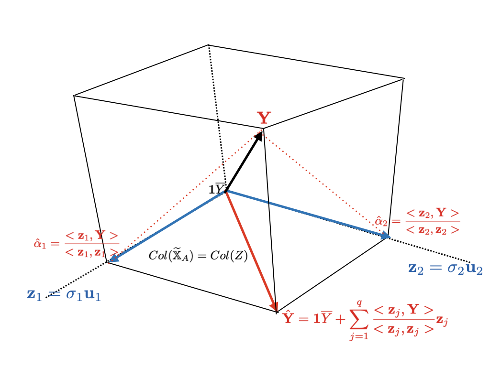
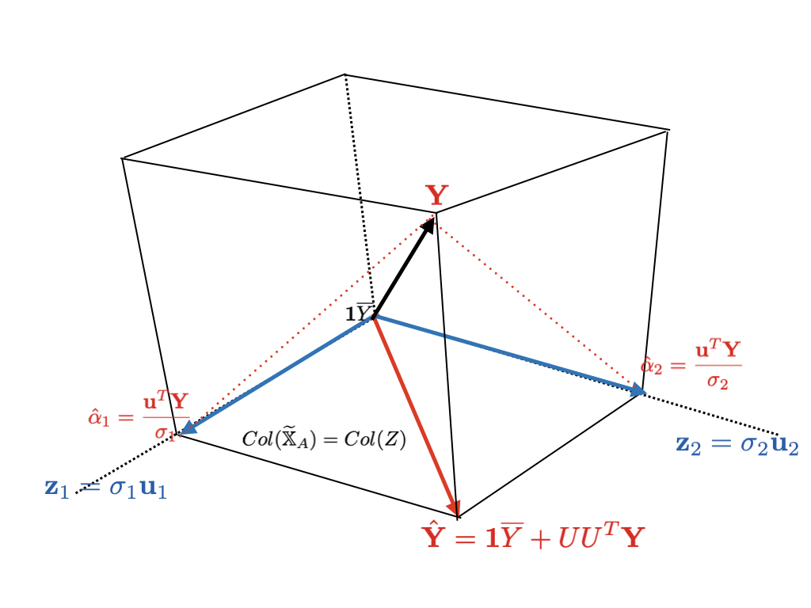
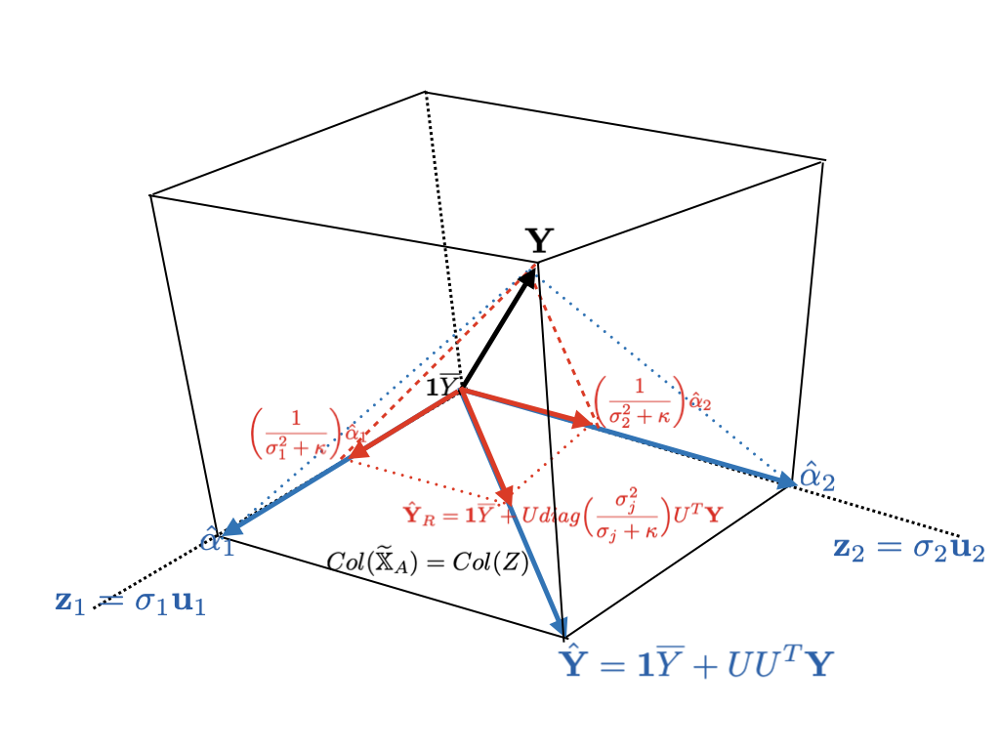

# Multicollinearity {#coll}

## Multicollinearity

See a dataset about equal opportunity in public education.

```{r}
(eeo <- haven::read_sav("data/p228.sav"))
```

In 1965, 70 schools were selected at random. 4 measurements were taken for each school.

- `ACHV`: student achievements, *response variable*
- `FAM`: faculty credentials
- `PEER`: influence of their peer group in the school
- `SCHOOL`: school facilities

[@Chatterjee:2015aa].

```{r}
eeo_fit <- lm(ACHV ~ ., data = eeo)
```

```{definition, colldef, name = "Multicollinearity"}
A set of predictors $\{ X_1, X_2, \ldots, X_p \}$ is said to have \textbf{\textit{multicollinearity}} iff there exist linear or near-linear dependencies among predictors.
```

### Effects of multicollinearity

Consider design matrix

$$X = \begin{bmatrix} \mathbf{1} & \mathbf{x}_1 & \cdots & \mathbf{x}_p \end{bmatrix} \in \R^{n \times (p + 1)}$$

When there exists any linear dependency among the predictors, column vectors of $X$ are *lineary dependent*. Or equivalently, centered columns $\{ \mathbf{x}_1 - \overline{x}_1 \mathbf{1}, \ldots, \mathbf{x}_p - \overline{x}_p \mathbf{1} \}$ are lineary dependent. Then

$$rank(X) < p + 1 \le n$$

i.e. rank deficient. From either Theorem \@ref(thm:fullrank) or \@ref(thm:fullrank2), $X^TX$ can be *singular*. In this case, we cannot get the LSE solution. It is not only the problem of computing but also the variance. Consider *total variance*, sum of every coefficient variance. From Proposition \@ref(prp:multbmoment),

\begin{equation*}
  \begin{split}
    \sum_{j = 0}^p Var(\hat\beta_j) & = trace \Big( Var(\hb) \Big) \\
    & = trace \Big( \sigma^2(X^TX)^{-1} \Big) \\
    & = \sigma^2 trace \Big( (X^TX)^{-1} \Big) \\
    & = \sigma^2 \sum_{j = 0}^p \frac{1}{\kappa_j} \quad \kappa_j := \text{eigenvalues of}\: X^TX = \text{singular values}^2
  \end{split}
\end{equation*}

If $X$ is not of full rank, $X^T X$ is not of full rank. In other words,

$$\exists j : \kappa_j = 0$$

By construction, even one $\kappa_j = 0$ results in

$$\sum_{j = 0}^p Var(\hat\beta_j) = \infty$$

It is found that *linear dependency leads to increasing variance of the estimates*. This variance problem occurs when nearly-linear dependeny situation, of course. So we should detect and remedy this.

## Multicollinearity diagnostics

### Correlation matrix

Multicollinearity leads to unstable regression coefficients. From Equation \@ref(eq:rsqangle), we know that $\hb$ is related to sample correlation between response and predictors. Pairwise correlation gives information about linear relationship between $X_j$.

```{r}
cor(eeo)
```

### Variance inflation factor

```{lemma, varbr}
Consider regression model $j$-th predictor $X_j$ on the remaining $X_k, \: k \neq j$, i.e.

$$X_{ij} = \alpha_0 + \alpha_1 x_{i1} + \cdots + \alpha_{j - 1} x_{i, j - 1} + \alpha_{j + 1} x_{i, j + 1} + \cdots + \alpha_p x_{ip} + \epsilon_i$$

Let $s_{jj} = \sum\limits_{i = 1}^n (x_{ij} - \overline{x}_j)^2$ be corrected sum of squares and let $R_j^2$ be the coefficient of determination. Then

$$Var(\hat\beta_j) = \frac{1}{1 - R_j^2} \frac{\sigma^2}{s_{jj}}, \quad 1 \le j \le p$$
```

```{proof}
Assume $j = 1$ without loss of generality. Write

$$X = \begin{bmatrix} \mathbf{x}_1 & X_B \end{bmatrix}$$

Then we have

\begin{equation}
  X \B = \mathbf{x}_1 \B_{A} + X_{B} \B_{B}
  (\#eq:xabsplit)
\end{equation}

Orthogonalize $\mathbf{x}_1$ by projecting onto $X_B$ as before.

$$\mathbf{x}_{1, \perp} := \mathbf{x}_1 - \Pi_B \mathbf{x}_1$$

where $\Pi_B = X_B (X_B^T X_B)^{-1} X_B^T$. It follows that

\begin{equation*}
  \begin{split}
    X \hb & = \mathbf{x}_1 \hb_1 + X_B \hb_{B} \\
    & = \mathbf{x}_{1, \perp} \hb_1 + X_B \Big( \hb_{B} + (X_B^T X_B)^{-1} X_B^T \mathbf{x}_1 \hb_{1} \Big) \\
    & = \Pi(\mathbf{Y} \mid R(\mathbf{x}_{1, \perp})) + \Pi(\mathbf{Y} \mid R(X_B))
  \end{split}
\end{equation*}

Thus,

$$
\begin{cases}
  \hb_{1, \perp} = (\mathbf{x}_{1, \perp}^T \mathbf{x}_{1, \perp})^{-1} \mathbf{x}_{1, \perp}^T \mathbf{Y} \\
  \hb_B = (X_B^T X_B)^{-1} X_B^T (\mathbf{Y} - \mathbf{x}_1 \hb_{1})
\end{cases}
$$

Note that $\mathbf{x}_{1, \perp}$ is the *residual vector in our previous resgression model* in the statement. By construction,

$$\mathbf{x}_{1, \perp}^T \mathbf{x}_{1, \perp} = SSE$$

Since $SST = s_{11}$,

$$R_{1}^2 = \frac{SST - SSE}{SST} = \frac{s_{11} - \mathbf{x}_{1, \perp}^T \mathbf{x}_{1, \perp}}{s_{11}}$$

Therefore,

\begin{equation}
  \mathbf{x}_{1, \perp}^T \mathbf{x}_{1, \perp} = s_{11} (1 - R_1^2)
  (\#eq:s11r)
\end{equation}

From Equation \@ref(eq:s11r),

$$Var(\hat\beta_1) = \sigma^2(\mathbf{x}_{1, \perp}^T \mathbf{x}_{1, \perp})^{-1} = \frac{\sigma^2}{s_{11}(1 - R_1^2)}$$

One proceeds in a similary way for the other $j$.

\begin{equation}
  \mathbf{x}_{j, \perp}^T \mathbf{x}_{j, \perp} = s_{jj} (1 - R_j^2)
  (\#eq:sjjr)
\end{equation}
```

What does Lemma \@ref(lem:varbr) mean? Recall that in simple linear regression setting,

$$Var(\hat\beta_j) = \frac{\sigma^2}{s_{jj}}$$

When multicollinearity occurs, one term is multiplied so that

\begin{equation}
  Var(\hat\beta_j) = \frac{1}{1 - R_j^2} \frac{\sigma^2}{s_{jj}}
  (\#eq:vifmotif)
\end{equation}


Naturally, we can think of $\frac{1}{1 - R_j^2}$ detecting multicollinearity.

```{definition, vif, name = "Variance inflation factor"}
Let $R_j^2$ be the coefficient of determination that results when $X_j$ is regressed against remaining $X_k, \: k \neq j$. Then the variance inflation factor for $X_j$ is defined by

$$VIF_j := \frac{1}{1 - R_j^2}, \: j = 1, \ldots, p$$
```

From Equation \@ref(eq:vifmotif),

\begin{equation}
  Var(\hat\beta_j) \propto (VIF_j) \sigma^2
  (\#eq:vifprop)
\end{equation}

Variance of $j$-th regression coefficient is proportion to $VIF_j$. The term *variance inflation factor* originated from this fact.

```{corollary, vifcorr}
$VIF_j$ is simple the inflation rate of $Var(\hat\beta_j)$ in comparison with the case where $X_j$ is not correlated with other predictors, i.e.

$$s_{jk} = \sum_{i = 1}^n (x_{ij} - \overline{x}_j)(x_{ik} - \overline{x}_k) = 0 \quad \forall k \neq j$$
```

```{proof}
By definition,

\begin{equation*}
  \begin{split}
    & VIF_j^2 = 1 \\
    & \Leftrightarrow R_j^2 = 0 \\
    & \Leftrightarrow s_{jj} - \mathbf{x}_{j, \perp}^T \mathbf{x}_{j, \perp} = \sum_{i = 1}^n (x_{ij} - \overline{x}_j)^2 - \sum_{i^{\prime} = 1}^n (x_{i^{\prime}j} - \overline{x}_j) (x_{i^{\prime}k} - \overline{x}_k) = 0 \\
    & \Leftrightarrow s_{jk} = \sum_{i^{\prime} = 1}^n (x_{ij} - \overline{x}_j) (x_{ik} - \overline{x}_k) = 0 \quad \forall k \neq j
  \end{split}
\end{equation*}
```

For example, suppose that

$$x_1 \approx c_0 + c_2 x_2 + \cdots + c_p x_p$$

Then

$$R_1^2 \approx 1$$

and so

$$VIF_1 \rightarrow \infty$$

```{remark}
Large $VIF_j$ for one or multiple $j$s indicate multicollinearity.
```

@Rawlings:2006aa and @Chatterjee:2015aa suggest some thresholds with references.

```{conjecture, vifthres1}
If $$VIF_j > 10$$,
then $\beta_j$ would be poorly estimated
```

Note that the *precision of OLS* is measured by its variance. Using the proportionality \@ref(eq:vifprop), let $D^2$ be the *expected squred distance of OLS* estimators [@Chatterjee:2015aa].

$$D^2 = \sigma^2 \sum_{j = 1}^p VIF_j$$

The smaller, the more accurate OLS is.

```{remark}
If predictor variables are orthogonal, then

$$\forall j : VIF_j = 1$$

and so

$$D^2 = p\sigma^2$$
```

Consider the ratio of $D^2$ to orthogonal $D^2$.

$$\frac{\sigma^2 \sum VIF_j}{p \sigma^2} = \frac{1}{p} \sum VIF_j \equiv \overline{VIF}$$

```{definition, vifbar}
Write average of every $VIF_j$ by

$$\overline{VIF} := \frac{1}{p} \sum_{j = 1}^p VIF_j$$
```

$\overline{VIF}$ is not just average. The remark implies that $\overline{VIF}$ estimates the ratio of the true multicollinearity to a model when predictors are uncorrelated. Hence, this can also be used as an criterion of multicollinearity.

```{conjecture, vifthres2}
If $$\overline{VIF} >> 1$$,
then serious multicollinearity might occur.
```

`car` library has a function `vif()`.

```{r}
car::vif(eeo_fit)
```

### Condition number

```{theorem, symeigen}
Let $\Sigma \in \R^{p \times p}$. Then the eigenvalues of $\Sigma$ are all real.
```

```{proof}
Let

$$\Sigma \mathbf{x} = \lambda \mathbf{x}$$

Then

$$\mathbf{x}^T \Sigma \mathbf{x} = \lambda \mathbf{x}^T \mathbf{x} = \lambda \lVert \mathbf{x} \rVert^2$$

Write $\alpha := \mathbf{x}^T \Sigma \mathbf{x}$. 

Claim: $\alpha \in \R$

Since $\mathbf{x} \in \R^p$ and $\Sigma \in \R^{p \times p}$, i.e. real matrix, it is obvious that $\alpha$ is real.

Since $\lVert \mathbf{x} \rVert^2 \neq 0$,

$$\lambda = \frac{\alpha}{\lVert \mathbf{x} \rVert^2}$$

is also a real number.
```

```{theorem, xtxeigen}
Let $X \in \R^{n \times p}$. Then the eigenvalues of $X^T X$ are all non-negative real number.
```

```{proof}
Since $X \in \R^{n \times p}$, $X^T X \in \R^{n \times n}$ and is symmetric. Let

$$(X^T X) \B = \lambda \B, \quad \B \neq \mathbf{0}$$

Since $X^T X$ is symmetric, every $\lambda \in \R$.

\begin{equation*}
  \begin{split}
    \lVert X \B \rVert^2 & = (X \B)^T (X \B) \\
    & = \B^T X^T X \B \\
    & = \lambda \B^T \B \qquad X^T X \B = \lambda \B \\
    & = \lambda \lVert \B \rVert^2
  \end{split}
\end{equation*}

Hence,

\begin{equation}
  \lambda = \frac{\lVert X \B \rVert^2}{\lVert \B \rVert^2} \ge 0
  (\#eq:nonegeigen)
\end{equation}
```

From Theorem \@ref(thm:xtxeigen), let

$$\lambda_1 \ge \lambda_2 \ge \cdots \ge \lambda_{p + 1} \ge 0$$

be eigenvalues of $X^T X$. Then we have

$$\lambda_{p + 1} > 0$$

guarantees existence of $(X^T X)^{-1}$. Reversely,

$$\lambda_{p + 1} \approx 0$$

results in nearly-non-invertibility.

```{definition, kondition, name = "Condition number"}
Let $\lambda_1 \ge \lambda_2 \ge \cdots \ge \lambda_{p + 1} \ge 0$ be eigenvalues of $X^T X$. Then \textbf{\textit{Condition number}} of $X^T X$ is defined by

$$\kappa := \frac{\lambda_1}{\lambda_{p + 1}} = \frac{(\text{maximal eigenvalue of} \: X^TX)}{(\text{minimal eigenvalue of} \: X^TX)}$$
```

Some textbooks such as @Chatterjee:2015aa define this measure additional square root, i.e. singular values of $X$. Since how large is important, it does not matter much. $\kappa$ measures *how small minimal eigenvalue compared to maximal eigenvalue*. This means spread of the eigenvalue spectrum of $X^T X$.

```{conjecture, kappathres}
The larger $\kappa$, the more serious multicollinearity is. ($\lambda_{p + 1} \approx 0 \Rightarrow \kappa \rightarrow \infty$)

\begin{enumerate}
  \item Weak dependence $\kappa \approx 100$
  \item Moderate to strong $100 \le \kappa \le 1000$
  \item Severe $\kappa \ge 1000$
\end{enumerate}
```

There is a base function called `kappa()` calculating the condition number of a `matrix`. Since this function has a `S3` method for `lm`, we can just provide `lm` object to get $\kappa$ of our model.

```{r}
kappa(eeo_fit)
```


## Principal Component Analysis

Multicollinearity violates the assumption of OLS model. This makes the estimator unstable - large variance. Sometimes we cannot even get the solution. In a linear regression frame, there exist some alternative to OLS dealing with large variance. Here we present two methods.

1. **Principal component regression**: By construction, principal components are uncorrelated.
2. Shrinkage methods: **Ridge regression** enables least squres get the solution and shrinks its variance.

Before looking at principal component analysis (PCA), we see some preliminary matrix algebra theorems: spectral decomposition and singular value decomposition.

### Spectral decomposition

```{theorem, specdecomp, name = "Spectral Decomposition"}
If $A \in \R^{p \times p}$ is a real symmetric matrix, then $A$ is diagonalizable as

$$A = P \Lambda P^T$$

where

$$
P = \begin{bmatrix}
  \mathbf{v}_1 & \mathbf{v}_2 & \cdots & \mathbf{v}_p
\end{bmatrix} = \begin{bmatrix}
  v_{11} & \cdots & v_{1p} \\
  \vdots & \cdots & \vdots \\
  v_{p1} & \cdots & v_{pp}
\end{bmatrix} \: \text{orthogonal}
$$

and

$$\Lambda = diag(\lambda_1, \ldots, \lambda_p)$$

with eigenvalue and corresponding orthonormal eigenvector of $A$ $(\lambda_j, \mathbf{v}_j), \: j = 1, \ldots, p$.
```

The theorem satisfies when a matrix is *symmetric*. For example, covariance matrix or correlation matrix.

```{r}
(spec_exm <- cov(eeo) %>% eigen())
```

`$values` are eigenvalues. $\Lambda$ is a diagonal matrix with these elements.

```{r}
diag(spec_exm$values)
```

`$vectors` is $P$ whose column vectors are corresponding orthonormal eigenvectors to `$values`. We can check the theory in the eye.

```{r}
near(spec_exm$vectors %*% diag(spec_exm$values) %*% t(spec_exm$vectors), cov(eeo))
```

The matrix decomposition can also be expressed as following corollary.

```{corollary, specdecomp2}
If $A \in \R^{p \times p}$ is a real symmetric matrix, then

$$A = \lambda_1 \mathbf{v}_1 \mathbf{v}_1^T + \cdots + \lambda_p \mathbf{v}_p \mathbf{v}_p^T$$

where each $(\lambda_j, \mathbf{v}_j)$ is defined as in Theorem \@ref(thm:specdecomp).
```

Spectral decomposition $A = P \Lambda P^T$ gives some useful facts to $A$.

```{proposition, specprop, name = "Properties of spectral decomposition"}
Let $A \in \R^{p \times p}$ be a real symmetric matrix. Then $A = P \Lambda P^T$.

\begin{itemize}
  \item $PP^T = P^T P = I$ so that $P^{-1} = P^T$
  \item $A^{-1} = P \Lambda^{-1} P^T$ with $\Lambda = diag \Big(\frac{1}{\lambda_1}, \ldots, \frac{1}{\lambda_p} \Big)$
  \item $A^k = P \Lambda^k P^T$ with $\Lambda = diag(\lambda_1^k, \ldots, \lambda_p^k)$
\end{itemize}
```

```{proof}
Since eigenvectors are orthonormalized, $P$ is orthogonal.

$$A^{-1} = (P^T)^{-1} \Lambda^{-1} P^{-1} = P \Lambda^{-1} P^T$$

$$A^k = (P \Lambda \underset{= I}{\underline{P^T) (P}} \Lambda P^T) \cdots (P \Lambda \underset{= I}{\underline{P^T) (P}} \Lambda P^T) = P \Lambda^k P^T$$

Recall that $\Lambda$ is diagonal.
```

Collaborating with quadrating form, spectral decomposition can give a geometric meaning.

```{theorem, pat, name = "Principal Axes Theorem"}
If $A \in \R^{p \times p}$ is a real symmetric matrix, then

$$\exists \: \text{change of variables} \: \mathbf{u} = P^T \mathbf{X} \quad\text{such that} \quad \mathbf{X}^T A \mathbf{X} = \mathbf{u}^T \Lambda \mathbf{u}$$

where $\Lambda$ is a diagonal matrix.
```

```{proof}
Spectral decomposition \@ref(thm:specdecomp) implies that

$$P^T AP = \Lambda$$

Then

$$\mathbf{X}^T A \mathbf{X} = \mathbf{u}^T P^T A P \mathbf{u} = \mathbf{u}^T \Lambda \mathbf{u}$$
```

```{corollary, pat2}
If $A \in \R^{p \times p}$ is a real symmetric matrix, then there exists a change of variables $\mathbf{u} = P^T \mathbf{X}$ s.t.

$$\mathbf{X}^T A \mathbf{X} = \lambda_1 (\mathbf{v}_1^T \mathbf{X})^2 + \cdots + \lambda_p (\mathbf{v}_p^T \mathbf{X})^2$$
```

Above Theorem \@ref(thm:pat) and Corollary \@ref(cor:pat2) is linearly transforming its coordinates of conic section. The directions of coordinate are $\mathbf{v}_j$, orthonormal eigenvectors. Axes are determined by corresponding egenvalues.

### Singular value decomposition

Let $X \in \R^{n \times (p + 1)}$ be any real matrix. Note that by Theorem \@ref(thm:xtxeigen), every eigenvalue of $X^T X$ is non-negative real number. Then we can compute its square root.

```{definition, sv, name = "Singular values of a real matrix"}
Let $X \in \R^{n \times (p + 1)}$ be any real matrix and let $\lambda_j$ be eigenvalues of $X^T X$, $j = 1, \ldots, p + 1$. Then signular values of $X$ is

$$\sigma_j := \sqrt{\lambda_j}, \quad j = 1, \ldots, p + 1$$
```

Singular value decomposition decomposes any matrix $X$ into

$$X = UDV^T$$

$D$ is a diagonal matrix which consists of singular values. There are several types of SVD according to shape of $D$. One is *full SVD* and the other is *reduced SVD*. In general, the latter is frequently used in regression literature. First, in full SVD, $D$ has same dimension as $X$ [@Leon:2014aa].

```{theorem, fullsvd, name = "Full SVD"}
If $X \in \R^{n \times (p + 1)}$ be any real matrix, then $X$ has a full SVD

$$X = UDV^T$$ with

$$
D = \left[\begin{array}{ccc|ccc}
  \sigma_1 & 0 & 0 & 0 & \cdots & 0 \\
  0 & \sigma_2 & 0 & 0 & \cdots & 0 \\
  \vdots & \vdots & \vdots & \vdots & \vdots & \vdots \\
  0 & \cdots & \sigma_{p + 1}& 0 & \cdots & 0 \\ \hline
  0 & \cdots & 0 & 0 & \cdots & 0 \\
  \vdots & \vdots & \vdots & \vdots & \vdots & \vdots \\
  0 & \cdots & 0 & 0 & \cdots & 0
\end{array}\right] \in \R^{n \times (p + 1)}
$$

where

$$\sigma_1 \ge \sigma \ge \cdots \ge \sigma_{p + 1} \ge 0$$

are singular values of $X$, $U \in \R^{n \times n}$ orthogonal, and $V \in \R^{(p + 1) \times (p + 1)}$ also orthogonal.
```

Other $U$ and $V$ is not unique.

```{theorem, fullsvd2}
Let $X \in \R^{n \times (p + 1)}$ be any real matrix and let $\sigma_1 \ge \sigma \ge \cdots \ge \sigma_{p + 1} \ge 0$ be its singular values. Suppose that

$$\sigma_1 \ge \sigma \ge \cdots \ge \sigma_r > 0$$

with $r \le p + 1$. If

$$
U = \left[\begin{array}{ccc|ccc}
  \mathbf{u}_1 & \cdots & \mathbf{u}_r & \mathbf{u}_{r + 1} & \cdots & \mathbf{u}_n
\end{array}\right]
$$

where

\begin{itemize}
  \item $\{ \mathbf{u}_1, \ldots, \mathbf{u}_r \}$ is an orthonormal basis for $R(X)$
  \item $\{ \mathbf{u}_{r + 1}, \ldots, \mathbf{u}_n \}$ is an orthonormal basis for $N(X^T) = R(X)^{\perp}$
  \item Thus, $U = [ \cdots \mid \cdots ]$ is orthogonal
\end{itemize}

$$
V = \left[\begin{array}{ccc|ccc}
  \mathbf{v}_1 & \cdots & \mathbf{v}_r & \mathbf{v}_{r + 1} & \cdots & \mathbf{v}_{p + 1}
\end{array}\right]
$$

where

\begin{itemize}
  \item $\{ \mathbf{v}_1, \ldots, \mathbf{v}_r \}$ is an orthonormal eigenvectors of $X^T X$, which in fact is orthonormal basis for $Row(X)$
  \item $\{ \mathbf{v}_{r + 1}, \ldots, \mathbf{v}_{p + 1} \}$ is an orthonormal eigenvectors of $X^T X$ belonging to $\lambda = 0$, which is orthonormal basis for $N(X) = Row(X)^{\perp}$
  \item Thus, $V = [ \cdots \mid \cdots ]$ is orthogonal
\end{itemize}

then

$$X = UDV^T$$
```

From the equation, it is easy to get

\begin{equation}
  XV = UD
  (\#eq:svdiag)
\end{equation}

From this equation, we call each $\mathbf{v}_j$ and $\mathbf{u}_j$ *right singular vector* and *left singular vector*. Next, we see reduced SVD. This uses left upper block of $D$, i.e. it has dimension of $(p + 1) \times (p + 1)$.

```{theorem, redsvd, name = "Reduced SVD"}
If $X \in \R^{n \times (p + 1)}$ be any real matrix, then $X$ has a reduced SVD

$$X = UDV^T$$ with

$$D = diag(\sigma_1, \sigma_2, \ldots, \sigma_{p + 1}) \in \R^{(p + 1) \times (p + 1)}$$

where

$$\sigma_1 \ge \sigma \ge \cdots \ge \sigma_{p + 1} \ge 0$$

are singular values of $X$, $U \in \R^{n \times (p + 1)}$ orthogonal, and $V \in \R^{(p + 1) \times (p + 1)}$ also orthogonal.
```

Since $D$ is diagonal matrix, $U$ has different dimension with previous SVD.

```{theorem, redsvd2}
Let $X \in \R^{n \times (p + 1)}$ be any real matrix and let $\sigma_1 \ge \sigma \ge \cdots \ge \sigma_{p + 1} \ge 0$ be its singular values. Suppose that

$$\sigma_1 \ge \sigma \ge \cdots \ge \sigma_r > 0$$

with $r \le p + 1$. If

$$
U = \left[\begin{array}{ccc|ccc}
  \mathbf{u}_1 & \cdots & \mathbf{u}_r & \mathbf{u}_{r + 1} & \cdots & \mathbf{u}_n
\end{array}\right]
$$

where

\begin{itemize}
  \item $\{ \mathbf{u}_1, \ldots, \mathbf{u}_r \}$ is an orthonormal basis for $R(X)$
  \item $\{ \mathbf{u}_{r + 1}, \ldots, \mathbf{u}_{p + 1} \}$ is an orthonormal basis for $N(X^T) = R(X)^{\perp}$
  \item Thus, $U = [ \cdots \mid \cdots ]$ is orthogonal
\end{itemize}

$$
V = \left[\begin{array}{ccc|ccc}
  \mathbf{v}_1 & \cdots & \mathbf{v}_r & \mathbf{v}_{r + 1} & \cdots & \mathbf{v}_{p + 1}
\end{array}\right]
$$

where

\begin{itemize}
  \item $\{ \mathbf{v}_1, \ldots, \mathbf{v}_r \}$ is an orthonormal eigenvectors of $X^T X$, which in fact is orthonormal basis for $Row(X)$
  \item $\{ \mathbf{v}_{r + 1}, \ldots, \mathbf{v}_{p + 1} \}$ is an orthonormal eigenvectors of $X^T X$ belonging to $\lambda = 0$, which is orthonormal basis for $N(X) = Row(X)^{\perp}$
  \item Thus, $V = [ \cdots \mid \cdots ]$ is orthogonal
\end{itemize}

then

$$X = UDV^T$$
```

In `R`, `svd()` produces this form of decomposition by default.

```{r}
svd(eeo)
```

Let $X = UDV^T$. Then for every $\mathbf{b} \in \R^{p + 1}$,

$$X \mathbf{b} = UDV^T \mathbf{b}$$

Each $V$, $D$, and $U$ linearly transform $\mathbf{b}$. How? For reproducibility, think about a circle.

```{r, include=FALSE}
gen_circle <- function(cen = c(0, 0), radius = 1, npoints = 100) {
  # idx <- seq(0, 2 * pi, length.out = npoints)
  # x <- cen[1] + radius * cos(idx)
  # y <- cen[2] + radius * sin(idx)
  circle <- 
    tibble(idx = seq(0, 2 * pi, length.out = npoints)) %>% 
    mutate_all(.funs = list(x = ~cos(.) + cen[1], y = ~sin(.) + cen[2])) %>% 
    select(x, y)
  rad1 <- 
    tibble(
      x = seq(cen[1], cen[1] + radius, length.out = npoints / 2),
      y = 0
    )
  rad2 <- 
    tibble(
      x = 0,
      y = seq(cen[2], cen[2] + radius, length.out = npoints / 2)
    )
  circle %>% 
    bind_rows(rad1, rad2)
}
#-------------------------
draw_circle <- function(data, mapping = aes()) {
  data %>% 
    ggplot(mapping = mapping) +
    geom_path() +
    coord_fixed() +
    labs(
      x = expression(b[1]),
      y = expression(b[2])
    )
}
#------------------------
circ_dat <- gen_circle()
u_exm <- svd(circ_dat)$u
d_exm <- diag(svd(circ_dat)$d)
v_exm <- svd(circ_dat)$v
dimnames(u_exm) <- list(paste0("V", 1:200), c("x", "y"))
dimnames(d_exm) <- list(c("x", "y"), c("x", "y"))
dimnames(v_exm) <- list(c("x", "y"), c("x", "y"))
```

```{r circle1, warning=FALSE, echo=FALSE, fig.cap="A circle with radius 1"}
circ_dat %>% 
  draw_circle(aes(x, y))
```

Now consider linear transformation

$$V^T \mathbf{b}$$

```{r circle2, warning=FALSE, echo=FALSE, fig.cap="$V^T \\mathbf{b}$"}
as.matrix(circ_dat) %*% v_exm %>% 
  as_tibble() %>% 
  draw_circle(aes(x, y))
```

In Figure \@ref(fig:circle2), we can see that $V$ maintains length and angle, but just rotate axes. Next,

$$D (V^T \mathbf{b})$$

```{r circle3, warning=FALSE, echo=FALSE, fig.cap="$D(V^T\\mathbf{b})$"}
as.matrix(circ_dat) %*% v_exm %*% t(d_exm) %>% 
  as_tibble() %>% 
  draw_circle(aes(x, y))
```

In Figure \@ref(fig:circle3), length has changed. In fact, angle has also changed a little bit while rotating. Finally,

$$U (DV^T \mathbf{b})$$

```{r circle4, warning=FALSE, echo=FALSE, fig.cap="$U(DV^T\\mathbf{b})$"}
as.matrix(circ_dat) %*% v_exm %*% t(d_exm) %*% t(u_exm) %>% 
  as_tibble() %>% 
  draw_circle(aes(V1, V2))
```

Figure \@ref(fig:circle4) is the final result of SVD. Coordinate is rotated each.

### OLS via SVD {#olssvd}

Using reduced SVD \@ref(thm:redsvd2), it is possible to solve OLS problem [@Hastie:2013aa]. Before applying it, consider centered input. Write

$$X = [ \mathbf{1} \mid \mathbb{X}_A ]$$

as before.

```{lemma, centering, name = "Centered input"}
Let

$$\widetilde{\mathbb{X}_A} = \Big[ x_{ij} - \overline{x}_j \Big]$$

be centered design matrix and let

$$\mathbb{X}_{A, \perp} = \mathbb{X}_A - \Pi_{\mathbf{1}} \mathbb{X}_A$$

be an projection of predictor variable observations into $R(\mathbf{1})$. Two are equivalent, i.e.

$$\widetilde{\mathbb{X}_A} = \mathbb{X}_{A, \perp}$$
```

```{proof}
Note that

$$\Pi_{\mathbf{1}} = \frac{1}{n} \mathbf{1}\mathbf{1}^T$$

Then

$$
\Pi_1 \mathbb{X}_A = \frac{1}{n} \mathbf{1}\mathbf{1}^T X = \begin{bmatrix}
  \overline{x}_1 & \overline{x}_2 & \cdots & \overline{x}_p \\
  \overline{x}_1 & \overline{x}_2 & \cdots & \overline{x}_p \\
  \vdots & \vdots & \cdots & \vdots \\
  \overline{x}_1 & \overline{x}_2 & \cdots & \overline{x}_p
\end{bmatrix}
$$

where $\overline{x}_j$ is the sample average for observations of $j$-th variable. It follows that

$$
\mathbb{X}_A - \Pi_1 \mathbb{X}_A= \begin{bmatrix}
  x_{11} - \overline{x}_1 & x_{12} - \overline{x}_2 & \cdots & x_{1p} - \overline{x}_p \\
  x_{21} - \overline{x}_1 & x_{22} - \overline{x}_2 & \cdots & x_{2p} - \overline{x}_p \\
  \vdots & \vdots & \cdots & \vdots \\
  x_{n1} - \overline{x}_1 & x_{n2} - \overline{x}_2 & \cdots & x_{np} - \overline{x}_p
\end{bmatrix} = \widetilde{\mathbb{X}_A}
$$
```

Note that

$$\mathbf{1} \perp \mathbb{X}_{A, \perp} = \widetilde{\mathbb{X}_A}$$

Then

\begin{equation*}
  \begin{split}
    X \hb & = \mathbf{1} \hat\beta_0^{\ast} + \widetilde{\mathbb{X}_A} \hb_{A} \\
    & = \Pi(\mathbf{Y} \mid R(\mathbf{1})) + \Pi(\mathbf{Y} \mid R(\widetilde{\mathbb{X}_A}))
  \end{split}
\end{equation*}

Hence,

$$
\begin{cases}
  \hat\beta_0^{\ast} = \overline{Y} \\
  \hb_{A} = (\widetilde{\mathbb{X}_A}^T\widetilde{\mathbb{X}_A})^{-1}\widetilde{\mathbb{X}_A}^T\mathbf{Y}
\end{cases}
$$

Since the intercept is estimated as response average, we only need to care about input part from now on. Apply SVD to $\widetilde{\mathbb{X}_A}$.

$$\widetilde{\mathbb{X}_A} = UDV^T$$

Then the LSE becomes

\begin{equation}
  \begin{split}
    \hb_{A} & = (\widetilde{\mathbb{X}_A}^T\widetilde{\mathbb{X}_A})^{-1}\widetilde{\mathbb{X}_A}^T\mathbf{Y} \\
    & = (VD^2 V^T)^{-1} VDU^T \mathbf{Y} \\
    & = VD^{-1} U^T \mathbf{Y} \\
    & = V diag\Big( \frac{1}{\sigma_j} \Big) U^T \mathbf{Y}
  \end{split}
  (\#eq:svdlse)
\end{equation}

This implies that rank deficiency, i.e. existence of $\sigma_j = 0$, makes OLS not properly work. In turn, fitted values can be computed in a compact form. Suppose that $\sigma_j \neq 0$.

\begin{equation}
  \begin{split}
    \hat{\mathbf{Y}} & = \mathbf{1} \overline{Y} + \widetilde{\mathbb{X}_A} \hb_{A} \\
    & = \mathbf{1} \overline{Y} + UDV^T VD^{-1} U^T \mathbf{Y} \\
    & = \mathbf{1} \overline{Y} + UDD^{-1} U^T \mathbf{Y} \\
    & = \mathbf{1} \overline{Y} + U U^T \mathbf{Y}
  \end{split}
  (\#eq:svdfit)
\end{equation}

Here, $U^T \mathbf{Y}$ are the coordinates of $\mathbf{Y}$ with respect to the orthonormal basis $U$, i.e. of $Col(X)$. For more details, rewrite the Equation \@ref(eq:svdfit). If $\sigma_j \neq 0$, then

$$\hat{\mathbf{Y}} = U U^T \mathbf{Y} = \sum_{j = 1}^p \mathbf{u}_j \mathbf{u}^T \mathbf{Y}$$

Each $\mathbf{u_j}$ indicating basis of $Col(X)$ is a coordinate. In other words, we can think of SVD as another orthogonalization process with QR decomposition in estimating regression model. The fitted value, which is projection onto $Col(X)$ and $\hat\theta_j = \mathbf{u}^T \mathbf{Y}$ are corresponding coordinates of $\mathbf{Y}$. Summing every $\hat\theta_j$, we can get the fitted value.

Compare this with QR decomposition

$$\hat{\mathbf{Y}} = Q Q^T \mathbf{Y}$$

whose orthonormal basis is $Q$. Observe that $Q$ and $U$ are generally different orthonormal bases for $Col(X)$ [@Hastie:2013aa].

### Principal component analysis

Principal component analysis (PCA) finds a set of $p$ orthogonal variables made by linear combination of original variables. Furthermore, we try to reduce the dimension $M < p$. It is called *dimension reduction* method. For instance, scatterplot needs at most two or three dimension. PCA enables us to visualize more easily. Since we remove some elements, we should preserve information of the data as much as possible. What are the information of data? How to preserve them?

```{r varinf, echo=FALSE, fig.cap="Summarizing the features"}
tibble(
  x = runif(100),
  y = rnorm(100, sd = 5)
) %>% 
  gg_scatter(aes(x, y)) +
  xlim(c(-10, 10)) +
  labs(
    x = expression(x[1]),
    y = expression(x[2])
  )
```

See Figure \@ref(fig:varinf). With $X_1 = x_{i1}$, it is hard to distinguish the observations.

```{conjecture, varinf2}
Small variance of a variable implies small information about the data.
```

Thus, we try to find the direction having the largest variance. For consistency, here we also use centered predictors. Let $\mathbf{X} = (X_1, \ldots, X_p)^T$ be a random vector with a mean $\boldsymbol\mu = (\mu_1, \ldots, \mu_p)^T$ and a variance $\Sigma$. Then $\widetilde{\mathbf{X}} = (X_1 - \mu_1, \ldots, X_p - \mu_p)^T$ has a mean $\mathbf{0}$ and a variance $\Sigma$.

```{definition, poppca, name = "Population principal components"}
Consider $\widetilde{\mathbf{X}}$. $Z_1, \ldots, Z_p$ are said to be \textbf{\textit{principal components}} of $\widetilde{\mathbf{X}}$ iff

\begin{enumerate}
  \item First PC $Z_1 = \argmax\limits_{\mathbf{a}_1^T \widetilde{\mathbf{X}}} \mathbf{a}_1^T \Sigma \mathbf{a}_1$ subject to $\mathbf{a}_1^T \mathbf{a}_1 = 1$
  \item Second PC $Z_2 = \argmax\limits_{\mathbf{a}_2^T \widetilde{\mathbf{X}}} \mathbf{a}_2^T \Sigma \mathbf{a}_2$ subject to $\mathbf{a}_2^T \mathbf{a}_2 = 1$ and $\mathbf{a}_2^T \mathbf{a}_1 = 0$
  \item $\vdots$
  \item Last PC $Z_p = \argmax\limits_{\mathbf{a}_p^T \widetilde{\mathbf{X}}} \mathbf{a}_p^T \Sigma \mathbf{a}_1$ subject to $\mathbf{a}_p^T \mathbf{a}_p = 1$ and $\forall k < p : \mathbf{a}_p^T \mathbf{a}_k = 0$
\end{enumerate}
```

By construction, PCA aims to finding uncorrelated set of linear combinations. How to find the solution $\mathbf{a}_j = (a_{1j}, \ldots, a_{pj})^T$? It can be shown that *Spectral decomposition* of $\Sigma$ gives it [@Johnson:2013aa].

```{theorem, poppcasol, name = "Population PC with covariance"}
Continuing the PCA of $\widetilde{\mathbf{X}}$, let

$$\lambda_1 \ge \cdots \ge \lambda_p \ge 0$$

be the eigenvalues of $\Sigma$, and let $\mathbf{v}_1, \ldots, \mathbf{v}_p$ be the corresponding orthonormal eigenvectors. Then each $j$-th principal components is computed by

$$Z_j = \mathbf{v}_j \widetilde{\mathbf{X}}$$ with

$$
\begin{cases}
  Var(Z_j) = \lambda_j \\
  \forall j \neq k : Cov(Z_j, Z_k) = 0
\end{cases}
$$
```

```{proof}
Note that covariance matrix $\Sigma$ is symmetric. Then by spectral decomposition,

$$\Sigma = P \Lambda P^T$$

where $P = \begin{bmatrix} \mathbf{v}_1 & \cdots & \mathbf{v}_p \end{bmatrix} \in \R^{p \times p}$ and $\Lambda = diag(\lambda_1, \ldots, \lambda_p) \in \R^{p \times p}$

Step 1: First PC

Let $\mathbf{a} \in \R^p$. Then

\begin{equation*}
  \begin{split}
    Var(\mathbf{a}^T \widetilde{\mathbf{X}}) & = \mathbf{a}^T \Sigma \mathbf{a} \\
    & = \mathbf{a}^T P\Lambda P^T \mathbf{a} \\
    & = \mathbf{b}^T \Lambda \mathbf{b} \quad \leftarrow \text{Set}\: \mathbf{b} := \mathbf{a}^T P \\
    & = \lambda_1 b_1^2 + \cdots + \lambda_p b_p^2 \\
    & {\color{red}{\le}} \:\: \lambda_1 (b_1^2 + \cdots + b_p^2) \quad \because \lambda_1 \ge \lambda_2, \ldots, \lambda_p \\
    & = \lambda_1 \mathbf{b}^T \mathbf{b} \\
    & = \lambda_1 \mathbf{a}^T P P^T \mathbf{a} \\
    & = \lambda_1 \mathbf{a}^T \mathbf{a} \\
    & = \lambda_1 \quad \because \text{construction}
  \end{split}
\end{equation*}

Thus, $\lambda_1$ is the upper bound of $Var(\mathbf{a}^T \widetilde{\mathbf{X}})$ subject to $\mathbf{a}^T \mathbf{a} = 1$.

Claim: $\mathbf{a} = \mathbf{v}_1$

This is quite trivial. Set $\mathbf{a} = \mathbf{v}_1$. Then

$$\mathbf{v}_1^T \Sigma \mathbf{v}_1 = \lambda_1 \mathbf{v}_1^T\mathbf{v}_1 = \lambda_1$$

Hence,

$$Z_1 = \mathbf{v}_1 \widetilde{\mathbf{X}}$$

with $Var(Z_1) = \lambda_1$.

Step 2: Find $\mathbf{a}_2 = \argmax\limits_{\mathbf{a} \in \R^p} \mathbf{a}_2^T \Sigma \mathbf{a}_2$ subject to $\mathbf{a}_2^T \mathbf{a}_2 = 1$ and $\mathbf{a}_2^T \Sigma \mathbf{v}_1 = 0$

Assume that $\mathbf{a}_2^T \mathbf{a}_2 = 1$ and that $\mathbf{a}_2 \perp \mathbf{v}_2$. Since $\{ \mathbf{v}_1, \mathbf{v}_2, \ldots, \mathbf{v}_p \}$ is an orthonormal basis of $\R^p$,

$$\mathbf{a}_2 \in \{ \mathbf{v}_2, \ldots, \mathbf{v}_p \}$$

Then we now have

\begin{equation*}
  \begin{split}
    \mathbf{a}_2^T \Sigma \mathbf{a}_2 & = \lambda_j \quad \text{for some}\: j \in \{ 2, \ldots, p \} \\
    & \le \lambda_2 \quad \because \lambda_2 \ge \lambda_3, \ldots, \lambda_p
  \end{split}
\end{equation*}

By symmetry, we can get the upper bound $\lambda_2$ at $\mathbf{a}_2 = \mathbf{v}_2$. Therefore,

$$Z_2 = \mathbf{v}_2^T \widetilde{\mathbf{X}}$$

with $Var(Z_2) = \lambda_2$. In addition,

$$Cov(Z_2, Z_1) = \mathbf{v}_2^T \Sigma \mathbf{v}_1 = \lambda_1 \mathbf{v}_2^T \mathbf{v}_1 = 0$$

One proceeds in a similar way for the next $j = 3, \ldots, p$. Since

$$\mathbf{a}^T \Sigma \mathbf{a} \le \lambda_j$$

in each step,

$$Z_j = \mathbf{v}_j^T \widetilde{\mathbf{X}}$$

, $Var(Z_j) = \lambda_j$, and $Cov(Z_j, Z_k)$ for every $k < j$.
```

Using Principal axes theorem \@ref(thm:pat), we can understand this covariance PCA better. Recall that a gaussian random variable $\mathbf{X} \sim MVN(\boldsymbol\mu, \Sigma)$ can be represented by ellipse $\widetilde{\mathbf{X}}^T \Sigma^{-1} \widetilde{\mathbf{X}} = c^2$.

```{r mvnellips, echo=FALSE, fig.cap="Ellipse for some bivariate normal distribution"}
sig_exm <- matrix(c(.1, .2, .2, 1), nrow = 2)
mvn_ellip <- 
  ellipse::ellipse(x = solve(sig_exm)) %>% 
  as_tibble()
mvn_p <- eigen(sig_exm)$vectors
mvn_lam <- diag(eigen(sig_exm)$values)
dimnames(mvn_p) <- list(c("x", "y"), c("x", "y"))
dimnames(mvn_lam) <- list(c("x", "y"), c("x", "y"))
#------------
mvn_ellip %>% 
  ggplot(aes(x, y)) +
  geom_path() +
  geom_segment(
    data = mvn_p %>% t() %>% as_tibble(),
    aes(x = 0, y = 0, xend = x, yend = y),
    arrow = arrow(length = unit(.1, "inches"))
  ) +
  labs(
    x = expression(tilde(x)[1]),
    y = expression(tilde(x)[2])
  ) +
  coord_fixed()
```

From Corollary \@ref(cor:pat2),

\begin{equation}
  \begin{split}
    c^2 & = \widetilde{\mathbf{X}}^T \Sigma^{-1} \widetilde{\mathbf{X}} \\
    & = \frac{1}{\lambda_1} (\mathbf{v}_1 \widetilde{\mathbf{X}})^2 + \cdots + \frac{1}{\lambda_p} (\mathbf{v}_p \widetilde{\mathbf{X}})^2 \\
    & = \frac{1}{\lambda_1} Z_1^2 + \cdots + \frac{1}{\lambda_p} Z_p^2 \quad \leftarrow Z_j = j \text{-th }\: PC
  \end{split}
  (\#eq:patpca)
\end{equation}

Hence, PCA is a linear transformation of coordinate

$$V^T \widetilde{\mathbf{X}}$$

```{r mvnellips2, echo=FALSE, fig.cap="Ellipse with respect to principal components"}
mvn_pca <- 
  as.matrix(mvn_ellip) %*% mvn_p %>% 
  as_tibble() %>% 
  rename(x = x, y = y) %>% 
  mutate(pca = TRUE)
mvn_ellip %>% 
  mutate(pca = FALSE) %>% 
  bind_rows(mvn_pca) %>% 
  ggplot(aes(x, y, colour = pca)) +
  geom_path() +
  geom_segment(
    data = mvn_p %>% t() %>% as_tibble(),
    aes(x = 0, y = 0, xend = x, yend = y),
    arrow = arrow(length = unit(.1, "inches")),
    inherit.aes = FALSE,
    col = gg_hcl(1)
  ) +
  geom_segment(
    data = mvn_lam %>% t() %>% as_tibble(),
    aes(x = 0, y = 0, xend = x, yend = y),
    arrow = arrow(length = unit(.1, "inches")),
    inherit.aes = FALSE,
    col = gg_hcl(2)[2]
  ) +
  labs(
    x = expression(tilde(x)[1]),
    y = expression(tilde(x)[2])
  ) +
  coord_fixed()
```

### Sample principal components

Our aim is to find principal components given observed sample. In this case,

$$\widetilde{X} = [x_{ij} - \overline{x}_j] \in \R^{n \times p}$$

```{remark, name = "Sample covariance matrix"}
For centered input $\widetilde{X}$, empirical covariance matrix is given by

$$S = \frac{1}{n - 1} \widetilde{X}^T \widetilde{X} = \bigg[ \frac{1}{n - 1} \sum_{i = 1}^n (x_{ij} - \overline{x}_j)(x_{ik} - \overline{x}_k) \bigg]_{j \times k} \in \R^{p \times p}$$
```

Conduct the spectral decomposition for $S$, i.e.

$$S = P\Lambda P^T$$

where

$$
\Lambda = diag(\lambda_1, \ldots, \lambda_p) \qquad \text{and} \qquad P = \begin{bmatrix}
  \mathbf{v}_1 & \cdots & \mathbf{v}_p
\end{bmatrix}
$$

with eigenvalue-orthonormal eigenvector pair $(\lambda_j, \mathbf{v}_j)$, $\lambda_1 \ge \cdots \ge \lambda_p \ge 0$. We can get an observed vector for $j$-th PC using Theorem \@ref(thm:poppcasol)

\begin{equation}
  \mathbf{z}_j = \widetilde{X} \mathbf{v}_j = \begin{bmatrix}
    z_{1j} \\
    z_{2j} \\
    \vdots \\
    z_{nj}
  \end{bmatrix} \in \R^n
  (\#eq:jthscore)
\end{equation}

This is called the $j$-th *principal component scores*.

```{theorem, pcascore, name = "Sample principal components"}
Given observed sample $\widetilde{X}$, entire principal component scrore matrix can be computed by

$$
\begin{aligned}
  Z & = \widetilde{X} P \in \R^{n \times p} \\
  & = \begin{bmatrix}
    z_{11} & z_{12} & \cdots & z_{1p} \\
    z_{21} & z_{22} & \cdots & z_{2p} \\
    \vdots & \vdots & \vdots & \vdots \\
    z_{n1} & z_{n2} & \cdots & z_{np}
  \end{bmatrix} \\
  & = \begin{bmatrix}
    \mathbf{z}_1 & \mathbf{z}_2 & \cdots & \mathbf{z}_p
  \end{bmatrix} \\
  & = \text{linear combination for observations}
\end{aligned}
$$
```

To reduce dimension, we just use the first $q < p$ columns of $P$.

$$Z = \widetilde{X} P_q$$

where $P_q$ consists of the first $q$ column of $P$. Or we just discard the last columns after calculating $Z$.

```{r}
eeo_cent <- scale(eeo, scale = FALSE)
#------------------------------------
eeo_p <- eigen(var(eeo_cent))$vectors
colnames(eeo_p) <- colnames(eeo)
eeo_p
```

```{r}
eeo_cent %*% eeo_p %>% # XP
  as_tibble()
```

In `R`, `princomp()` conduct PCA through spectral decomposition.

```{r}
princomp(~ ., data = eeo)$scores %>% 
  as_tibble()
```

This function implements `eigen()`. Of course, the result is the same as we calculated directly.

### PC as linear manifolds

Principal components finds linear combination having maximal variances in order. We can find another components. In fact, these are equivalent. Find the closest hyperplane to the points [@Hastie:2013aa].

$$\mathbf{f}(\mathbf{z}) = \boldsymbol\mu + V_q \mathbf{z}, \quad V_q \in \R^{p \times q} \: \text{orthogonal}$$

with $V_q = \begin{bmatrix} \mathbf{v}_1 & \cdots & \mathbf{v}_q \end{bmatrix}$.

<!-- ```{r} -->
<!-- eeo_load <- prcomp(eeo)$rotation[c("SCHOOL", "PEER"),1] -->
<!-- #------------------------------- -->
<!-- eeo_cent %>%  -->
<!--   as_tibble() %>%  -->
<!--   bind_cols( -->
<!--     as_tibble(prcomp(eeo)$x[,1:2]) -->
<!--   ) %>%  -->
<!--   gg_scatter(aes(SCHOOL, PEER)) + -->
<!--   geom_abline( -->
<!--     aes( -->
<!--       slope = eeo_load[2] / eeo_load[1], -->
<!--       intercept = 0 -->
<!--     ), -->
<!--     alpha = .7 -->
<!--   ) + -->
<!--   geom_linerange( -->
<!--     aes(x = SCHOOL, ymin = PEER, ymax = eeo_load[2] / eeo_load[1] * (SCHOOL)), -->
<!--     col = I("red"), -->
<!--     alpha = .5 -->
<!--   ) -->
<!-- ``` -->

This find least squres solution minimizing the errors between the hyperplane. In OLS, loss was calculated with respect to the original coordinate but here it is calculated vertical to the hyperplane.

```{definition, re, name = "Reconstruction error"}
PCA deals with reconstruction error.

$$RE := \sum_{i = 1}^n \lVert \mathbf{x}_i - \mathbf{f}(\mathbf{z}_i) \rVert^2$$
```

PCA corresponds to the problem of finding least squares for

\begin{equation}
  (\hat{\boldsymbol\mu}, \{ \mathbf{z}_i \}, \hat{P}_q) = \argmin_{\boldsymbol\mu, \{ \mathbf{z}_i \}, V_q} \sum_{i = 1}^n \lVert \mathbf{x}_i - \boldsymbol\mu - V_q \mathbf{z}_i \rVert^2
  (\#eq:pcare)
\end{equation}

First partially optimize for $\boldsymbol\mu$ and $\{ \mathbf{z}_i \}$.

Since

$$RE = \sum (\mathbf{x}_i - \boldsymbol\mu - V_q \mathbf{z}_i)^T (\mathbf{x}_i - \boldsymbol\mu - V_q \mathbf{z}_i)$$

$$\frac{\partial RE}{\partial \boldsymbol\mu} = -2 \sum (\mathbf{x}_i - \boldsymbol\mu - V_q \mathbf{z}_i)$$

Setting it to be $\mathbf{0}$,

\begin{equation}
  \hat{\boldsymbol\mu} = \overline{\mathbf{x}} - V_q \overline{\mathbf{z}}
  (\#eq:pcamuhat)
\end{equation}

Since

$$RE = \sum \Big\{ \lVert \mathbf{x}_i - \boldsymbol\mu \rVert^2 - 2(\mathbf{x}_i - \boldsymbol\mu)^T V_q \mathbf{z}_i + \mathbf{z}_i^T \mathbf{z}_i \Big\}$$

$$\frac{\partial RE}{\partial \mathbf{z}_i} = -2 V_q^T (\mathbf{x}_i - \boldsymbol\mu) + 2 \mathbf{z}_i$$

Setting this to be $\mathbf{0}$,

\begin{equation}
  \hat{\mathbf{z}}_i = V_q^T (\mathbf{x}_i - \boldsymbol\mu)
  (\#eq:pcasclin)
\end{equation}

From Equations \@ref(eq:pcamuhat) and \@ref(eq:pcasclin),

\begin{equation*}
  \begin{split}
    & \hat{\boldsymbol\mu} = \overline{\mathbf{x}} - V_q V_q^T (\overline{\mathbf{x}} - \hat{\boldsymbol\mu}) \\
    & \Leftrightarrow V_q V_q^T (\overline{\mathbf{x}} - \hat{\boldsymbol\mu}) = \overline{\mathbf{x}} - \hat{\boldsymbol\mu} \\
    & = (I - V_q V_q^T) (\overline{\mathbf{x}} - \hat{\boldsymbol\mu}) = \mathbf{0}
  \end{split}
\end{equation*}

Since $V_q$ is orthogonal, $V_q V_q^T = V_q (V_q^T V_q)^{-1} V_q^T$ is a projection onto $R(V_q)$. Theorem \@ref(thm:fundsub) implies that $I - V_q V_q^T$ is a projection onto $R(V_q)^{\perp}$. Thus,

$$\hat{\boldsymbol\mu} = \overline{\mathbf{x}} + \mathbf{h}, \quad \mathbf{h} \in R(V_q)^{\perp}$$

Setting $\mathbf{h} = \mathbf{0}$,

\begin{equation}
  \begin{cases}
    \hat{\boldsymbol\mu} = \overline{\mathbf{x}} \\
    \hat{\mathbf{z}}_i = V_q^T (\mathbf{x}_i - \overline{\mathbf{x}})
  \end{cases}
  (\#eq:pcamuaz)
\end{equation}

We are using centered input, so

$$\boldsymbol\mu = \mathbf{0}, \quad \overline{\mathbf{x}} = \mathbf{0}$$

Denote that we do not know $V_q$ yet. Partially optimized,

$$RE = \sum_{i = 1}^n \lVert \widetilde{\mathbf{x}}_i - V_q V_q^T \widetilde{\mathbf{x}}_i \rVert^2$$

To get $V_q$, solve

\begin{equation}
  \hat{P}_q = \argmin_{V_q} \sum_{i = 1}^n \lVert \widetilde{\mathbf{x}}_i - V_q V_q^T \widetilde{\mathbf{x}}_i \rVert^2
  (\#eq:pcapq)
\end{equation}

Again, $V_q V_q^T$ is a projection onto $Col(V_q)$. It is easy to realize that we might use Equation \@ref(eq:svdfit).

```{theorem, svdpc, name = "Principal components by SVD"}
Given centered input $\widetilde{\mathbb{X}}_A$, SVD is conducted. Then

$$
\begin{aligned}
  \widetilde{\mathbb{X}}_A V = UD & = Z \\
  & = \begin{bmatrix}
    \mathbf{z}_1 & \cdots & \mathbf{z}_p
  \end{bmatrix}
\end{aligned}
$$

with dimension reduction

$$
\hat{V_q} = \begin{bmatrix}
  \mathbf{v}_1 & \cdots & \mathbf{v}_q
\end{bmatrix}
$$
```

While `princomp()` does it with `eigen()`, `prcomp()` conduct PCA using singular value decomposition. `R` is recommending this function more that the former.

> The calculation is done by a singular value decomposition of the (centered and possibly scaled) data matrix, not by using eigen on the covariance matrix. This is generally the preferred method for numerical accuracy. The print method for these objects prints the results in a nice format and the plot method produces a scree plot.

The following is the result of $UD$

```{r}
eeo_svd <- svd(eeo_cent)
eeo_svd$u %*% diag(eeo_svd$d) %>% 
  head()
```

Of course, $\widetilde{\mathbb{X}}_A V$ gives the same result.

```{r}
head(eeo_cent %*% eeo_svd$v)
```

Try `prcomp()`. `$x` has PC score.

```{r}
prcomp(eeo)$x %>% 
  as_tibble()
```

Recall that these results are same as previous spectral decomposition. In fact, linear approximation approach is equivalent to variance maximization.

```{r pcaequiv, echo=FALSE, fig.cap="Equivalence of two approaches"}

```

See Figure \@ref(fig:pcaequiv). By the Pythagorean law,

\begin{equation*}
  \begin{split}
    \lVert \widetilde{\mathbf{x}}_i \rVert^2 & = \lVert V_q V_q^T \widetilde{\mathbf{x}}_i \rVert^2 + \lVert ( I - V_q V_q^T ) \widetilde{\mathbf{x}}_i \rVert^2 \\
     & = \lVert V_q^T  \widetilde{\mathbf{x}}_i \rVert^2 + \lVert ( I - V_q V_q^T ) \widetilde{\mathbf{x}}_i \rVert^2
  \end{split}
\end{equation*}

It follows that

\begin{equation*}
  \begin{split}
    & Var(\widetilde{\mathbf{x}}_i) = Var(V_q^T \widetilde{\mathbf{x}}_i) + \sum_{i = 1}^n \lVert ( I - V_q V_q^T ) \widetilde{\mathbf{x}}_i \rVert^2 \\
    & \sum_{j = 1}^p \mathbf{v}_j^T S \mathbf{v}_j = \sum_{j = 1}^q \mathbf{v}_j^T S \mathbf{v}_j + \sum_{i = 1}^n \lVert ( I - V_q V_q^T ) \widetilde{\mathbf{x}}_i \rVert^2 \\
    & \sum_{j = 1}^p \mathbf{v}_j^T S \mathbf{v}_j = \text{maximal variance} + \text{minimal reconstruction error} \\
    & \sum_{j = 1}^p \mathbf{v}_j^T S \mathbf{v}_j = \text{Spectral decomposition} + \text{reduced SVD}
  \end{split}
\end{equation*}

In fact, spectral decomposition is just a special case of SVD. Recall that

$$S = \frac{1}{n - 1} \widetilde{\mathbb{X}}_A^T \widetilde{\mathbb{X}}_A$$

The only difference in eigenvalues of $S$ and $\widetilde{\mathbb{X}}_A^T \widetilde{\mathbb{X}}_A$ is proportion $\frac{1}{n - 1}$. Arithmetically, the two calculations are equivalent.

### Variance

```{theorem, samplepcvar, name = "Sample variance of PC"}
Let $\mathbf{z}_j$ be $j$-th PC score. Then

\begin{itemize}
  \item Total variance $$\sum_{j = 1}^p Var(\mathbf{Z}_j) = \sum_{j = 1}^p Var(\widetilde{\mathbf{X}}_j) = \frac{1}{n} \sum \sigma_j^2$$
  \item Sample variance explained by $\mathbf{z}_j$ $$Var(\mathbf{z}_j) = \frac{\sigma_j^2}{n}$$
  \item Proportion of variance explained using $q$ PCs $$PVE_q = \frac{\sigma_1^2 + \cdots + \sigma_q^2}{\sum\limits_{j = 1}^p \sigma_j^2}$$
\end{itemize}
```

```{proof}
Consider principal component scores

$$Z = \widetilde{\mathbb{X}}_A P = UD = \widetilde{\mathbb{X}}_A V$$

Then

$$\mathbf{z}_j = \sigma_j \mathbf{u}_j$$

and so

\begin{equation*}
  \begin{split}
    Var(\mathbf{z}_j) & = \frac{1}{n} < \mathbf{z}_j, \mathbf{z}_j > \\
    & = \frac{1}{n} < \sigma_j \mathbf{u}_j, \sigma_j \mathbf{u}_j > \\
    & = \frac{\sigma^2}{n}
  \end{split}
\end{equation*}

In turn,

\begin{equation*}
  \begin{split}
    \sum Var(\widetilde{\mathbf{X}}_j) & = \frac{1}{n} \sum_{i, j} \widetilde{x}_{ij}^2 \\
    & = \frac{1}{n} tr(\widetilde{\mathbb{X}}_A^T \widetilde{\mathbb{X}}_A) \\
    & = \frac{1}{n} tr(VD^2 V^T) \\
    & = \frac{1}{n} tr(V^T V D^2) \\
    & = \frac{1}{n} tr(D^2) = \sum_j \frac{\sigma_j}{n} \\
    & = \sum_{j = 1}^p Var(\mathbf{Z}_j) \\
    & > \sum_{j = 1}^q Var(\mathbf{Z}_j), \quad q < p
  \end{split}
\end{equation*}

Hence,

$$PVE_q = \frac{Var(\mathbf{Z}_1) + \cdots + Var(\mathbf{Z}_q)}{\sum Var(\mathbf{Z})} = \frac{\sigma_1^2 + \cdots + \sigma_q^2}{\sum\limits_{j = 1}^p \sigma_j^2}$$
```

### Principal components regression

Using principal components of centered inputs

$$Z = \widetilde{\mathbb{X}}_A P = UD = \widetilde{\mathbb{X}}_A V$$

one may rewrite the regression equation.

\begin{equation}
  \begin{split}
    X \B & = \mathbf{1} \beta_0^{\ast} + \mathbb{X}_{A, \perp} \B_{A} \\
    & = \mathbf{1} \beta_0^{\ast} + \mathbb{X}_{A, \perp} V V^T \B_{A} \\
    & = \mathbf{1} \beta_0^{\ast} + Z (V^T \B_{A}) \\
    & = \mathbf{1} \beta_0^{\ast} + Z \boldsymbol\alpha, \quad \alpha \equiv V^T \B_{A} \\
  \end{split}
  (\#eq:pcrmeanres)
\end{equation}

It is trivial that

$$\hat\beta_0^{\ast} = \overline{Y}$$

In case of $\boldsymbol\alpha$,

\begin{equation}
  \begin{split}
    \hat{\boldsymbol\alpha} & = (Z^T Z)^{-1} Z^T \mathbf{Y} \\
    & = (D^TU^TUD)^{-1}D^TU^T \mathbf{Y} \\
    & = D^{-1}U^T\mathbf{Y}
  \end{split}
  (\#eq:pcralpha)
\end{equation}

```{r pcrfig, echo=FALSE, fig.cap="Geometry of PCR"}

```

Figure \@ref(fig:pcrfig) presents what $\hat{\boldsymbol\alpha}$ indicates. It also holds when dimension is reduced by $q \le p$. Unlike G-S process, PCA rotates the original axes and make orthogonal axes. Since orthogonal estimating process is same. But to use this properly, $\hb_{A}$ should be same as LSE. Is it?

```{remark}
Let $\hb_{A}^{PCR}$ be $\hb_{A}$ in Equation \@ref(eq:pcrmeanres). If $q = p$, then

$$\hb_{A}^{PCR} = \hb_{A}^{LSE}$$
```

```{proof}
From Equation \@ref(eq:pcralpha),

\begin{equation}
  \hb_{A} = V \hat{\boldsymbol\alpha} = VD^{-1}U^T \mathbf{Y}
  (\#eq:pcrlse)
\end{equation}
```

Hence, when we use every component in PCR, it is guaranteed that the regression coefficient is same as LSE. Practically, we sometimes discard some components. Or in the presence of multicollinearity, $\sigma_j \approx 0$ for some $j$. We do not have to use these $j$. Choose the first $q$ PCs $Z_1, \ldots, Z_q$ with $q < p$.

\begin{equation}
  \begin{split}
    \widetilde{\mathbb{X}}_A \left[\begin{array}{cccc|cc}
      \mathbf{v}_1 & \mathbf{v}_2 & \cdots & \mathbf{v}_q & \cdots & \mathbf{v}_p
    \end{array}\right] & = U diag(\sigma_1, \sigma_2, \ldots, \sigma_q \: \bigg\vert \ldots, \sigma_p ) \\
    & = \widetilde{\mathbb{X}}_A \left[\begin{array}{cccc|cc}
      \mathbf{v}_1 & \mathbf{v}_2 & \cdots & \mathbf{v}_q & \cdots & \mathbf{v}_p
    \end{array}\right] \quad \text{from}\: P\Lambda P^T \\
    & = \left[\begin{array}{cccc|cc}
      \mathbf{z}_1 & \mathbf{z}_2 & \cdots & \mathbf{z}_q & \cdots & \mathbf{z}_p
    \end{array}\right] \\
    & = \Big[ Z_q \quad \Big\vert \quad \text{discard}\: q - p \: \text{smallest}\: \sigma_j \Big]
  \end{split}
  (\#eq:pcrdimred)
\end{equation}

We just remove entire columns with the smallest $\sigma_j$, or equivalently $\lambda_j$. How does this removal work? One can worry that removal negatively affect the other variable. Recall that

$$\forall j \neq k : \quad <\mathbf{z}_j, \mathbf{z}_k> = 0$$

i.e. principal components are uncorrelated. Thus, we can freely remove any component.

Look at the Equation \@ref(eq:pcrmeanres) and Figure \@ref(fig:pcrfig).

\begin{equation}
  \hat{\mathbf{Y}}^{PCR} = \mathbf{1} \overline{Y} + \sum_{j = 1}^p \frac{< \mathbf{z}_j, \mathbf{Y} >}{< \mathbf{z}_j, \mathbf{z}_j >} \mathbf{z}_j
  (\#eq:pcrsimple)
\end{equation}

Here, when $q = p$,

$$\hat\alpha_j = \frac{< \mathbf{z}_j, \mathbf{Y} >}{< \mathbf{z}_j, \mathbf{z}_j >}$$

and

$$\hb^{PCR} = \sum_{j = 1}^p \hat\alpha_j \mathbf{v}_j$$

is same as regression coefficient estimate. Furthermore, each element is of simple LSE, $\hat\beta_j^{LSE}$. Since uncorrelated, try to remove the last $p - q$.

$$
\hat{\mathbf{Y}}^{PCR}(q) = \mathbf{1} \overline{Y} + \begin{bmatrix}
  \hat\alpha_1 \\
  \vdots \\
  \hat\alpha_q
\end{bmatrix} \begin{bmatrix}
  \mathbf{z}_1 & \cdots & \mathbf{z}_q
\end{bmatrix}
$$

In this case, each $\hat\alpha_j$ still has same value. However,

$$\hb^{PCR} = \sum_{j = 1}^{\color{red}{q}} \hat\alpha_j \mathbf{v}_j \neq \hb^{LSE}$$

Refer to Equation \@ref(eq:svdfit). LSE can be interpreted by principal components.

$$\hat{\mathbf{Y}}^{LSE} = \mathbf{1} \overline{Y} + UDD^{-1} U^T \mathbf{Y} = \mathbf{1} \overline{Y} + \sum_{j = 1}^p \mathbf{z}_j \frac{\mathbf{u}^T \mathbf{Y}}{d_j}$$

```{r lsepc, echo=FALSE, fig.cap="LSE and PC"}

```

See Figure \@ref(fig:lsepc). LSE projects the response vector onto principal components hyperplane.

Principal components are chosen in direction of maximal variance of predictors. In other words, it is determined only by predictors, not response.

```{conjecture, pcrmotif, name = "Key idea of PCR"}
The directions in which $X_1, \ldots, X_p$ show the most variation are \textit{probably going to be associated with} $Y$.
```

Conjecture \@ref(cnj:pcrmotif) is just hunch. It is not guaranteed the best performance of the model [@James:2013aa]. Against this kind of disadvantages, alternative methods such as *partial least squares* are sometimes used.


## Ridge Regression

Consider centered input $\widetilde{\mathbb{X}}_A = \mathbb{X}_{A, \perp}$ facing with multicollinearity. Multicollinearity makes estimation unstable.

```{r}
summary(eeo_fit)
```

Look at `Std. Error`. These values of standard error can be thought to be large compared to `Estimate`. **Ridge regression** shrinks unstable variance of coefficient $\frac{1}{\epsilon}$ to $\frac{1}{\epsilon + \kappa}$.

### Original motivation of ridge regression

Originally, ridge regression is developed to deal with singularity of $X^T X$ due to linear dependency. When multicollinearity occurs, the matrix becomes rank deficient. Then $(X^T X)^{-1}$ does not exist. In this situation, LSE does not have unique solution.

To make it possible to get the inverse matrix, *add positive values to the diagonal element*.

```{remark, name = "Ridge estimator"}
Ridge estimator always has unique solution even when $(\widetilde{\mathbb{X}}_A^T \widetilde{\mathbb{X}}_A)^{-1}$ does not exist.

\begin{equation}
  \hb_{A, R} = (\widetilde{\mathbb{X}}_A^T \widetilde{\mathbb{X}}_A + \kappa I)^{-1}\widetilde{\mathbb{X}}_A^T \mathbf{Y}
  (\#eq:ridgemotif)
\end{equation}

with $\kappa > 0$.
```

This is called *biased regression* in that the model has sacrificed biasedness condition for smaller variance.

```{theorem, biasreg, name = "Expectation of ridge estimator"}
The ridge estimator $\hb_{A, R}$ is biased when $\kappa > 0$.

$$E \hb_{A, R} = (\widetilde{\mathbb{X}}_A^T \widetilde{\mathbb{X}}_A + \kappa I)^{-1}\widetilde{\mathbb{X}}_A^T \widetilde{\mathbb{X}}_A \B_{A} \neq \B_A$$
```

```{proof}
Note that ridge estimator is linear function of $\mathbf{Y}$. Since $E\mathbf{Y} = \widetilde{\mathbb{X}}_A \B_{A}$,

$$E \hb_{A, R} = (\widetilde{\mathbb{X}}_A^T \widetilde{\mathbb{X}}_A + \kappa I)^{-1}\widetilde{\mathbb{X}}_A^T \widetilde{\mathbb{X}}_A \B_{A}$$
```

### Ridge penalty

Nowadays, ridge estimator is defined to be the minimizer of penalized least square estimation problem.

```{remark, name = "Regularized estimates"}
Let $\kappa$ be a tuning parameter for penalty, which controls complexity of the model.

\begin{itemize}
  \item $$LSE^R = \argmin_{\B} \Big[ RSS + \kappa \text{penalty} \Big]$$
  \item $$MLE^R = \argmax_{\B} \Big[ L(\B) - \kappa \text{penalty} \Big]$$
\end{itemize}
```

In ridge regression, $l_2$ penalty is used.

```{definition, l2p, name = "Ridge penalty"}
Let $\beta_1, \ldots, \beta_p$ be the regression coefficients. Then \textbf{\textit{ridge penalty}} is squared $l_2$ norm compted by

$$\lVert \B_A \rVert^2 = \sum_{j = 1}^p \beta_j^2$$
```

Thus, ridge estimator becomes

\begin{equation}
  \hb_{A, R} = \argmin_{\B_A} \bigg\{ (\mathbf{Y} - \mathbf{1} \overline{Y} - \widetilde{\mathbb{X}}_A \B_A)^T (\mathbf{Y} - \mathbf{1} \overline{Y} - \widetilde{\mathbb{X}}_A \B_A) + \kappa \B_A^T \B_A \bigg\}
  (\#eq:ridgeargmin)
\end{equation}

```{theorem, ridgesol, name = "Ridge solution"}
Solution to the penalized least squares estimation problem \@ref(eq:ridgeargmin) gives exactly same solution as the original one \@ref(eq:ridgemotif).

$$\hb_{A, R} = (\widetilde{\mathbb{X}}_A^T \widetilde{\mathbb{X}}_A + \kappa I)^{-1}\widetilde{\mathbb{X}}_A^T \mathbf{Y}$$
```

```{proof}
Write

$$Q(\kappa) \equiv (\mathbf{Y} - \mathbf{1} \overline{Y} - \widetilde{\mathbb{X}}_A \B_A)^T (\mathbf{Y} - \mathbf{1} \overline{Y} - \widetilde{\mathbb{X}}_A \B_A) + \kappa \B_A^T \B_A$$

Note that

$$
\frac{\partial}{\partial \B_A} Q(\kappa) = -2 \widetilde{\mathbb{X}}_A \mathbf{Y} + 2 \widetilde{\mathbb{X}}_A^T \widetilde{\mathbb{X}}_A \B_A + 2 \kappa \B_A
$$

Setting it to $\mathbf{0}$, we obtain normal equation

\begin{equation}
  (\widetilde{\mathbb{X}}_A^T \widetilde{\mathbb{X}}_A + \kappa I) \hb_{A, R} = \widetilde{\mathbb{X}}_A^T \mathbf{Y}
  (\#eq:ridgenormal)
\end{equation}

Hence,

$$\hb_{A, R} = (\widetilde{\mathbb{X}}_A^T \widetilde{\mathbb{X}}_A + \kappa I)^{-1}\widetilde{\mathbb{X}}_A^T \mathbf{Y}$$
```

As in section \@ref(olssvd), we might implement SVD for ridge solution formula. For $\widetilde{\mathbb{X}}_A$, we have

$$\widetilde{\mathbb{X}}_A = UDV^T$$

Then we have

$$\widetilde{\mathbb{X}}_A^T \widetilde{\mathbb{X}}_A = VD^2 V^T$$

It follows that

\begin{equation}
  \begin{split}
    \hb_{A, R} & = (\widetilde{\mathbb{X}}_A^T \widetilde{\mathbb{X}}_A + \kappa I)^{-1}\widetilde{\mathbb{X}}_A^T \mathbf{Y} \\
    & = (VD^2V + \kappa I)^{-1} VDU^T \mathbf{Y} \\
    & = \Big( (VD)^{-1} VD^2 V^T + \kappa (VD)^{-1} \Big)^{-1} U^T \mathbf{Y} \\
    & = (DV^T + \kappa D^{-1}V^T)^{-1} U^T \mathbf{Y} \\
    & = V ( D + \kappa D^{-1})^{-1} D^{-1}D U^T \mathbf{Y} \\
    & = V ( D^2 + \kappa I)^{-1} D U^T \mathbf{Y} \\
    & = V diag\Big( \frac{\sigma_j}{\sigma_j^2 \: {\color{red}{+ \kappa}}} \Big) U^T \mathbf{Y}
  \end{split}
  (\#eq:ridgesvd)
\end{equation}

Compare this to OLS \@ref(eq:svdlse).

```{remark, name = "Regression coefficents via SVD"}
Ridge estimator shrinks OLS estimator.

\begin{itemize}
  \item $\hb_{A} = V diag\Big( \frac{1}{\sigma_j} \Big) U^T \mathbf{Y}$
  \item $\hb_{A, R} = V diag\Big( \frac{\sigma_j}{\sigma_j^2 + \kappa} \Big) U^T \mathbf{Y}$
\end{itemize}
```

The difference between the two is $\kappa$ in denominator. Look at OLS. As mentioned, if $\sigma_j = 0$, we cannot get a unique solution. On the other hand, ridge solution adds $\kappa > 0$, so $\frac{1}{\sigma_j^2 + \kappa} < \infty$ is certified. Also, if

$$\kappa \rightarrow \infty$$

$\hb_{A, B}$ goes close to zero, i.e. *As we give larger penalty, the coefficient shrinks.*

One proceeds in a similar way for **fitted values**.

\begin{equation}
  \begin{split}
    \hat{\mathbf{Y}}_R & = \mathbf{1} \overline{Y} + \widetilde{\mathbb{X}}_A \hb_{A, R} \\
    & = \mathbf{1} \overline{Y} + UDV^T V diag\Big( \frac{\sigma_j}{\sigma_j^2 + \kappa} \Big) U^T \mathbf{Y} \\
    & = \mathbf{1} \overline{Y} + UD diag\Big( \frac{\sigma_j}{\sigma_j^2 + \kappa} \Big) U^T \mathbf{Y} \\
    & = \mathbf{1} \overline{Y} + U diag\Big( \frac{\sigma_j^2}{\sigma_j^2 + \kappa} \Big) U^T \mathbf{Y}
  \end{split}
  (\#eq:ridgefit)
\end{equation}

In OLS \@ref(eq:svdfit), $UU^T$ means projection. However, this is derived only when $DD^{-1} = I$, i.e. when $\sigma_j \neq 0$. However, ridge regression always project. In fact, ridge regression projects the response vector *into PC hyperplane*. Re-express Equation \@ref(eq:ridgefit).

\begin{equation}
  \begin{split}
    \hat{\mathbf{Y}}_R & = \mathbf{1} \overline{Y} + U diag\Big( \frac{\sigma_j^2}{\sigma_j + \kappa} \Big) U^T \mathbf{Y} \\
    & = \mathbf{1} \overline{Y} + UD diag\Big( \frac{1}{\sigma_j + \kappa} \Big) D U^T \mathbf{Y} \\
    & = \mathbf{1} \overline{Y} + \sum_{j = 1}^p \mathbf{z}_j \bigg(\frac{1}{\sigma_j^2 + \kappa} \bigg) \mathbf{z}_j^T \mathbf{Y} \quad \mathbf{z}_j = d_j \mathbf{u}_j = j\text{-th}\: PC \: \text{score}
  \end{split}
  (\#eq:ridgepc)
\end{equation}

```{r ridgepc, echo=FALSE, fig.cap="Ridge regression and PC"}

```

Note that

$$<\mathbf{z}_j, \mathbf{z}_j> = 1$$

Then in Equation \@ref(eq:ridgepc), we have

$$\hat\alpha_j = \mathbf{z}_j^T \mathbf{Y}$$

Observe that $\bigg(\frac{1}{\sigma_j^2 + \kappa} \bigg)$ shrinks each PC coefficient $\hat\alpha_j$. For more detail, look at Figure \@ref(fig:ridgepc).

### Variance of ridge estimator

Theorem \@ref(thm:biasreg) shows that the ridge estimator is biased. However, it has much smaller variance.

```{theorem, ridgevariance, name = "Variance of ridge estimator"}
Suppose that $Var \mathbf{Y} = \sigma^2 I$. Then

\begin{itemize}
  \item $$Var\hb_A = \sigma^2 V diag\bigg( \frac{1}{\sigma_j^2} \bigg) V^T$$
  \item $$Var\hb_{A, R} = \sigma^2 V diag\bigg( \frac{\sigma_j^2}{(\sigma_j^2 + \kappa)^2} \bigg) V^T$$
\end{itemize}
```

```{proof}
Consider SVD expression \@ref(eq:svdlse) and \@ref(eq:ridgesvd).

\begin{equation*}
  \begin{split}
    Var\hb_A & = \sigma^2 (\widetilde{\mathbb{X}}_A^T \widetilde{\mathbb{X}}_A)^{-1} \\
    & = \sigma^2 (VD^2 V^T)^{-1} \\
    & = \sigma^2 V diag\bigg( \frac{1}{\sigma_j^2} \bigg) V^T
  \end{split}
\end{equation*}

\begin{equation*}
  \begin{split}
    Var\hb_{A, R} & = \bigg( V diag\Big( \frac{\sigma_j}{\sigma_j^2 + \kappa} \Big) U^T \bigg) Var \mathbf{Y} \bigg( V diag\Big( \frac{\sigma_j}{\sigma_j^2 + \kappa} \Big) U^T \bigg)^T \\
    & = \sigma^2 V diag\Big( \frac{\sigma_j}{\sigma_j^2 + \kappa} \Big) U^T U diag\Big( \frac{\sigma_j}{\sigma_j^2 + \kappa} \Big) V^T \\
    & = \sigma^2 V diag\Big( \frac{\sigma_j^2}{(\sigma_j^2 + \kappa)^2} \Big) V^T
  \end{split}
\end{equation*}
```

When we face multicollinearity problem, there exist $j$ such that

$$\sigma_j \approx 0$$

It makes

$$Var\hb_A \rightarrow \infty$$

i.e. very unstable. However, $Var\hb_{A, R}$ has $\kappa > 0$ in denominator. Denote that

$$\frac{\sigma_j^2}{(\sigma_j^2 + \kappa)^2} \rightarrow 0 \quad \text{as} \quad \sigma_j \rightarrow 0$$

Hence, multicollinearity does not make variance large. It has small variance in the cost of bias.

```{theorem, ridgetot, name = "Total variance"}
Let $\kappa > 0$. Then total variance of ridge regression is always smaller than of OLS.

$$\sum_{j = 1}^p Var(\hat\beta_{j, R}) = \sigma^2 \sum_{j = 1}^p \frac{\sigma_j^2}{(\sigma_j^2 + \kappa)^2} < \sum_{j = 1}^p Var(\hat\beta_j) = \sigma^2 \sum_{j = 1}^p \frac{1}{\sigma_j^2}$$
```

```{proof}
Note that

$$\sum_j Var(\hat\beta_j) = tr\Big(Var\hb_{A} \Big)$$

Then

\begin{equation}
  \begin{split}
    \sum_j Var(\hat\beta_j) & = \sigma^2 tr \bigg( V diag\bigg( \frac{1}{\sigma_j^2} \bigg) V^T \bigg) \\
    & = \sigma^2 tr \bigg( V^T V diag\bigg( \frac{1}{\sigma_j^2} \bigg) \bigg) \\
    & = \sigma^2 tr \bigg( diag\bigg( \frac{1}{\sigma_j^2} \bigg) \bigg) \\
    & = \sigma^2 \sum_j \frac{1}{\sigma_j^2}
  \end{split}
\end{equation}

One proceeds in a similar way for ridge estimator that

\begin{equation}
  \begin{split}
    \sum_j Var(\hat\beta_{j, R}) & = tr\Big( Var\hb_{A, R} \Big) \\
    & = \sigma^2 tr \bigg( V diag\bigg( \frac{\sigma_j^2}{(\sigma_j^2 + \kappa)^2} \bigg) V^T \bigg) \\
    & = \sigma^2 tr \bigg( diag\bigg( \frac{\sigma_j^2}{(\sigma_j^2 + \kappa)^2} \bigg) \bigg) \\
    & = \sigma^2 \sum_j \frac{\sigma_j^2}{(\sigma_j^2 + \kappa)^2}
  \end{split}
\end{equation}

Since $\kappa > 0$,

$$\frac{1}{\sigma_j^2} > \frac{\sigma_j^2}{(\sigma_j^2 + \kappa)^2}$$

for all $\kappa$.

Hence,

$$\sum_j Var(\hat\beta_j) > \sum_j Var(\hat\beta_{j, R})$$
```

### Ivanov regularization

Refer to $L_2$ penalization \@ref(eq:ridgeargmin).

\begin{equation}
  \hb_{A, R} = \argmin_{\B_A} \bigg\{ \lVert \mathbf{Y} - \mathbf{1} \overline{Y} - \widetilde{\mathbb{X}}_A \B_A \rVert^2 + \kappa \lVert \B_A \rVert^2 \bigg\}
  (\#eq:ridgetikhonov)
\end{equation}

This form of regularization is called *Tikhonov regularization*. Recall that this constraint has shrinked the coefficients. There is another regularization that directly gives constraint on the size of the coefficients.

```{remark, name = "Ivavnov regularization"}
An equivalent way to write the ridge problem is

\begin{equation}
  \hb_{A, R} = \argmin_{\B_A} \lVert \mathbf{Y} - \mathbf{1} \overline{Y} - \widetilde{\mathbb{X}}_A \B_A \rVert^2 \quad \text{subject to} \: \lVert \B_{A} \rVert^2 \le d
  (\#eq:ridgeivanov)
\end{equation}

which makes \textit{explicit the size constraint} on the parameters.
```

Following the definitions of @Wade:2017aa, we first presents the *lagrangian multipliers* to show two regularizations are equivalent.

```{lemma, lagrang, name = "Lagrange Multipliers"}
Let $n > p$, $V$ be open in $\R^n$, and $f, g_j: V \rightarrow \R$ be $\mathcal{C}^1$ on $V$ for $j = 1, \ldots, p$. Suppose that

\begin{equation}
  \exists \: \mathbf{a} \in V : \quad \frac{\partial (g_1, \ldots, g_p)}{\partial(x_1, \ldots, x_p)}(\mathbf{a}) \neq \mathbf{0}
  (\#eq:ridgelagrange)
\end{equation}

If $f(\mathbf{a})$ is a local extremum of $f$ subject to the constraints

$$g_k (\mathbf{a}) = 0, \quad k = 1, \ldots, p$$

then

$$\exists \: \text{scalars} \: \lambda_1, \ldots, \lambda_p : \quad \triangledown f(\mathbf{a}) + \sum_{j = 1}^p \lambda_j \triangledown g_j(\mathbf{a}) = \mathbf{0}$$
```

```{definition, nestparam, name = "Nested parameter space"}
Ivanov regularization is constraint by nested parameter space defined by

\begin{equation*}
  \begin{split}
    \Omega_d & := \overline{B_d(\mathbf{0})} \\
    & = \{ \B_A \in \R^p : \lVert \B_{A} \rVert^2 \le d \}
  \end{split}
\end{equation*}
```

```{remark}
If $d_1 < d_2 < \cdots < \infty$, then

$$\Omega_{d_1} \subset \Omega_{d_2} \subset \cdots \subset \Omega_{\infty}$$
```

```{proof, name = "Equivalence between Ivanov regularization and Tikhonov regularization"}
Consider Ivanov regularization.

\begin{equation*}
  \begin{split}
    \hb_{A, R} & = \argmin_{\B_A \in \R^p} \lVert \mathbf{Y} - \mathbf{1} \overline{Y} - \widetilde{\mathbb{X}}_A \B_A \rVert^2 \quad \text{subject to} \: \lVert \B_{A} \rVert^2 \le d \\
    & = \argmin_{\B_A \in \Omega_d} \lVert \mathbf{Y} - \mathbf{1} \overline{Y} - \widetilde{\mathbb{X}}_A \B_A \rVert^2
  \end{split}
\end{equation*}

If $\B_{A, d_1} \in \Omega_d$ and $\B_{A, d_2}$ with $d_1 < d_2$, then

$$\lVert \mathbf{Y} - \mathbf{1} \overline{Y} - \widetilde{\mathbb{X}}_A \B_{A, d_1} \rVert^2 \le \lVert \mathbf{Y} - \mathbf{1} \overline{Y} - \widetilde{\mathbb{X}}_A \B_{A, d_2} \rVert^2$$

by construction. It follows that

\begin{equation}
  \begin{split}
    \hb_{A, R} & = \argmin_{\B_A \in {\color{blue}{\partial}}\Omega_d} \lVert \mathbf{Y} - \mathbf{1} \overline{Y} - \widetilde{\mathbb{X}}_A \B_A \rVert^2 \\
    & = \argmin_{\B_A \in \R^p} \lVert \mathbf{Y} - \mathbf{1} \overline{Y} - \widetilde{\mathbb{X}}_A \B_A \rVert^2 \quad \text{subject to} \: \lVert \B_{A} \rVert^2 {\color{blue}{=}} d
  \end{split}
  (\#eq:ivanovbeta)
\end{equation}

We now have minimization problem with constraint

$$\lVert \mathbf{Y} - \mathbf{1} \overline{Y} - \widetilde{\mathbb{X}}_A \B_A \rVert^2 \quad \text{subject to} \: \lVert \B_{A} \rVert^2 - d = 0$$

From Lagrangian multipliers \@ref(lem:lagrang),

$$
\exists \: k \in \R : \quad \frac{\partial}{\partial \B_A} \lVert \mathbf{Y} - \mathbf{1} \overline{Y} - \widetilde{\mathbb{X}}_A \B_A \rVert^2 + k \frac{\partial}{\partial \B_A} (\lVert \B_A \rVert^2 - d) = \mathbf{0}
$$

Then

$$-2 \widetilde{\mathbb{X}}_A^T \mathbf{Y} + 2 \widetilde{\mathbb{X}}_A^T \widetilde{\mathbb{X}}_A \B_A + 2 k \B_A = \mathbf{0}$$

and so

$$(\widetilde{\mathbb{X}}_A^T \widetilde{\mathbb{X}}_A + kI)\hb_{A, R} = \widetilde{\mathbb{X}}_A^T \mathbf{Y}$$

which is same as normal equation dervied from Tikhonov regularization. This completes the proof.
```

```{corollary, ivtik}
$\kappa$ of Tikhonov regualrization and $d$ of Ivanov regularization have ono-to-one correspondence.
```

```{proof}
From our previous result, we have

\begin{equation*}
  \begin{split}
    \hb_{A, R} & = \argmin_{\B_A \in \R^p} \lVert \mathbf{Y} - \mathbf{1} \overline{Y} - \widetilde{\mathbb{X}}_A \B_A \rVert^2 \quad \text{subject to} \: \lVert \B_{A} \rVert^2 \le d \\
    & = \argmin_{\B_A \in \R^p} \lVert \mathbf{Y} - \mathbf{1} \overline{Y} - \widetilde{\mathbb{X}}_A \B_A \rVert^2 \quad \text{subject to} \: \lVert \B_{A} \rVert^2 = d \\
    & = \argmin_{\B_A \in \R^p} \bigg\{ \lVert \mathbf{Y} - \mathbf{1} \overline{Y} - \widetilde{\mathbb{X}}_A \B_A \rVert^2 + \kappa \lVert \B_A \rVert^2 \bigg\} \\
    & = (\widetilde{\mathbb{X}}_A^T \widetilde{\mathbb{X}}_A + \kappa I)^{-1}\widetilde{\mathbb{X}}_A^T \mathbf{Y} \\
    & = V diag\bigg( \frac{\sigma_j}{\sigma_j^2 + \kappa} \bigg) U^T \mathbf{Y}
  \end{split}
\end{equation*}

Then

\begin{equation}
  \lVert \hb_{A, R} \rVert^2 = \mathbf{Y}^T U diag\bigg( \frac{\sigma_j^2}{(\sigma_j^2 + \kappa)^2} \bigg) U^T \mathbf{Y} = d
  (\#eq:dvskappa)
\end{equation}

Suppose that $\kappa_1 \neq \kappa_2$ corresponding to each $d_1$ and $d_2$. Then

\begin{equation*}
  \begin{split}
    d_1 - d_2 & = \mathbf{Y}^T U diag\bigg( \frac{\sigma_j^2}{(\sigma_j^2 + \kappa_1)^2} \bigg) U^T \mathbf{Y} - \mathbf{Y}^T U diag\bigg( \frac{\sigma_j^2}{(\sigma_j^2 + \kappa_2)^2} \bigg) U^T \mathbf{Y} \\
    & = \mathbf{Y}^T U diag\bigg( \frac{\sigma_j^2}{(\sigma_j^2 + \kappa_1)^2} - \frac{\sigma_j^2}{(\sigma_j^2 + \kappa_2)^2} \bigg) U^T \mathbf{Y} \\
    & = \mathbf{Y}^T UD diag\bigg( \frac{1}{(\sigma_j^2 + \kappa_1)^2} - \frac{1}{(\sigma_j^2 + \kappa_2)^2} \bigg) D U^T \mathbf{Y}
  \end{split}
\end{equation*}

Since

$$DU^T \mathbf{Y} = \begin{bmatrix} \sigma_1 \mathbf{u}_1^T \mathbf{Y} & \cdots & \sigma_p \mathbf{u}_p^T \mathbf{Y} \end{bmatrix}$$

and

$$\sigma_j \mathbf{u}_j = \mathbf{z}_j \quad : j\text{-th principal component score}$$

$$d_1 - d_2 = \sum_{j = 1}^p \bigg\{ \frac{1}{(\sigma_j^2 + \kappa_1)^2} - \frac{1}{(\sigma_j^2 + \kappa_2)^2} \bigg\} (\mathbf{z}_j^T \mathbf{Y})^2$$

Assuming that

$$\hat\alpha_j = \mathbf{z}_j^T \mathbf{Y} \neq 0$$

we have

$$d_1 - d_2 \neq 0$$

Hence, $\kappa$ and $d$ has one-to-one correspondence.
```

<!-- Recall that for $r = rank(\widetilde{\mathbb{X}}_A)$, $\{ \mathbf{u}_1, \ldots, \mathbf{u}_r \}$ is a basis for $R(\widetilde{\mathbb{X}}_A) = Col(\widetilde{\mathbb{X}}_A)$ and $\{ \mathbf{u}_{r + 1}, \ldots, \mathbf{u}_n \}$ is a basis for $N(\widetilde{\mathbb{X}}_A^T) = R(\widetilde{\mathbb{X}}_A)^{\perp}$. Then for every $j = 1, \ldots, n$, -->

<!-- $$\mathbf{u}_j \neq \mathbf{0}$$ -->

Consider the decomposition of sums of squares.

\begin{equation*}
  \begin{split}
    \lVert \mathbf{Y} - \mathbf{1} \overline{Y} - \widetilde{\mathbb{X}}_A \B_A \rVert^2 & = (\mathbf{Y} - \mathbf{1} \overline{Y} - \widetilde{\mathbb{X}}_A \B_A)^T (\mathbf{Y} - \mathbf{1} \overline{Y} - \widetilde{\mathbb{X}}_A \B_A) \\
    & = \Big(\mathbf{Y} - \mathbf{1} \overline{Y} - \widetilde{\mathbb{X}}_A (\B_A - \hb_{A}) - \widetilde{\mathbb{X}}_A \hb_{A} \Big)^T \Big(\mathbf{Y} - \mathbf{1} \overline{Y} - \widetilde{\mathbb{X}}_A (\B_A - \hb_{A}) - \widetilde{\mathbb{X}}_A \hb_{A} \Big) \\
    & = \lVert \mathbf{Y} - \mathbf{1} \overline{Y} - \widetilde{\mathbb{X}}_A \hb_{A} \rVert^2 + (\B_A - \hb_{A})^T \widetilde{\mathbb{X}}_A^T \widetilde{\mathbb{X}}_A (\B_A - \hb_{A}) \\
    & \qquad - (\mathbf{Y} - \mathbf{1} \overline{Y} - \widetilde{\mathbb{X}}_A \hb_{A})^T \widetilde{\mathbb{X}}_A (\B_A - \hb_{A}) - \widetilde{\mathbb{X}}_A^T (\B_A - \hb_{A})^T (\mathbf{Y} - \mathbf{1} \overline{Y} - \widetilde{\mathbb{X}}_A \hb_{A}) \\
    & = \lVert \mathbf{Y} - \mathbf{1} \overline{Y} - \widetilde{\mathbb{X}}_A \hb_{A} \rVert^2 + (\B_A - \hb_{A})^T \widetilde{\mathbb{X}}_A^T \widetilde{\mathbb{X}}_A (\B_A - \hb_{A})
  \end{split}
\end{equation*}

Write the function of error by

\begin{equation}
  f(\B_A) := (\B_A - \hb_{A})^T \widetilde{\mathbb{X}}_A^T \widetilde{\mathbb{X}}_A (\B_A - \hb_{A})
  (\#eq:olsfn)
\end{equation}

Denote that ridge regression gives a constraint to this error such that

$$\lVert \B_A \rVert^2 \le d$$

As in Definition \@ref(def:nestparam), write the constraint region by

$$\Omega_d = \{ \B_A : \lVert \B_A \rVert^2 \le d \}$$

By construction, this is a *closed ball*.

```{r ridgepen, echo=FALSE, message=FALSE, fig.cap="Contours of the error and constraint function for ridge regression"}
gen_circle <- function(cen = c(0, 0), radius = 1, npoints = 100) {
  tibble(idx = seq(0, 2 * pi, length.out = npoints)) %>% 
    mutate_all(.funs = list(x = ~cos(.) + cen[1], y = ~sin(.) + cen[2])) %>% 
    select(x, y)
}
#-----------------------------------
gen_ellipse <- function(cen = c(0, 0), major = 1, minor = 1, npoints = 100, rot = 0) {
  polar <- 
    tibble(idx = seq(0, 2 * pi, length.out = npoints)) %>% 
    mutate(r = (major * minor) / sqrt((minor * cos(idx))^2 + (major * sin(idx))^2))
  polar %>% 
    mutate_at(
      .vars = vars("idx"),
      .funs = list(
        x = ~cos(idx) * r,
        y = ~sin(idx) * r
      )
    ) %>% 
    mutate(
      rot_x = cos(rot) * x + sin(rot) * y + cen[1],
      rot_y = -sin(rot) * x + cos(rot) * y + cen[2]
    ) %>% 
    select(x = rot_x, y = rot_y)
}
#------------------------------------
library(foreach)
elip_dat <-
  foreach(i = 1:5, major = 1:5, minor = c(.2, .4, .6, .8, 1), .combine = bind_rows) %do% {
    gen_ellipse(cen = c(6 / sqrt(2), 6 / sqrt(2)), major = major, minor = minor, npoints = 500, rot = - pi / 4) %>% 
      mutate(cr = paste0("el", i))
  }
#-----------------------------------
elip_label <- 
  tibble(
    x = c(sqrt(2) / 2, 6 / sqrt(2)),
    y = c(sqrt(2) / 2, 6 / sqrt(2)),
    b = c("hat(beta)[AR]", "hat(beta)[A]"),
    cr = c("cir", "el1")
  )
#-----------------------------------
gen_circle() %>% 
  add_column(cr = "cir") %>% 
  bind_rows(elip_dat) %>% 
  ggplot(aes(x, y, colour = cr)) +
  geom_path() +
  geom_point(
    data = elip_label,
    aes(x = x, y = y),
    size = 3
  ) +
  ggrepel::geom_label_repel(
    data = elip_label,
    aes(x = x, y = y, label = b, fill = cr),
    size = 3.5,
    col = I("white"),
    segment.colour = I("black"),
    box.padding = unit(0.35, "lines"),
    point.padding = unit(0.5, "lines"),
    inherit.aes = FALSE,
    parse = TRUE
  ) +
  labs(
    x = expression(beta[1]),
    y = expression(beta[2])
  ) +
  theme(
    legend.position = "none",
    axis.ticks = element_blank(),
    axis.text = element_blank()
  )
```

See Figure \@ref(fig:ridgepen). In two dimensional situation, the constraint space, i.e.

$$\Omega_d = \{ \B_A : \beta_1^2 + \beta_2^2 \le d \}$$

the closed ball $\Omega_d$ becomes a circle. It can be shown that OLS $\hb_{A}$ is outside of $\Omega_d$, i.e.

$$\lVert \hb_{A} \rVert^2 > d$$

Equation \@ref(eq:ridgelagrange) implies that $\hb_{A, R}$ is the minimizer of

$$\lVert \mathbf{Y} - \mathbf{1} \overline{Y} - \widetilde{\mathbb{X}}_A \B_A \rVert^2 + k ( \lVert \B_A \rVert^2 - d)$$

Then we have

\begin{equation*}
  \begin{split}
    \lVert \mathbf{Y} - \mathbf{1} \overline{Y} - \widetilde{\mathbb{X}}_A \B_A \rVert^2 & \ge \lVert \mathbf{Y} - \mathbf{1} \overline{Y} - \widetilde{\mathbb{X}}_A \B_A \rVert^2 + k ( \underset{\color{red}{< 0}}{\underline{\lVert \B_A \rVert^2 - d}} ) \\
    & \ge \lVert \mathbf{Y} - \mathbf{1} \overline{Y} - \widetilde{\mathbb{X}}_A {\color{blue}{\hb_{A, R}}} \rVert^2 + k ( \lVert {\color{blue}{\hb_{A, R}}} \rVert^2 - d) \\
    & = \lVert \mathbf{Y} - \mathbf{1} \overline{Y} - \widetilde{\mathbb{X}}_A {\color{blue}{\hb_{A, R}}} \rVert^2
  \end{split}
\end{equation*}

Now *claim that* $\lVert \hb_{A} \rVert^2 > d$. Hence from Equation \@ref(eq:dvskappa),

\begin{equation*}
  \begin{split}
    d & = \lVert \hb_{A, R} \rVert^2 \\
    & = \mathbf{Y}^T U diag\bigg( \frac{\sigma_j^2}{(\sigma_j^2 + \kappa)^2} \bigg) U^T \mathbf{Y} \\
    & = \sum_{j = 1}^p \bigg\{ \frac{\sigma_j^2}{(\sigma_j^2 + \kappa)^2} \bigg\} (\mathbf{u}_j^T \mathbf{Y})^2 \\
    & < \sum_{j = 1}^p \bigg\{ \frac{1}{\sigma_j^2} \bigg\} (\mathbf{u}_j^T \mathbf{Y})^2 \quad \leftarrow \text{if}\: \sigma_j \neq 0 \\
    & = \mathbf{Y}^T U diag\bigg( \frac{1}{\sigma_j^2} \bigg) U^T \mathbf{Y} \\
    & = \mathbf{Y}^TUD^{-1}V^TVD^{-1}U^T \mathbf{Y} \\
    & = \hb_{A}^T \hb_{A} \\
    & = \lVert \hb_{A} \rVert^2
  \end{split}
\end{equation*}

Figure \@ref(fig:ridgepen) presents these relationship of OLS and ridge estimator. OLS is optimized outside of the closed ball, ridge constraint. The contours are of OLS error $f(\B_A)$ \@ref(eq:olsfn). These are contours of same RSS values. $\hb_{A}$ makes it the smallest and it locate in the smallest RSS. $\hb_{A, R}$, however, must be in $\Omega_d$, while optimizing $f(\B_A)$ as possible as it can. As a result, $\hb_{A, R}$ *minimizes the penalized RSS at the contact point of the circle and ellipse*.

Think about smaller and smaller $d$. Then we get smaller size of $\hb_{A, R}$. Thus, smaller value of $d$ shrinks $\hb_{A, R}$ toward $\mathbf{0}$. Since it is larger than $0$, it may not be exactly zero.

### Ridge regression in `R`

In general, we use `glmnet` package to fit ridge regression. In fact this implements maximum likelihood, not least squares. `glmnet::glmnet()` can fit a penalization model called *elasticnet* which has both $l_2$ penalty and $l_1$ penalty (of LASSO). The penalty weight is controlled by `alpha = 1`. Here, we use ridge regression, so we should change it to `alpha = 0`. Furthermore, this function does not accept `data.frame` as input. We should give `matrix` to `x` and `y`. In `lambda`, $\kappa$ can be specified.

```{r}
eeo_mat <- 
  eeo %>% 
  scale() %>% 
  as_tibble() %>% 
  model.matrix(ACHV ~ .-1, data = .)
#------------------------------------
eeo_ridge <- glmnet::glmnet(x = eeo_mat, y = eeo$ACHV, alpha = 0)
```

`coef(glmnet)` gives a sparse Matrix object `dgCMatrix` which contains ridge estimates for each `lambda`. Rows are variables.

```{r ridgepath, fig.cap="Ridge regression path along $\\log \\kappa$"}
coef(eeo_ridge) %>% 
  Matrix::t() %>% 
  as.matrix() %>% 
  as_tibble() %>% 
  add_column(s = eeo_ridge$lambda) %>% 
  rename_all(.funs = list(~str_remove_all(., pattern = "\\(|\\)"))) %>% # (Intercept) to Intercept
  select(-Intercept) %>% # Intercept = average of y
  gather(-s, key = "coeff", value = "b") %>% 
  ggplot(aes(x = s, y = b, colour = coeff)) +
  geom_ref_line(h = 0) +
  geom_path() +
  scale_x_log10() +
  labs(
    colour = "Variables",
    x = expression(Log ~ kappa),
    y = expression(hat(beta)[AR])
  )
```

Observe that each coefficient is shrinking as $\kappa$ enlarging in Figure \@ref(fig:ridgepath).

In the above code, I manually made coefficient matrix to draw a plot. Actually, `broom::tidy()` perform this all at once. If `return_zeros =TRUE` is added, zero estimates are also included in the output.

```{r}
broom::tidy(eeo_ridge, return_zeros = TRUE)
```


