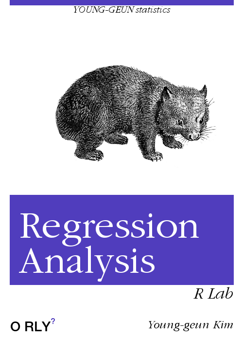

--- 
title: "R Lab for Regression Analysis"
author: |
  | [Young-geun Kim](https://github.com/ygeunkim)
  | [Department of Statistics](https://stat.skku.edu/stat/index.jsp), [SKKU](https://www.skku.edu/skku/index.do)
  | [dudrms33@g.skku.edu](mailto:dudrms33@g.skku.edu)
date: "`r format(Sys.time(), '%d %b, %Y')`"
include-before:
  - \newcommand{\iid}{\stackrel{iid}{\sim}}
  - \newcommand{\indep}{\stackrel{indep}{\sim}}
  - \newcommand{\hsim}{\stackrel{H_0}{\sim}}
  - \newcommand{\ind}{\perp\!\!\!\perp}
  - \newcommand{\R}{\mathbb{R}}
  - \newcommand{\B}{\boldsymbol\beta}
  - \newcommand{\hb}{\boldsymbol{\hat\beta}}
  - $\DeclareMathOperator*{\argmin}{argmin}$
  - $\DeclareMathOperator*{\argmax}{argmax}$
cover-image: cover.png
site: bookdown::bookdown_site
documentclass: book
bibliography: [book.bib, packages.bib]
biblio-style: apalike
link-citations: yes
description: "This aims at covering materials of regression analysis with R programming."
---

```{r, echo=FALSE, results='asis'}
eqn_numbering()
```

# Welcome {-}

</a> This book aims at covering materials of regression analysis. Also, there will be R programming for regression.

```{r, eval=FALSE}
library(tidyverse)
```

`tidyverse` package will be used in every chapter, so loading step will be hidden.

## Linear Regression Analysis {-}

```{r}
data(BioOxyDemand, package = "MPV")
(BioOxyDemand <-
  BioOxyDemand %>% 
  tbl_df())
```

### Relation {-}

We wonder how `x` affects `y`, especially linearly.

- Functional relation: mathematical equation, $$y = \beta_0 + \beta_1 x$$
- Statistical relation: embeded with noise

So we try to estimate

$$y = \beta_0 + \beta_1 x + \epsilon$$

```{r}
BioOxyDemand %>% 
  ggplot(aes(x, y)) +
  geom_point()
```


Looking just with the eyes, we can see the linear relationship. Regression analysis estimates the relationship statistically.


```{r}
BioOxyDemand %>% 
  ggplot(aes(x, y)) +
  geom_smooth(method = "lm") +
  geom_point()
```


